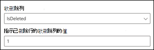
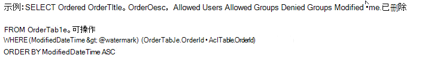

# Azure SQL 和 Microsoft SQL Server 连接器

通过 Microsoft SQL Server 或 Azure SQL 连接器，你的组织可以发现内部部署 SQL Server 数据库中的数据，也可以从云中的 Azure SQL 实例承载的数据库中对数据进行索引。 连接器将指定的内容索引到 Microsoft Search 中。 若要使索引保持对源数据的最新，它支持定期完全爬网和增量爬网。 使用这些 SQL 连接器，您还可以限制对特定用户的搜索结果的访问。

本文适用于 Microsoft 365 管理员或任何配置、运行和监控 Microsoft SQL Server 或 Azure SQL 连接器的人。 它说明了如何配置连接器和连接器功能、限制和故障排除技术。

## 仅在本地 Microsoft SQL Server 连接器中安装数据网关 (所需) 

为了访问第三方数据，您必须安装和配置 Microsoft Power BI 网关。 若要了解详细信息，请参阅 [安装本地网关](https://docs.microsoft.com/data-integration/gateway/service-gateway-install) 。  

## 注册应用
对于 Azure SQL 连接器，必须在 Azure Active Directory 中注册应用，以允许 Microsoft Search 应用访问用于索引的数据。 若要了解有关注册应用程序的详细信息，请参阅 Microsoft Graph 文档了解如何 [注册应用](https://docs.microsoft.com/graph/auth-register-app-v2)。 

完成应用注册并记下应用程序名称、应用程序 (客户端) ID 和租户 ID 之后，需要 [生成新的客户端密码](https://docs.microsoft.com/azure/healthcare-apis/register-confidential-azure-ad-client-app#application-secret)。 客户端密码只会显示一次。 请记住注意 & 将客户端密码安全地存储在一起。 在 Microsoft Search 中配置新连接时，请使用客户端 ID 和客户端密码。 

若要将注册的应用程序添加到 Azure SQL 数据库，需要执行以下操作：
 - 登录到 Azure SQL DB
 - 打开新的查询窗口
 - 通过运行命令 "创建来自外部提供程序的用户 [app name]" 来创建新用户
 - 通过运行命令 "exec sp_addrolemember" db_datareader "、" [app name] "或" ALTER ROLE db_datareader ADD MEMBER [app name] "将用户添加到角色

>[!NOTE]
>若要撤销在 Azure Active Directory 中注册的任何应用程序的访问权限，请参阅 Azure 文档中有关 [删除已注册的应用程序](https://docs.microsoft.com/azure/active-directory/develop/quickstart-remove-app)的说明。

## 连接到数据源

若要将 Microsoft SQL Server 连接器连接到数据源，必须配置要爬网的数据库服务器和本地网关。 然后，您可以使用所需的身份验证方法连接到数据库。

对于 Azure SQL 连接器，只需指定要连接到的服务器名称或 IP 地址。 Azure SQL 连接器仅支持 Azure Active Directory Open ID connect (OIDC) authentication 连接到数据库。

> [!NOTE]
> 您的数据库必须运行 SQL server 版本2008或更高版本，Microsoft SQL Server 连接器才能连接。

若要搜索数据库内容，您必须在配置连接器时指定 SQL 查询。 这些 SQL 查询需要将要编制索引的所有数据库列命名 (即 source properties) ，包括要获取所有列所需执行的任何 SQL 联接。 若要限制对搜索结果的访问权限，您必须在配置连接器时指定 SQL 查询中 (Acl) 的访问控制列表。

## 必需的完全爬网 () 

在此步骤中，将配置运行对数据库的完全爬网的 SQL 查询。 完全爬网将选择要使其成为可 **查询**、可 **搜索** 或可 **检索** 的所有列或属性。 您还可以指定 ACL 列，以限制对特定用户或组的搜索结果访问。

> [!Tip]
> 若要获取所需的所有列，可以联接多个表。

### 选择 "数据列" (必需的) 和 ACL 列 (可选的) 

该示例演示如何选择包含用于搜索的数据的五个数据列：订单 Id、OrderTitle、OrderDesc、CreatedDateTime 和 IsDeleted。 若要设置每个数据行的查看权限，可以选择以下 ACL 列： AllowedUsers、AllowedGroups、DeniedUsers 和 DeniedGroups。 所有这些数据列都可以进行 **查询**、 **搜索** 或 **检索**。

选择数据列，如以下示例查询所示： `SELECT OrderId, OrderTitle, OrderDesc, AllowedUsers, AllowedGroups, DeniedUsers, DeniedGroups, CreatedDateTime, IsDeleted`

若要管理对搜索结果的访问权限，您可以指定查询中的一个或多个 ACL 列。 SQL 连接器允许您控制每个记录级别的访问权限。 您可以选择对表中的所有记录具有相同的访问控制。 如果 ACL 信息存储在单独的表中，则可能必须在查询中执行与这些表的联接。

下面介绍了上述查询中的每个 ACL 列的用法。 下面的列表介绍了4种 **访问控制机制**。

* **AllowedUsers**：此选项指定将能够访问搜索结果的用户 id 的列表。 在下面的示例中，用户列表为： john@contoso.com、keith@contoso.com 和 lisa@contoso.com 只能访问订单 Id 为12的记录。
* **AllowedGroups**：此选项指定将能够访问搜索结果的用户组。 在下面的示例中，group sales-team@contoso.com 将只有具有订单 Id = 12 的记录可供访问。
* **DeniedUsers**：此选项指定 **不** 具有对搜索结果的访问权限的用户的列表。 在以下示例中，用户 john@contoso.com 和 keith@contoso.com 无权使用订单 Id 为13的记录访问权限，而其他所有人都有权访问此记录。
* **DeniedGroups**：此选项指定 **不** 具有对搜索结果的访问权限的用户组。 在以下示例中，组 engg-team@contoso.com 和 pm-team@contoso.com 无权访问订单 Id 为15的记录，而其他人有权访问此记录。  

###  (必需的水印) 

为了防止对数据库进行过载，连接器使用完全爬网水印列为批次批处理和恢复完全爬网查询。 通过使用 "水印" 列的值，将提取每个后续批处理，并从最后一个检查点恢复查询。 实际上，这是一种控制完全爬网的数据刷新的机制。

创建水印的查询代码段，如以下示例所示：

* `WHERE (CreatedDateTime > @watermark)`. 使用保留关键字引用水印列名称 `@watermark` 。 如果水印列的排序顺序是升序，请使用 `>` ; 否则，使用 `<` 。
* `ORDER BY CreatedDateTime ASC`. 在 "水印" 列上按升序或降序进行排序。

在下图所示的配置中， `CreatedDateTime` 是选定的水印列。 若要提取第一批行，请指定水印列的数据类型。 在这种情况下，数据类型为 `DateTime` 。

第一个查询使用 "CreatedDateTime > 1 月1日，1753 00:00:00" (日期时间数据类型的最小值) 来提取前 **N** 行数。 在提取第一个批处理后，如果按升序对 `CreatedDateTime` 行进行排序，则在批处理中返回的最大值将保存为检查点。 例如，2019 03:00:00 至3月1日。 然后，通过使用查询中的 "CreatedDateTime > 3 月1日，2019 03:00:00" 获取下一批 **N** 行。

###  (可选) 跳过软删除的行

若要在数据库中排除软删除的行的索引，请指定软删除的列名称和值，该值指示行已删除。

### 完全爬网：管理搜索权限

单击 " **管理权限** " 以选择用于指定访问控制机制的各种访问控制 (ACL) 列。 选择您在完全爬网 SQL 查询中指定的列名称。

每个 ACL 列都应为多值列。 可以通过分隔符（如分号）分隔这些多个 ID 值 (; ) 、逗号 (、) 等等。 您需要在 " **值分隔符** " 字段中指定此分隔符。

支持使用以下 ID 类型作为 Acl：

* **用户主体名称 (upn)**：用户主体名称 (UPN) 是电子邮件地址格式的系统用户的名称。 UPN (例如： john.doe@domain.com) 由用户名 (登录名) 、分隔符 (@ 符号) 和域名 (UPN 后缀) 组成。 
* **Azure Active Directory (AAD) ID**：在 Azure AD 中，每个用户或组都有一个对象 ID，它看起来像 "e0d3ad3d-0000-1111-2222-3c5f5c52ab9b" 这样的内容。
* **Active Directory (AD) 安全 ID**：在本地 AD 安装中，每个用户和组都具有一个不可变的唯一安全标识符，其外观类似于-1-5-21-3878594291-2115959936-132693609-65242。 '

## 增量爬网 (可选) 

在此可选步骤中，提供用于运行数据库的增量爬网的 SQL 查询。 使用此查询，SQL 连接器可确定自上次增量爬网以来对数据所做的任何更改。 在完全爬网中，选择要使其成为可 **查询**、可 **搜索** 或可 **检索** 的所有列。 指定在完全爬网查询中指定的一组相同的 ACL 列。

下图中的组件与完全爬网组件类似，但有一个例外。 在这种情况下，"ModifiedDateTime" 是选定的水印列。 查看 [完整的爬网步骤](#full-crawl-required) ，了解如何编写增量爬网查询，并查看以下图像作为示例。

## 管理搜索权限

您可以选择使用 [完全爬网屏幕中指定的 acl](#full-crawl-manage-search-permissions) ，也可以将其覆盖以使您的内容对所有人可见。

## 分配属性标签

通过从选项菜单中进行选择，可以为每个标签分配一个 source 属性。 虽然这一步并不是强制性的，但具有一些属性标签将改进搜索相关性，并确保最终用户更准确地搜索结果。

## 管理架构

在 " **管理架构** " 屏幕上，您可以选择更改架构属性， (可 **查询**、可 **搜索**、 **检索** 和 **可精简**) 与属性相关联，添加可选别名，然后选择 **Content** 属性。

## 限制

在预览版本中，SQL 连接器具有以下限制：

* Microsoft SQL Server 连接器：本地数据库必须运行 SQL Server 版本2008或更高版本。
* 仅通过使用用户主体名称 (UPN) 、Azure Active Directory (Azure AD) 或 Active Directory 安全性来支持 Acl。
* 不支持在数据库列中对多信息内容编制索引。 此类内容的示例包括 HTML、JSON、XML、blob 和文档 parsings，它们作为数据库列中的链接存在。
