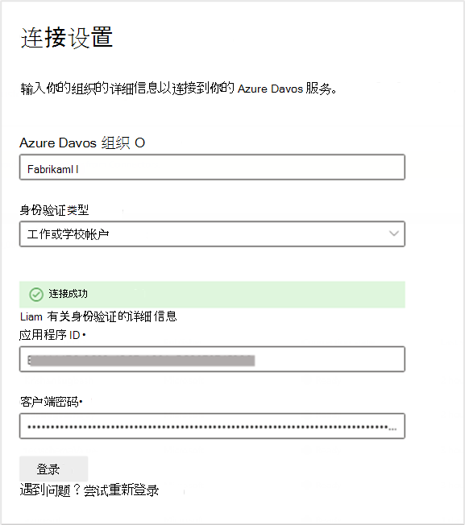
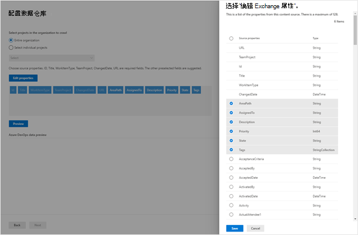

# Azure DevOps 连接器

使用 Azure DevOps 连接器，组织可以在其 Azure DevOps 服务实例中对工作项编制索引。 在从 Azure DevOps 配置连接器和索引内容之后，最终用户可以在 Microsoft Search 中搜索这些项目。

本文适用于 Microsoft 365 管理员或任何配置、运行和监控 Azure DevOps 连接器的人。 它说明了如何配置连接器和连接器功能、限制和故障排除技术。

>[!IMPORTANT]
>Azure DevOps 连接器仅支持 Azure DevOps 云服务。 此连接器不支持 Azure DevOps Server 2019、TFS 2018、TFS 2017、TFS 2015 和 TFS 2013。

## 连接到数据源

若要连接到 Azure DevOps 实例，需要你的 Azure DevOps [组织](https://docs.microsoft.com/azure/devops/organizations/accounts/create-organization) 名称、其应用 ID 和 OAuth 身份验证的客户端密码。

### 注册应用

您必须在 Azure DevOps 中注册应用程序，以便 Microsoft 搜索应用程序可以访问该实例。 若要了解详细信息，请参阅 Azure DevOps 文档了解如何 [注册应用](https://docs.microsoft.com/azure/devops/integrate/get-started/authentication/oauth?view=azure-devops#register-your-app)。

下表提供了有关如何填写 "应用注册" 表单的指导：

 **必填字段** | **说明**      | **推荐值**
--- | --- | ---
| 公司名称         | 这是您的公司的名称。 | 使用适当的值   |
| 应用程序名称     | 此唯一值标识您正在授权的应用程序。    | Microsoft 搜索     |
| 应用程序网站  | 此必填字段是在连接器设置过程中请求访问你的 Azure DevOps 实例的应用程序的 URL。  | <https://gcs.office.com/>                |
| 授权回调 URL        | 授权服务器重定向到的必需回调 URL。 | <https://gcs.office.com/v1.0/admin/oauth/callback>|
| 授权作用域 | 这是应用程序的访问范围 | 选择以下作用域：标识 (读取) 、工作项 (读取) 、变量组 (读取) 、项目和团队 (读取) 、Graph (读取) |

在向上面的详细信息注册应用程序时，将获取将用于配置连接器的 **应用程序 ID** 和 **客户端密码** 。

>[!NOTE]
>若要撤销对 Azure DevOps 中注册的任何应用程序的访问权限，请转到 Azure DevOps 实例右侧的 "用户设置"。 单击 "配置文件"，然后单击侧窗格的 "安全" 部分中的 "授权"。 将鼠标悬停在授权的 OAuth 应用上，以查看应用程序详细信息一角的 "撤消" 按钮。

### 连接设置

在使用 Azure DevOps 注册 Microsoft Search 应用程序后，您可以完成 "连接设置" 步骤。 输入你的组织名称、应用 ID 和客户端密码。

## 选择项目和字段

您可以选择用于为整个组织或特定项目编制索引的连接。

如果选择对整个组织编制索引，则组织中所有项目中的项目都将获得索引。 在下一次爬网过程中创建新项目和项目时将对其编制索引。 如果选择单个项目，则只会对这些项目中的工作项编制索引。

接下来，选择您希望连接在继续之前对这些字段中的数据编制索引和预览的字段。

## 管理搜索权限

Azure DevOps 连接器当前仅支持 **所有人都能看到** 的搜索权限。 已编制索引的数据将显示在所有用户的搜索结果中。

## 管理搜索架构

配置搜索架构映射。 您可以选择哪些属性可供 **查询** 、可 **搜索** 和 **检索** 。

## 设置刷新计划

Azure DevOps 连接器支持完全爬网和增量爬网的刷新计划。 完全爬网可查找以前同步到 Microsoft 搜索索引的已删除工作项。 将运行完全爬网以同步所有工作项。 若要同步新的工作项和对现有工作项的更新，您需要计划增量爬网。

对于增量爬网，建议的日程安排为1小时，对于完全爬网，则为一天。
