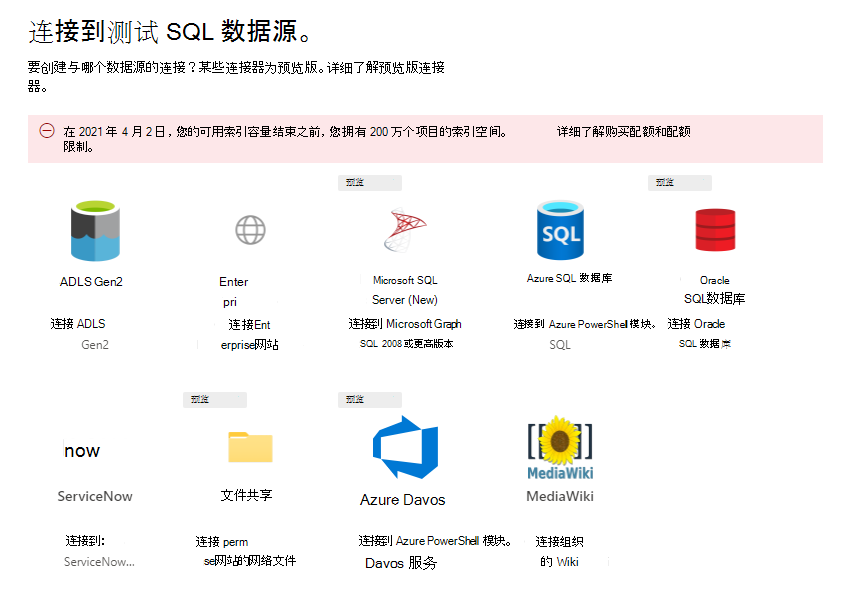
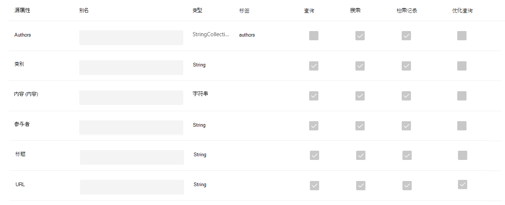
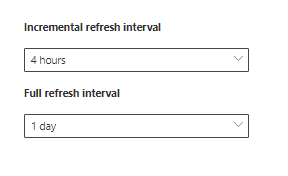

<!-- markdownlint-disable no-trailing-punctuation -->

# Microsoft 的图形连接器的安装概述 

本文总结了使用 [microsoft 365 管理中心](https://admin.microsoft.com) 设置 microsoft 的任何图形连接器所需的基本过程。 基本过程包括以下步骤：  
<!---Add links to each section in the doc--->

1. 在 Microsoft 365 管理中心中添加图形连接器。
2. 命名连接。
3. 配置连接设置。
4. 管理搜索权限。
5. 分配属性标签。
6. 管理架构。
7. 选择 "刷新设置"。
8. 查看连接。

请务必注意，安装过程与 Microsoft 的所有图形连接器非常相似，但不完全相同。 **除了阅读本文，请务必阅读特定于连接器的数据源。**  

## 步骤1：在 Microsoft 365 管理中心中添加图形连接器

完成以下步骤以配置任何 Microsoft 构建的连接器。

1. 登录到您在[Microsoft 365 管理中心](https://admin.microsoft.com)的管理员帐户
2. 在导航窗格中，选择 " **设置**"，然后选择 " **搜索 & 智能**"。 选择 " [连接器" 选项卡](https://admin.microsoft.com/Adminportal/Home#/MicrosoftSearch/Connectors)。
3.  选择 " **+ 添加**"，然后从可用选项菜单中选择您选择的数据源。

>[!注意：] 最多可以向每个租户添加10个图形连接。

## 步骤2：为连接命名
您将需要指定以下属性： 

* 名称  
* 连接 ID 
*  (可选) 的说明 

连接 ID 为连接器创建隐式属性。 它必须仅包含字母数字字符，并且最多为32个字符。 

## 步骤3：配置连接设置

根据数据源的类型，配置连接设置的过程会有所不同。 若要添加到租户中的数据源类型的连接器特定信息，请参阅安装过程中完成此步骤的类型。  

若要了解有关连接到本地数据源的详细信息，请参阅 [安装本地 data gateway](https://aka.ms/configuregateway)。

## 步骤4：管理搜索权限

访问控制列表 (Acl) 确定组织中的哪些用户可以访问每个数据项。  

一些连接器（如 [MICROSOFT SQL](MSSQL-connector.md) 和 [Azure Data Lake Storage Gen2](azure-data-lake-connector.md) ）在 Azure [Active Directory (azure AD) ](https://docs.microsoft.com/azure/active-directory/) acl 中提供支持。

其他连接器（如 [ServiceNow](servicenow-connector.md)、 [Azure DevOps](azure-devops-connector.md)和 [SALESFORCE](salesforce-connector.md) ）支持非 Azure AD 用户和组的同步。  

## 步骤5：分配属性标签
您可以在 "分配属性标签" 页上将语义标签分配给源属性。 标签是 Microsoft 提供的已知的已知标记，提供语义含义。 它们允许 Microsoft 将连接器数据集成到 Microsoft 365 体验中，例如增强的搜索、人员卡片、智能发现等。  

下表列出了当前支持的标签及其说明。  

标签 | 说明
--- | ---  
**title** | 要在搜索和其他体验中显示的项目的标题 
**url** | 源系统中项的目标 url 
**createdBy** | 创建项目的人员的姓名 
**lastModifiedBy** | 最近编辑项目的人员的姓名 
**authors** | 参与/合作项目的人员的姓名 
**createdDateTime** | 项目创建时间 
**lastModifiedDateTime** | 最近编辑项目的时间 
**fileName** | 文件项目的名称 
**FileExtension** | 文件项（如 .pdf 或 word）的类型 

此页面上的属性基于您的数据源预先选择，但如果存在更适合特定标签的其他属性，则可以更改此选择。  

标签 **标题** 是最重要的标签。 **强烈建议** 您为此标签分配一个属性，以便您的连接参与 [结果群集体验](result-cluster.md)。

错误映射标签将导致 deteriorated 搜索体验。 对于某些标签，没有为其分配属性。  

## 步骤6：管理架构

### Content 属性

强烈建议您从 "选项" 的下拉菜单中选择 "* * 内容" 属性，或保留默认值（如果存在）。 此属性用于对内容进行全文本索引、搜索结果页面代码段生成、 [结果群集](result-cluster.md) 参与、语言检测、HTML/文本支持、排名和相关性以及查询表述。

如果选择内容属性，您将可以选择在 [创建结果类型](customize-results-layout.md)时使用系统生成的属性 **ResultSnippet** 。 此属性用作在查询时从 content 属性生成的动态代码段的占位符。 如果您的结果类型中使用此属性，则会在搜索结果中生成代码段。

### 为源属性创建别名

可以在 "管理架构" 页上的 "别名" 列下将别名添加到属性中。 别名是属性的友好名称。 它们在查询和创建筛选器中使用。 它们还可用于从多个连接中规范化源属性，以使其具有相同的名称。 通过这种方式，您可以为具有多个连接的垂直创建一个筛选器。 有关详细信息，请参阅 [自定义搜索结果页](customize-search-page.md) 。  

### 搜索架构属性

您可以设置搜索架构属性，以控制每个 source 属性的搜索功能。 搜索架构可帮助确定搜索结果页面上显示的结果以及最终用户可以查看和访问的信息。

搜索架构属性包括可 **搜索**、可 **查询**、可 **检索** 和 **可精简**。 下表列出了 Microsoft Graph 连接器支持和解释其功能的每个属性。

搜索架构属性 | 函数 | 示例
--- | --- | ---
外面 | 将属性的文本内容设为可搜索的。 属性内容包含在全文本索引中。 | 如果属性为 **title**，则针对 **企业** 的查询返回包含任何文本或标题中的 word **Enterprise** 的答案。
可 | 按查询搜索特定属性的匹配项。 然后可以通过编程方式或逐字方式在查询中指定属性名称。 |  如果 **Title** 属性是可查询的，则支持查询 **标题： Enterprise** 。 
可检索 | 只能在结果类型中使用可检索的属性并显示在搜索结果中。 |
可精简 | 在 Microsoft 搜索结果页中，可以使用可精简属性。 | 如果在连接设置过程中将该属性标记为可精简，则组织中的用户可以在搜索结果页中按 **lastModifiedDateTime** [筛选](custom-filters.md)。

对于除文件共享连接器之外的所有连接器，必须手动设置自定义类型。 若要激活每个字段的搜索功能，您需要映射到属性列表的搜索架构。 "连接向导" 将根据您选择的源属性集自动选择搜索架构。 您可以通过选中 "搜索架构" 页中每个属性和属性的复选框来修改此架构。

 
### 搜索架构设置的限制和建议

* **Content** 属性仅可搜索。 在下拉列表中选择此属性后，将无法将此属性标记为可 **检索** 或可 **查询**。

* 当使用 **content** 属性呈现搜索结果时，会出现重大性能问题。 例如， [ServiceNow](https://www.servicenow.com)知识库文章的 **文本** 内容字段。

* 仅属性在搜索结果中标记为可检索的，并且可用于创建新式结果类型 (MRTs) 。

* 只能将字符串属性标记为可搜索。

> [!NOTE]
> 创建连接后， **不能** 修改架构。 若要执行此操作，您需要删除连接并创建一个新的连接。

## 第7步：刷新设置

刷新间隔决定数据在数据源和 Microsoft 搜索之间的同步频率。 每种类型的数据源都有一组不同的最佳刷新计划，具体取决于修改数据的频率和修改的类型。

有两种类型的刷新间隔，即 **完全刷新** 和 **增量刷新**，但增量刷新对某些数据源不可用。

通过完全刷新，搜索引擎将处理内容源中的每个项目并对其进行索引，而不考虑以前的爬网。 完全刷新最适用于以下情况：

* 检测数据删除。
* 由于错误，增量刷新无法更新内容。
* 已修改 Acl。
* 修改了爬网规则。
* 如果已更新连接的架构 (尚不支持架构更新) 

使用 **增量刷新** 时，搜索引擎只能处理自上次成功爬网后创建或修改的项目，并对其编制索引。 因此，并不会对内容源中的所有数据重新编制索引。 增量刷新最佳工作以检测内容、元数据、权限和其他更新。

增量刷新比完全刷新速度快得多，因为未处理未更改的项目。 但是，如果您选择运行增量刷新，您仍需要定期运行完全刷新，以保持内容源与搜索索引之间的准确数据同步。

<!---Change screenshot for one that shows both options in new UI (try ServiceNow)--->

## 步骤8：查看连接

您可以根据需要查看整个配置并编辑设置，然后再完成连接。 **如果尚未阅读数据源连接器的特定信息，请务必阅读。** 准备好完成连接后，选择 " **完成更新** "。

## 我如何知道连接设置正常工作？

转到 "[管理中心](https://admin.microsoft.com)" 的 "**连接器**" 选项卡下的已发布连接列表。 若要了解如何进行更新和删除，请参阅 [管理连接器](manage-connector.md)。
