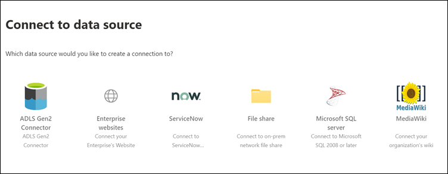

# 将 Microsoft 构建的连接器设置为 Microsoft Search

本文将指导您完成配置 Microsoft 构建的连接器的步骤。 概述了在 Microsoft 365[管理中心](https://admin.microsoft.com)中设置连接的流程。 有关如何设置特定 Microsoft 构建的连接器的更多详细信息，请参阅以下文章：
* [Azure Data Lake Storage Gen2](azure-data-lake-connector.md)
* [企业网站](enterprise-web-connector.md)
* [文件共享](file-share-connector.md)
* [MediaWiki](mediawiki-connector.md)
* [Microsoft SQL server](MSSQL-connector.md)
* [ServiceNow](servicenow-connector.md)

## 设置
若要配置任何 Microsoft 构建的连接器，请转到[管理中心](https://admin.microsoft.com)：
1. 使用[Microsoft 365](https://www.microsoft.com/microsoft-365)测试租户的凭据登录你的帐户。
2. 转到 "**设置** > **Microsoft Search** > **连接器**"。
3. 选择 "**添加连接器**"。
4. 从可用连接器列表中，选择所选的连接器。

### 命名连接器
若要创建连接，请先指定以下属性：
1. 连接的名称
2. 连接 ID
3. Description （可选）

连接 ID 为连接器创建隐式属性。 它必须仅包含字母数字字符，并且最多为32个字符。

### 连接到数据源
数据连接过程根据连接器的类型而有所不同。 若要了解有关连接到本地数据源的详细信息，请参阅[安装本地 data gateway](https://aka.ms/configuregateway)。

### 选择源属性
由第三方数据源设置为源属性的数据字段被编入 Microsoft Search。 若要修改这些属性，请选择 "**连接器**" 页面右侧侧栏中的 "**编辑属性**"。 **最高可选择64个源属性**。

###  管理搜索架构 
管理员可以设置搜索架构属性，以控制每个 source 属性的搜索功能。 搜索架构可帮助确定搜索结果页面上显示的结果以及最终用户可以查看和访问的信息。

搜索架构属性包括可**搜索**、可**查询**和可**检索**。 下表列出了 Microsoft Graph 连接器支持和解释其功能的每个属性。

**搜索架构属性** | **Function** | **示例**
--- | --- | ---
外面 | 将属性的文本内容设为可搜索的。 属性内容包含在全文本索引中。 | 如果属性为**title**，则针对**企业**的查询返回包含任何文本或标题中的 word **Enterprise**的答案。
可 | 按查询搜索特定属性的匹配项。 然后可以通过编程方式或逐字方式在查询中指定属性名称。 |  如果**Title**属性是可查询的，则支持查询**标题： Enterprise** 。
可检索 | 只能在结果类型中使用可检索的属性并显示在搜索结果中。 | 

对于除文件共享连接器之外的所有连接器，必须手动设置自定义类型。 若要激活每个字段的搜索功能，您需要映射到属性列表的搜索架构。 "连接向导" 将根据您选择的源属性集自动选择搜索架构。 您可以通过选中 "搜索架构" 页中每个属性和属性的复选框来修改此架构。

这些限制和建议适用于搜索架构设置：
* 对于索引自定义类型的连接器，我们建议您**不要标记包含**主要内容可**检索**的字段。 使用该搜索属性呈现搜索结果时，会出现重大性能问题。 例如， [ServiceNow](https://www.servicenow.com)知识库文章的**文本**内容字段。
* 仅属性在搜索结果中标记为可检索的，并可用于创建新式结果类型（MRTs）。
* 只能将字符串属性标记为可搜索。

> [!Note]
> 创建连接后，**不能**修改架构。 若要执行此操作，您需要删除连接并创建一个新的连接。

###  管理搜索权限
访问控制列表（Acl）确定组织中的哪些用户可以访问每个数据项。 文件共享连接器仅支持可映射到[Azure Active Directory （AZURE AD）](https://docs.microsoft.com/azure/active-directory/)的 acl。 所有其他连接器都支持对所有用户都可见的搜索权限。

### 设置刷新计划
刷新计划确定数据与 Microsoft Graph 和 Microsoft Search 中的索引同步的频率。 您可以通过两种方式安排刷新：完全爬网或增量爬网。

通过**完全爬网**，搜索引擎将处理内容源中的每个项目并对其进行索引，而不考虑以前的爬网。 在下列情况下，完全爬网的效果最佳：
* 您需要检测数据的删除。
* 增量爬网无法对内容进行爬网以对错误进行爬网。
* 需要 Microsoft Search 软件更新。 更新将修改搜索架构。
* 已修改 Acl。
* 修改了爬网规则。

使用**增量爬网**时，搜索引擎可以仅处理自上次成功爬网后创建或修改的项，并对这些项编制索引。 因此，并不会对内容源中的所有数据重新编制索引。 增量爬网最适用于检测内容、元数据、权限和其他更新。

增量爬网比完全爬网快得多，因为未处理未更改的项目。 若要保持内容源和搜索索引之间的准确数据同步，您需要定期运行这两个爬网。

每个连接器都具有一组不同的最佳刷新计划，具体取决于修改数据的频率和修改的类型。

### 查看连接器设置
配置连接器后，[管理员中心](https://admin.microsoft.com)将转到可查看您的设置的页面。 您可以在确认连接之前，通过配置过程来编辑任何设置。 若要了解详细信息，请参阅[管理连接器](manage-connector.md)。

## 后续步骤：自定义搜索结果页
通过 Microsoft Search 用户界面（UI），最终用户可以从你的[microsoft 365](https://www.microsoft.com/microsoft-365)生产力应用和更广泛的 microsoft 生态系统中搜索内容。 垂直搜索是指当用户在[Bing](https://Bing.com)中的[SharePoint](http://sharepoint.com/)、 [microsoft Office](https://Office.com)和 microsoft 搜索中查看搜索结果时显示的选项卡。 您可以自定义搜索纵向以缩小结果范围，以便只显示特定类型的搜索结果。 这些纵向显示为搜索结果页顶部的选项卡。 新式结果类型（MRT.LOG）是指定如何显示结果的 UI。

您必须创建自己的纵向和结果类型，以便最终用户可以查看来自新连接的搜索结果。 如果不执行此步骤，则连接中的数据不会显示在搜索结果页上。

若要了解有关如何创建您的纵向和 MRTs 的详细信息，请参阅[搜索结果页面自定义](customize-search-page.md)。

## 我如何知道这有效？
转到 "[管理中心](https://admin.microsoft.com)" 的 "**连接器**" 选项卡下的已发布连接列表。 若要了解如何进行更新和删除，请参阅[管理连接器](manage-connector.md)。
