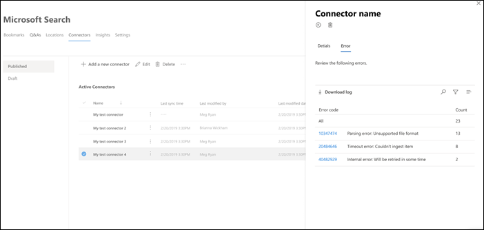

<!-- markdownlint-disable no-inline-html -->

# 查看连接详细信息和错误

若要访问和管理连接器，必须指定为租户的搜索管理员。 请与租户管理员联系，以预配搜索管理员角色。

导航到"连接器["选项卡](https://admin.microsoft.com/Adminportal/Home#/MicrosoftSearch/Connectors)中的"Microsoft 365 管理中心"。 

在"连接器"选项卡上单击连接时，可以查看连接详细信息 [和错误](https://admin.microsoft.com/Adminportal/Home#/MicrosoftSearch/Connectors)。  

## 查看上次爬网信息

第一个初始增量或完全爬网成功完成后，最后一个爬网数据值将显示在详细信息窗格中的最后一个爬网标头下。 如果没有运行最后一次爬网，您将看不到上一次爬网标头下的任何信息。 有关上次爬网的信息将帮助您深入了解如何执行爬网，并在必要时执行必要的步骤。

以下最后一个爬网值将可用于每个连接：

值 | 说明
--- | ---
**完成时间** | 上次爬网完成的日期和时间
**类型** | 增量或完全爬网
**Duration** | 上一次爬网完成所花的时间
**成功** | 上一次爬网中成功包含的项目数
**错误** | 上次爬网中出错的项目数

## 监视错误

对于" **连接器"选项卡** 上的每个 **活动** 连接器，任何现有爬网错误都显示在" **错误"选项卡** 下。选项卡列出了错误代码、每个代码的计数以及错误日志下载选项。 请参阅下图中的示例。 选择 **错误代码** 以查看错误的详细信息。

若要查看错误的特定详细信息，请选择其错误代码。 将出现一个屏幕，显示错误详细信息和链接。 最新错误显示在顶部。 请参阅下表中的示例。

下面是可能会针对任何连接显示的不同错误的列表。

错误代码 | 错误消息 | 解决方案
--- | --- | ---
1000 | 数据源不可用。 检查 Internet 连接或确保连接器仍可访问数据源。 | 如果数据源因网络问题而不可访问，或者数据源本身被删除、移动或重命名，则会发生此错误。 检查提供的数据源详细信息是否仍然有效。
1001 | 无法更新数据，因为数据源限制连接器。 | 若要取消限制数据源，请检查其缩放限制能否增加或等到一天中流量较少的时间。
1002 | 无法对数据源进行身份验证。 验证与此数据源关联的凭据是否正确。 | 单击 **"** 编辑"更新身份验证凭据。
1003 | 与连接器关联的帐户无权访问该项目。 |  确保适当的帐户有权访问要编制索引的项目。
1004 | 无法访问本地数据网关。 确保网关服务正在运行，并且连接配置中更新了网关详细信息。 | 使用网关检查计算机，打开 Power BI 网关应用程序，并确保网关正在运行。 验证网关是否使用与 Microsoft 搜索相同的管理员帐户，然后确保在连接配置中更新所有网关详细信息。
1005 | 与此数据源关联的凭据已过期。 续订凭据并更新连接。 | 单击 **"** 编辑"更新身份验证凭据。
1006 | 网关版本已过期，不再支持此连接器。 你将需要更新网关。 | 请访问[安装本地数据网关](/data-integration/gateway/service-gateway-install)，以在包含网关的计算机上安装 Power BI 网关的最新版本。
1007 | 未检测到Power BI许可证。 您需要一个有效的Power BI许可证才能执行此爬网。 | 您需要一个有效的Power BI许可证才能执行此爬网。 检查您的组织是否具有有效的许可证。 如果是，请重试。 如果没有，请获取许可证，然后重试。
1008 | 租户的总配额利用率已达到其限制。 | 请尝试删除连接以释放部分配额或调整引入筛选器以引入较少的数据。 如果这些无法解决问题，请与 Microsoft 支持部门联系。
1009 | 连接的总配额使用率已达到其限制。 | 尝试调整引入筛选器以引入较少的数据。 如果此操作无法解决问题，请与 Microsoft 支持部门联系。
1010 | 对非 Azure AD 组编制索引的总配额使用率已达到其 10 万的限制。 | 请尝试删除连接以释放部分配额或调整引入筛选器以引入较少的数据。 如果这些无法解决问题，请与 Microsoft 支持部门联系。
1011 | 无法[Graph连接器代理](graph-connector-agent.md)或脱机。 | 
1012 | 由于身份验证模式不受支持，连接身份验证失败。 | 编辑连接以更新连接的身份验证设置。
2001 | 索引被限制，因为队列中有大量更新。 根据队列，可能需要一些时间才能完成更新。 | 请等待，直到队列被清除。
2002 | 索引编制失败，因为项目格式不受支持。 | 有关详细信息，请参阅连接器特定的文档。
2003 | 由于项目内容不受支持，索引编制失败。 | 有关详细信息，请参阅连接器特定的文档。
2004 | 索引编制失败，因为项目或文件大小不受支持。 | 有关详细信息，请参阅连接器特定的文档。
2005 | 索引编制失败，因为 URI 太长。 | 有关详细信息，请参阅连接器特定的文档。
2006 | 由于映射公式无效或没有具有此属性的 Azure AD 用户，用户映射失败。 | 请尝试使用不同的映射公式删除和重新创建连接。 
2007 | 此项目不会显示在Microsoft 搜索，因为无法对无权查看此项目的一些用户或组编制索引。 | 
2008 | 连接不能具有成员数超过 50，000 的非 Azure AD 组。 | 尝试从组中删除用户，或者尝试从组中删除包含该组的 ACLed 项，然后重新创建连接。
2009 | 由于大量请求，非 Azure AD 组索引暂时暂停。 当系统处理完这些请求后，索引将恢复。 请稍后重新查看。 | 
2010 | 由于 Microsoft 进行了更新，此连接不再有效。 请删除连接并创建一个新连接。 | 请删除连接并创建一个新连接。
5000 | 出错了。 如果继续，请联系支持人员。 |