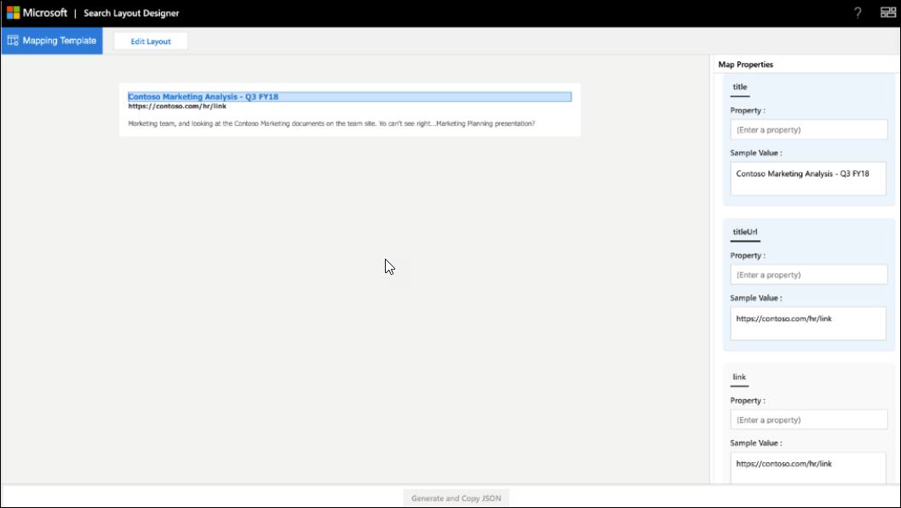

<!-- markdownlint-disable no-hard-tabs -->
# <a name="create-a-layout-to-customize-search-results"></a>创建布局以自定义搜索结果

可以使用搜索布局设计器为自定义垂直方向设计结果布局。 你可以开始设计布局，方法为选择布局设计器中提供的模板，并使用它们（如果它们符合你的要求）。 或者，你可以选择以各种方式编辑这些模板以满足你的要求。 例如，添加/删除图像、添加/删除文本和修改文本。 如果没有一个模板符合你的要求，你可以选择开始使用空白模板设计布局。  

布局准备就绪后，使用自适应 [卡片模板](/adaptive-cards/templating/language) 语言创建用于定义结果类型的结果布局 JSON。 使用布局设计器中的"映射"步骤将结果属性映射到布局。  

## <a name="create-a-layout-on-your-own"></a>自行创建布局

自行创建布局需要了解自适应[卡片及其](/adaptive-cards/authoring-cards/getting-started)[架构](https://adaptivecards.io/explorer/)。 搜索结果布局使用自适应卡片提供的部分元素，并且可以使用布局设计器了解受支持的元素集。  

创建你自己的布局时，使用连接器的数据创建自适应卡片布局，然后完成布局。
创建你自己的布局有两个主要步骤：

- 设计布局。
- 将数据与模板分开。

### <a name="design-the-layout"></a>设计布局

本示例中，我们显示了包含标题、链接和描述性文本的布局。


下面是布局的关联 JSON 文件：

```json
{
    "type": "AdaptiveCard",
    "version": "1.3",
    "body": [
        {
            "type": "ColumnSet",
            "columns": [
                {
                    "type": "Column",
                    "width": 8,
                    "items": [
                        {
                            "type": "TextBlock",
                            "text": "Contoso Marketing Analysis - Q3 FY18",
                            "color": "Accent",
                            "size": "Medium",
                            "spacing": "None",
                            "weight": "Bolder"
                        },
                        {
                            "type": "TextBlock",
                            "text": "https://contoso.com/hr/link",
                            "spacing": "None",
                            "color": "Dark",
                            "weight": "Bolder"
                        },
                        {
                            "type": "TextBlock",
                            "text": "Marketing team at Contoso.., and looking at the Contoso Marketing documents on the team site. This contains the data from FY20 and will taken over to FY21...Marketing Planning is ongoing for FY20..",
                            "wrap": true,
                            "maxLines": 2,
                            "spacing": "Medium"
                        }
                    ],
                    "horizontalAlignment": "Center",
                    "spacing": "None"
                }
            ]
        }
    ],
    "$schema": "http://adaptivecards.io/schemas/adaptive-card.json"
}
```

### <a name="separate-the-data-from-the-layout"></a>将数据与布局分开

你可以将数据与布局分开并绑定数据。

下面是绑定数据后的布局 JSON：

```json
{
    "type": "AdaptiveCard",
    "version": "1.3",
    "body": [
        {
            "type": "ColumnSet",
            "columns": [
                {
                    "type": "Column",
                    "width": 8,
                    "items": [
                        {
                            "type": "TextBlock",
                            "text": "[${title}](${titleUrl})",
                            "color": "Accent",
                            "size": "Medium",
                            "spacing": "None",
                            "weight": "Bolder"
                        },
                        {
                            "type": "TextBlock",
                            "text": "${link}",
                            "spacing": "None",
                            "color": "Dark",
                            "weight": "Bolder"
                        },
                        {
                            "type": "TextBlock",
                            "text": "${description}",
                            "wrap": true,
                            "maxLines": 2,
                            "spacing": "Medium"
                        }
                    ],
                    "horizontalAlignment": "Center",
                    "spacing": "None"
                }
            ]
        }
    ],
    "$schema": "http://adaptivecards.io/schemas/adaptive-card.json"
}
```

示例数据：在示例数据编辑器中指定 **示例** 数据，以在预览模式下查看数据 **绑定卡片**。

```json
{

    "title": "Contoso Marketing Analysis - Q3 FY18",
    "titleUrl": "https://contoso.com/hr/link",
    "link": "https://contoso.com/hr/link",
    "description": "Marketing team, and looking at the Contoso Marketing documents on the team site. Yo can't see right...Marketing Planning presentation?"

}
```

## <a name="map-the-layout-to-the-result-properties"></a>将布局映射到结果属性

必须将布局的每个字段映射到结果属性或连接器属性，以生成结果布局 JSON。



选择布局中的字段以突出显示需要映射的变量。 您可以对一个字段使用多个变量，并且所有字段都必须映射到结果属性。

### <a name="show-snippet-on-search-result"></a>在搜索结果上显示代码段  

在连接器结果 **的内容属性** 上生成的动态代码段可以显示在搜索结果中。 **ResultSnippet** 是一个系统属性，它充当针对每个 Connector 结果生成的代码段的占位符属性。 若要在结果布局上显示代码段 **，ResultSnippet** 系统属性必须映射到搜索结果布局中的相应字段，例如 Description。 在每个结果上生成的代码段还使用用户输入的查询词突出显示代码段中的匹配项。

## <a name="things-to-consider"></a>注意事项

在开始使用之前，应做一些操作，以及避免执行一些操作以确保布局成功。

### <a name="do"></a>允许事项

- 如果要将静态链接用于徽标而不是结果属性，请编辑模板以在布局中提供徽标链接。
- 验证结果 JSON 中使用的结果属性未返回任何数据的方案的结果布局。 如果 `$when` 属性不包含数据，则使用 条件隐藏元素。  
- 确保条件的数据类型 `$when` 与结果属性匹配。 例如，请勿在 `Number` 条件 `Text` 中 `$when` 进行比较。  
- 在设计结果布局时考虑主题要求。  
- 确保元素 `Textblock`   可以处理动态内容。 可以使用 和 `wrap` `maxLines` 元素属性来达到此目的。
- 在 Markdown 中使用时 `{DATE()}` 正确设置日期格式。  

### <a name="dont"></a>禁止事项

- 绑定值时不要定义无效的数据类型。 有关数据类型详细信息，请参阅 [管理搜索架构](/sharepoint/search/manage-the-search-schema)。
- 避免按照结果布局 JSON 的最大高度在结果页面上裁剪结果。 如果超过结果布局的最大高度，将在结果页上裁剪结果。
- 不要在元素 `px` 属性中使用值。
- 不要在结果布局中将 markdown 与 **ResultSnippet** 属性一同用于突出显示搜索结果中的查询匹配。

## <a name="resources"></a>资源

[自定义搜索结果页面](customize-search-page.md)

[自适应卡片](/adaptive-cards/authoring-cards/getting-started)

[自适应卡片模板语言](/adaptive-cards/templating/language)

[自适应卡片架构](https://adaptivecards.io/explorer/)
