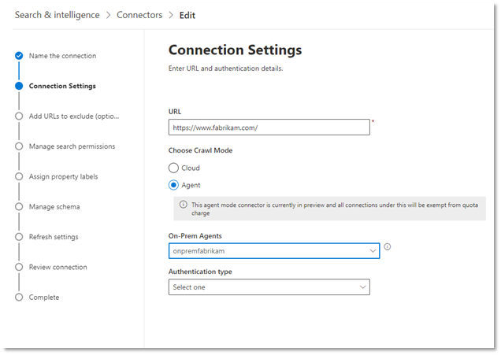

<!-- markdownlint-disable no-inline-html -->
# 企业网站连接器

通过企业网站连接器，您的组织可以 **从其面向内部的网站中** 索引文章和内容。 在配置了该网站的连接器和同步内容之后，最终用户可以从任何 Microsoft 搜索客户端搜索该内容。

本文适用于 [Microsoft 365](https://www.microsoft.com/microsoft-365) 管理员或任何配置、运行和监视企业网站连接器的人。 它说明了如何配置连接器和连接器功能、限制和故障排除技术。  

## 连接设置

若要连接到数据源，您需要填写网站的根 URL，选择爬网源，以及要使用的身份验证类型：无、基本身份验证或使用 [Azure Active Directory (AZURE AD) ](https://docs.microsoft.com/azure/active-directory/)的 OAuth 2.0。 完成此信息后，请单击 "测试连接" 以验证设置。

### URL

使用 "URL" 字段指定要对其进行爬网的网站的根目录。 企业网站连接器将使用此 URL 作为起始点，并根据此 URL 中的所有链接进行爬网。

### 爬网模式：云或本地 (预览) 

爬网模式确定要编制索引的网站的类型（云或本地）。 对于你的云网站，选择 **云** 作为爬网模式。

此外，连接器现在支持对本地网站进行爬网。 此模式处于预览阶段。 若要访问本地数据，必须首先安装和配置 Graph 连接器代理。 若要了解详细信息，请参阅 [Graph 连接器代理](https://docs.microsoft.com/microsoftsearch/on-prem-agent)。

对于内部部署网站，选择 " **代理** " 作为 "爬网模式"，在 " **本地代理** " 字段中，选择之前安装和配置的 Graph 连接器代理。  

### 身份验证

基本身份验证需要用户名和密码。 使用 [Microsoft 365 管理中心](https://admin.microsoft.com)创建此 bot 帐户。

使用 [AZURE AD](https://docs.microsoft.com/azure/active-directory/) 的 OAuth 2.0 需要资源 ID、客户端 ID 和客户端密码。 OAuth 2.0 仅适用于云模式。

有关详细信息，请参阅 [使用 OAuth 2.0 代码授予流授予对 Azure Active Directory web 应用程序的访问权限](https://docs.microsoft.com/azure/active-directory/develop/v1-protocols-oauth-code)。 使用以下值注册：

**名称：** Microsoft Search  
**Redirect_URI：**`https://gcs.office.com/v1.0/admin/oauth/callback`

若要获取资源、client_id 和 client_secret 的值，请转到 **使用授权代码请求** 重定向 URL 网页上的访问令牌。

有关更多详细信息，请参阅 [快速入门：使用 Microsoft identity Platform 注册应用程序](https://docs.microsoft.com/azure/active-directory/develop/quickstart-register-app)。

## 对 robots.txt 的支持

连接器检查以查看是否存在根网站的 robots.txt 文件，如果存在，则将遵循并遵循该文件中的说明。 如果不希望连接器对网站上的某些页面或目录进行爬网，则可以在 robots.txt 文件中的 "禁止" 声明中调用这些页面或目录。

## 添加要排除的 Url

您可以根据需要创建 **排除列表** ，以排除某些 url 的爬网，如果该内容是敏感的或不值得爬网。 若要创建排除列表，请浏览根 URL。 您可以选择在配置过程中将排除的 Url 添加到列表中。

## 管理搜索权限

企业网站连接器仅支持 **所有人都** 能看到的搜索权限。 索引数据显示在搜索结果中，并对组织中的所有用户可见。

## 分配属性标签

通过从选项菜单中进行选择，可以为每个标签分配一个 source 属性。 虽然这一步并不是强制性的，但具有一些属性标签将改进搜索相关性，并确保最终用户更准确地搜索结果。

## 管理架构

在 " **管理架构** " 屏幕上，您可以选择更改架构属性， (可 **查询**、可 **搜索**、 **检索** 和 **可精简**) 与属性相关联，添加可选别名，然后选择 **Content** 属性。

## 设置刷新计划

企业网站连接器仅支持完全刷新。 这意味着连接器将在每次刷新期间对网站的所有内容进行重新爬网。 若要确保连接器获取足够的时间来对内容进行爬网，建议您设置一个较大的刷新计划间隔。 建议在一到两周之间进行计划刷新。

## 疑难解答

阅读网站的内容时，爬网可能会遇到一些源错误，这些错误由下面的详细错误代码表示。 若要获取有关错误类型的详细信息，请在选择该连接后转到 " **错误详细** 信息" 页。 单击 **错误代码** 以查看更多详细错误。 此外，请参阅 [管理连接器](https://docs.microsoft.com/microsoftsearch/manage-connector) 以了解详细信息。

 详细错误代码 | 错误消息
 --- | ---
 6001 | 尝试建立索引的网站不可访问
 6005 | 根据 robots.txt 配置，要尝试索引的源页面已被阻止。
 6008 | 无法解析 DNS
 6009 | 对于除 HTTP 404、408) 之外的所有客户端错误 (，请参阅 HTTP 4xx 错误代码以了解详细信息。
 6013 | 找不到要尝试索引的源页面。  (HTTP 404 错误) 
 6018 | 源页面未响应，且请求已超时。 (HTTP 408 错误) 
 6021 | 要尝试编制索引的源页面在页面上没有文本内容。
 6023 | 不支持尝试索引的源页面， (不支持 HTML 页面) 
 6024 | 尝试索引的源页面包含不受支持的内容。

* 当数据源由于网络问题或数据源本身被删除、移动或重命名而无法访问时，将发生错误6001-6013。 检查提供的数据源详细信息是否仍然有效。
* 当数据源包含页面上的非文本内容或页面不是 HTML 时，将发生错误6021-6024。 请检查数据源，并在排除列表中添加此页面或忽略错误。

## 限制

企业网站连接器不支持搜索 **动态网页** 上的数据。 这些网页的示例如 [Confluence](https://www.atlassian.com/software/confluence) 和 [Unily](https://www.unily.com/) 之类的内容管理系统中所示，或存储网站内容的数据库。

## 后续步骤

发布连接后，需要自定义搜索结果页面。 若要了解有关自定义搜索结果的信息，请参阅 [自定义搜索结果页](https://docs.microsoft.com/microsoftsearch/configure-connector#next-steps-customize-the-search-results-page)。
