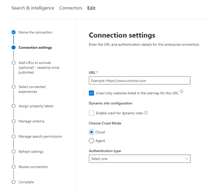

<!---Previous ms.author: monaray --->

<!-- markdownlint-disable no-inline-html -->

# Enterprise连接器Graph网站Enterprise websites Graph connector

通过Enterprise连接器Graph组织可以索引其面向内部的网站 **的文章和内容**。The Enterprise websites Graph connector allows your organization to index articles and **content from its internal-facing websites**. 配置连接器并同步网站内容后，最终用户可以从任何客户端搜索Microsoft 搜索内容。After you configure the connector and sync content from the website, end users can search for that content from any Microsoft Search client.

> [!NOTE]
> 阅读 [**Setup your Graph connector**](configure-connector.md)一文，了解 Graph 连接器的一般设置说明。Read the [**Setup your Graph connector**](configure-connector.md) article to understand the general Graph connectors setup instructions.

本文适用于配置、运行和监视 Enterprise连接器的任何人。This article is for anyone who configures, runs, and monitors an Enterprise websites connector. 它补充了常规安装过程，并显示了仅适用于 Enterprise 连接器的说明。It supplements the general setup process, and shows instructions that apply only for the Enterprise websites connector. 本文还包括有关疑[难解答和](#troubleshooting)[限制的信息](#limitations)。This article also includes information about [Troubleshooting](#troubleshooting) and [Limitations](#limitations).

<!---## Before you get started-->

<!---Insert "Before you get started" recommendations for this data source-->

## 步骤 1：在Graph中添加一个Microsoft 365 管理中心Step 1: Add a Graph connector in the Microsoft 365 admin center

按照常规 [设置说明操作](./configure-connector.md)。Follow the general [setup instructions](./configure-connector.md).
<!---If the above phrase does not apply, delete it and insert specific details for your data source that are different from general setup instructions.-->

## 步骤 2：命名连接Step 2: Name the connection

按照常规 [设置说明操作](./configure-connector.md)。Follow the general [setup instructions](./configure-connector.md).
<!---If the above phrase does not apply, delete it and insert specific details for your data source that are different from general setup instructions.-->

## 步骤 3：配置连接设置Step 3: Configure the connection settings

若要连接到数据源，请填写网站的根 URL，选择爬网源和你要使用的身份验证类型：无、基本身份验证或[包含 Azure Active Directory (Azure AD) ](/azure/active-directory/)的 OAuth 2.0。To connect to your data source, fill in the root URL of the website, select a crawl source, and the type of authentication you'd like to use: None, Basic Authentication, or OAuth 2.0 with [Azure Active Directory (Azure AD)](/azure/active-directory/). 完成此信息后，选择"测试连接"以验证设置。After you complete this information, select Test Connection to verify your settings.

### URLURL

使用 URL 字段指定要爬网的网站的根。Use the URL field to specify the root of the website that you'd like to crawl. 企业网站连接器将使用此 URL 作为起点，并按照此 URL 的所有链接进行爬网。The enterprise websites connector will use this URL as the starting point and follow all the links from this URL for its crawl.

### 对网站地图中列出的网站进行爬网Crawl websites listed in the sitemap

选择后，连接器将仅对网站地图中列出的 URL 进行爬网。When selected the connector will only crawl the URLs listed in the sitemap. 如果未选择或未找到站点地图，连接器将深入爬网在网站的根 URL 上找到的所有链接。If not selected or no site map is found, the connector will do a deep crawl of all the links found on the root URL of the site.

> [!div class="mx-imgBorder"]
> 

### 爬网模式：云或本地Crawl mode: Cloud or On-premises

爬网模式确定要索引的网站类型（云或本地）。The crawl mode determines the type of websites you want to index, either cloud or on-premises. 对于云网站，选择 **"云** "作为爬网模式。For your cloud websites, select **Cloud** as the crawl mode.

此外，连接器现在支持对本地网站进行爬网。Also, the connector now supports crawling of on-premises websites. 若要访问本地数据，必须先安装和配置 Graph 连接器代理。To access your on-premises data, you must first install and configure the Graph connector agent. 若要了解更多信息，请参阅[Graph代理](./on-prem-agent.md)。To learn more, see [Graph connector agent](./on-prem-agent.md).

对于本地网站，选择"代理"作为爬网模式，在"本地代理"字段中，选择之前安装和配置的 Graph 连接器代理。For your on-premises websites, select **Agent** as the crawl mode and in the **On-prem Agent** field, choose the Graph connector agent that you installed and configured earlier.  

### 身份验证Authentication

基本身份验证需要用户名和密码。Basic Authentication requires a username and password. 使用帐户创建此自动程序[Microsoft 365 管理中心。](https://admin.microsoft.com)Create this bot account by using the [Microsoft 365 admin center](https://admin.microsoft.com).

具有 [Azure AD](/azure/active-directory/) 的 OAuth 2.0 需要资源 ID、客户端 ID 和客户端密码。OAuth 2.0 with [Azure AD](/azure/active-directory/) requires a resource ID, Client ID, and Client Secret. OAuth 2.0 仅适用于云模式。OAuth 2.0 only works with Cloud mode.

有关详细信息，请参阅使用[OAuth 2.0 代码Azure Active Directory授权访问 Web](/azure/active-directory/develop/v1-protocols-oauth-code)应用程序。For more information, see [Authorize access to Azure Active Directory web applications using OAuth 2.0 code grant flow](/azure/active-directory/develop/v1-protocols-oauth-code). 注册以下值：Register with the following values:

**名称：Microsoft 搜索****Name:** Microsoft Search  
**Redirect_URI：**`https://gcs.office.com/v1.0/admin/oauth/callback`**Redirect_URI:** `https://gcs.office.com/v1.0/admin/oauth/callback`

若要获取资源、client_id 和 client_secret 的值，请转到使用授权代码请求重定向 URL **网页上的访问** 令牌。To get the values for the resource, client_id, and client_secret, go to **Use the authorization code to request an access token** on the redirect URL webpage.

有关详细信息，请参阅快速入门[：向应用程序注册Microsoft 标识平台。](/azure/active-directory/develop/quickstart-register-app)For even more information, see [Quickstart: Register an application with the Microsoft identity platform](/azure/active-directory/develop/quickstart-register-app).

## 步骤 3a：添加 URL 以排除 (可选的爬网限制) Step 3a: Add URLs to exclude (Optional crawl restrictions)

有两种方法可以阻止对页面进行爬网：禁止在robots.txt文件中对页面进行爬网或将其添加到排除列表。There are two ways to prevent pages from being crawled: disallow them in your robots.txt file or add them to the Exclusion list.

### 支持robots.txtSupport for robots.txt

连接器检查根网站是否存在robots.txt文件，如果存在，它将遵循并遵循该文件中的说明。The connector checks to see if there is a robots.txt file for your root site and, if one exists, it will follow and respect the directions found within that file. 如果您不希望连接器对网站上的某些页面或目录进行爬网，可以在您的 robots.txt 文件中调用这些页面或目录。If you do not want the connector to crawl certain pages or directories on your site, you can call out those pages or directories in the "Disallow" declarations in your robots.txt file.

### 添加要排除的 URLAdd URLs to exclude

您可以选择创建排除列表，以在内容敏感或值得爬网时排除某些 URL 进行爬网。You can optionally create an **Exclusion list** to exclude some URLs from getting crawled if that content is sensitive or not worth crawling. 若要创建排除列表，请浏览根 URL。To create an exclusion list, browse through the root URL. 您可以在配置过程中将排除的 URL 添加到列表中。You can add the excluded URLs to the list during the configuration process.

## 步骤 4：分配属性标签Step 4: Assign property labels

可以通过从选项菜单中选择来为每个标签分配源属性。You can assign a source property to each label by choosing from a menu of options. 虽然此步骤不是必需的，但具有一些属性标签将提高搜索相关性，并确保最终用户获得更准确的搜索结果。While this step isn't mandatory, having some property labels will improve the search relevance and ensure more accurate search results for end users.

## 步骤 5：管理架构Step 5: Manage schema

在"管理架构"屏幕上，可以更改架构属性 (选项包括"查询"、搜索、检索和精简) 与属性关联，添加可选别名，然后选择"**内容**"属性。On the **Manage Schema** screen, you can change the schema attributes (the options are **Query**, **Search**, **Retrieve**, and **Refine**) associated with the properties, add optional aliases, and choose the **Content** property.

## 步骤 6：管理搜索权限Step 6: Manage search permissions

the Enterprise websites connector only supports search permissions visible to **Everyone**.The Enterprise websites connector only supports search permissions visible to **Everyone**. 索引数据将显示在搜索结果中，并且对组织中所有用户可见。Indexed data appears in the search results and is visible to all users in the organization.

## 步骤 7：设置刷新计划Step 7: Set the refresh schedule

Enterprise网站连接器仅支持完全刷新。The Enterprise websites connector only supports a full refresh. 这意味着连接器将在每次刷新过程中对网站的所有内容重新进行crawl。This means that the connector will recrawl all the website's content during every refresh. 若要确保连接器有足够的时间对内容进行爬网，建议您设置一个大型刷新计划间隔。To make sure the connector gets enough time to crawl the content, we recommend that you set a large refresh schedule interval. 我们建议在一到两周之间计划刷新。We recommend a scheduled refresh between one and two weeks.

## 步骤 8：查看连接Step 8: Review connection

按照常规 [设置说明操作](./configure-connector.md)。Follow the general [setup instructions](./configure-connector.md).
<!---If the above phrase does not apply, delete it and insert specific details for your data source that are different from general setup instructions.-->

## 疑难解答Troubleshooting

在读取网站内容时，爬网可能会遇到一些源错误，这些错误由下面的详细错误代码表示。When reading the website's content, the crawl may encounter some source errors, which are represented by the detailed error codes below. 若要获取有关错误类型的详细信息，请转到选择连接后 **的错误** 详细信息页面。To get more information on the types of errors, go to the **error details** page after selecting the connection. 选择 **错误代码** 以查看更详细的错误。Select the **error code** to see more detailed errors. 另请参阅 [管理连接器以了解](./manage-connector.md) 详情。Also refer to [Manage your connector](./manage-connector.md) to learn more.

 详细错误代码Detailed Error code | 错误消息Error message
 --- | ---
 60016001 | 尝试编制索引的网站不可访问The site that is being tried to index is not reachable
 60056005 | 尝试编制索引的源页已因配置robots.txt阻止。The source page that is being tried to index has been blocked by as per robots.txt configuration.
 60086008 | 无法解析 DNSUnable to resolve the DNS
 60096009 | 对于除 HTTP 404 (408) 之外的所有客户端错误，请参阅 HTTP 4xx 错误代码了解详细信息。For all client-side errors (Except HTTP 404, 408), refer to HTTP 4xx error codes for details.
 60136013 | 找不到尝试编制索引的源页。The source page that is being tried to index could not be found.  (HTTP 404 错误) (HTTP 404 error)
 60186018 | 源页面未响应，并且请求已退出。 (HTTP 408 错误) The source page is not responding, and the request has timed out. (HTTP 408 error)
 60216021 | 试图编制索引的源页面在页面上没有文本内容。The source page that is being tried to index has no textual content on the page.
 60236023 | 尝试编制索引的源页不受支持， (HTML 页面) The source page that is being tried to index is unsupported (not an HTML page)
 60246024 | 试图编制索引的源页包含的内容不受支持。The source page that is being tried to index has unsupported content.

* 错误 6001-6013 在数据源因网络问题而不可访问时发生，或者数据源本身被删除、移动或重命名时发生。Errors 6001-6013 occur when the data source is not reachable due to a network issue or when the data source itself is deleted, moved, or renamed. 检查提供的数据源详细信息是否仍然有效。Check if the data source details provided are still valid.
* 当数据源包含页面上的非文本内容或页面不是 HTML 时，将发生错误 6021-6024。Errors 6021-6024 occur when the data source contains non-textual content on the page or when the page is not an HTML. 检查数据源，在排除列表中添加此页面或忽略错误。Check the data source and add this page in exclusion list or ignore the error.

## 限制Limitations

the Enterprise websites connector doesn't support searching data on **dynamic webpages**.The Enterprise websites connector doesn't support searching data on **dynamic webpages**. 这些网页的示例存储在内容管理系统（如 [Confluence](https://www.atlassian.com/software/confluence) 和 [Unily）](https://www.unily.com/) 或存储网站内容的数据库中。Examples of those webpages live in content management systems like [Confluence](https://www.atlassian.com/software/confluence) and [Unily](https://www.unily.com/) or databases that store website content.