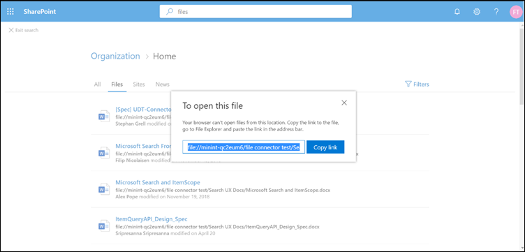

# <a name="file-share-connector"></a><span data-ttu-id="15cc7-103">文件共享连接器</span><span class="sxs-lookup"><span data-stu-id="15cc7-103">File share connector</span></span>

<span data-ttu-id="15cc7-104">使用文件共享连接器，组织中的用户可以搜索内部部署文件共享。</span><span class="sxs-lookup"><span data-stu-id="15cc7-104">With the file share connector, users in your organization can search on-premises file shares.</span></span> <span data-ttu-id="15cc7-105">这些共享中的搜索结果将与[SharePoint](http://sharepoint.com/)和[Microsoft OneDrive for business](https://onedrive.live.com/about/business/)中的结果合并。</span><span class="sxs-lookup"><span data-stu-id="15cc7-105">The search results from these shares merge with the results from [SharePoint](http://sharepoint.com/) and [Microsoft OneDrive for Business](https://onedrive.live.com/about/business/).</span></span>

<span data-ttu-id="15cc7-106">本文适用于[Microsoft 365](https://www.microsoft.com/microsoft-365)管理员或任何配置、运行和监视文件共享连接器的人。</span><span class="sxs-lookup"><span data-stu-id="15cc7-106">This article is for [Microsoft 365](https://www.microsoft.com/microsoft-365) administrators or anyone who configures, runs, and monitors a file share connector.</span></span> <span data-ttu-id="15cc7-107">它说明了如何配置连接器和连接器功能、限制和故障排除技术。</span><span class="sxs-lookup"><span data-stu-id="15cc7-107">It explains how to configure your connector and connector capabilities, limitations, and troubleshooting techniques.</span></span>

## <a name="install-a-data-gateway"></a><span data-ttu-id="15cc7-108">安装 data gateway</span><span class="sxs-lookup"><span data-stu-id="15cc7-108">Install a data gateway</span></span>
<span data-ttu-id="15cc7-109">为了访问第三方数据，您必须安装和配置[Microsoft POWER BI](https://msit.powerbi.com/)网关。</span><span class="sxs-lookup"><span data-stu-id="15cc7-109">In order to access your third-party data, you must install and configure a [Microsoft Power BI](https://msit.powerbi.com/) gateway.</span></span> <span data-ttu-id="15cc7-110">若要了解详细信息，请参阅[安装本地网关](https://docs.microsoft.com/data-integration/gateway/service-gateway-install)。</span><span class="sxs-lookup"><span data-stu-id="15cc7-110">See [Install an on-premises gateway](https://docs.microsoft.com/data-integration/gateway/service-gateway-install) to learn more.</span></span>  

## <a name="content-requirements"></a><span data-ttu-id="15cc7-111">内容要求</span><span class="sxs-lookup"><span data-stu-id="15cc7-111">Content requirements</span></span>
<span data-ttu-id="15cc7-112">**文件类型**。</span><span class="sxs-lookup"><span data-stu-id="15cc7-112">**File types**.</span></span> <span data-ttu-id="15cc7-113">只有这些格式的文件可以编制索引和搜索： DOC、.DOCM、.DOCX、DOT、.DOTX、.EML、GIF、HTML、JPEG、MHT、MHTML、MSG、NWS、.OBD、.OBT、ODP、ODS、ODT、、、、、XLS、.XLSX、.XLT、.pptm、XML、XPS 和 ZIP。</span><span class="sxs-lookup"><span data-stu-id="15cc7-113">Only files in these formats can be indexed and searched: DOC, DOCM, DOCX, DOT, DOTX, EML, GIF, HTML, JPEG, MHT, MHTML, MSG, NWS, OBD, OBT, ODP, ODS, ODT, ONE, PDF, POT, PPS, PPT, PPTM, PPTX, TXT, XLB, XLC, XLSB, XLS, XLSX, XLT, XLXM, XML, XPS, and ZIP.</span></span> <span data-ttu-id="15cc7-114">仅对这些格式的文本内容编制索引。</span><span class="sxs-lookup"><span data-stu-id="15cc7-114">Only the textual content of these formats is indexed.</span></span> <span data-ttu-id="15cc7-115">忽略所有多媒体内容。</span><span class="sxs-lookup"><span data-stu-id="15cc7-115">All multimedia content is ignored.</span></span>
 
<span data-ttu-id="15cc7-116">**文件大小限制**。</span><span class="sxs-lookup"><span data-stu-id="15cc7-116">**File size limits**.</span></span> <span data-ttu-id="15cc7-117">支持的最大文件大小为 100 MB。</span><span class="sxs-lookup"><span data-stu-id="15cc7-117">The maximum supported file size is 100 MB.</span></span> <span data-ttu-id="15cc7-118">将从索引中跳过超过 100 MB 的文件。</span><span class="sxs-lookup"><span data-stu-id="15cc7-118">Files that exceed 100 MB are skipped from indexing.</span></span> <span data-ttu-id="15cc7-119">后处理的最大大小限制为 4 MB。</span><span class="sxs-lookup"><span data-stu-id="15cc7-119">The maximum post-processed size limit is 4 MB.</span></span> <span data-ttu-id="15cc7-120">当文件的大小达到 4 MB 时处理停止。</span><span class="sxs-lookup"><span data-stu-id="15cc7-120">Processing stops when a file's size reaches 4 MB.</span></span> <span data-ttu-id="15cc7-121">因此，文件中存在的某些短语可能不适用于搜索。</span><span class="sxs-lookup"><span data-stu-id="15cc7-121">As a result, some phrases present in the file might not work for search.</span></span>

## <a name="connect-to-a-data-source"></a><span data-ttu-id="15cc7-122">连接到数据源</span><span class="sxs-lookup"><span data-stu-id="15cc7-122">Connect to a data source</span></span>
<span data-ttu-id="15cc7-123">在 "**连接到数据源**" 页上，选择 "**文件共享**" 并提供名称、连接 ID 和说明。</span><span class="sxs-lookup"><span data-stu-id="15cc7-123">On the **Connect to data source** page, select **File share** and provide the name, connection ID, and description.</span></span> <span data-ttu-id="15cc7-124">在下一页上，提供文件共享的路径，然后选择您以前安装的网关。</span><span class="sxs-lookup"><span data-stu-id="15cc7-124">On the next page, provide the path to the file share and select your previously installed gateway.</span></span> <span data-ttu-id="15cc7-125">输入具有对共享中所有文件的读取访问权限的[Microsoft Windows](https://microsoft.com/windows)用户帐户的凭据。</span><span class="sxs-lookup"><span data-stu-id="15cc7-125">Enter the credentials for a [Microsoft Windows](https://microsoft.com/windows) user account with read access to all the files in the share.</span></span> <span data-ttu-id="15cc7-126">请浏览其余设置并发布连接。</span><span class="sxs-lookup"><span data-stu-id="15cc7-126">Go through the rest of the settings and publish the connection.</span></span>

## <a name="set-the-refresh-schedule"></a><span data-ttu-id="15cc7-127">设置刷新计划</span><span class="sxs-lookup"><span data-stu-id="15cc7-127">Set the refresh schedule</span></span>
<span data-ttu-id="15cc7-128">建议的默认刷新计划间隔为15分钟，但您可以将其更改为您喜欢的其他间隔。</span><span class="sxs-lookup"><span data-stu-id="15cc7-128">The recommended default refresh schedule interval is 15 minutes, but you can change it to another interval that you prefer.</span></span>

## <a name="set-up-your-search-results-page"></a><span data-ttu-id="15cc7-129">设置您的搜索结果页</span><span class="sxs-lookup"><span data-stu-id="15cc7-129">Set up your search results page</span></span>
<span data-ttu-id="15cc7-130">若要在 "**全部**" 和 "**文件**" 选项卡中显示不同的文件连接结果，您需要设置[SharePoint](http://sharepoint.com/)搜索引擎结果页：</span><span class="sxs-lookup"><span data-stu-id="15cc7-130">To display different file connection results in the **All** and **Files** tabs, you need to set up a [SharePoint](http://sharepoint.com/) search engine results page:</span></span>
- <span data-ttu-id="15cc7-131">**All**表显示文件连接、SharePoint 文件、 [OneDrive](https://onedrive.live.com/about/business/)文件和 SharePoint 网站的合并结果。</span><span class="sxs-lookup"><span data-stu-id="15cc7-131">The **All** table shows combined results from your file connections, SharePoint files, [OneDrive](https://onedrive.live.com/about/business/) files, and SharePoint sites.</span></span> 
- <span data-ttu-id="15cc7-132">"**文件**垂直" 显示来自连接、SharePoint 和 OneDrive 的所有文件结果。</span><span class="sxs-lookup"><span data-stu-id="15cc7-132">The **Files** vertical shows all file results from your connections, SharePoint, and OneDrive.</span></span>
<span data-ttu-id="15cc7-133">将文件连接中的结果添加到 "**全部**" 和 "**文件**" 行业中已有的结果。</span><span class="sxs-lookup"><span data-stu-id="15cc7-133">Results from file connections are added to already existing results in both the **All** and **Files** verticals.</span></span>

<span data-ttu-id="15cc7-134">若要设置搜索结果页面，请执行以下步骤：</span><span class="sxs-lookup"><span data-stu-id="15cc7-134">To set up your search results page, take these steps:</span></span>
1. <span data-ttu-id="15cc7-135">使用新式搜索页面创建 SharePoint 网站集。</span><span class="sxs-lookup"><span data-stu-id="15cc7-135">Create a SharePoint site collection with a modern search page.</span></span>

2. <span data-ttu-id="15cc7-136">安装[SharePoint Online 命令行管理](https://www.microsoft.com/download/details.aspx?id=35588)程序。</span><span class="sxs-lookup"><span data-stu-id="15cc7-136">Install a [SharePoint Online Management Shell](https://www.microsoft.com/download/details.aspx?id=35588).</span></span>

3. <span data-ttu-id="15cc7-137">以管理员身份打开 SharePoint Online 命令行管理程序，并导入现有的**Microsoft.SharePoint.Client.dll**模块 `C:\Windows\Microsoft.NET\assembly\GAC_MSIL\Microsoft.SharePoint.Client\v4.0_16.0.0.0__71e9bce111e9429c\Microsoft.SharePoint.Client.dll` 。</span><span class="sxs-lookup"><span data-stu-id="15cc7-137">Open SharePoint Online Management Shell as an administrator and import the **Microsoft.SharePoint.Client.dll** module present at `C:\Windows\Microsoft.NET\assembly\GAC_MSIL\Microsoft.SharePoint.Client\v4.0_16.0.0.0__71e9bce111e9429c\Microsoft.SharePoint.Client.dll`.</span></span>

> [!NOTE]
> <span data-ttu-id="15cc7-138">对于所有用户而言，此路径可能不相同。</span><span class="sxs-lookup"><span data-stu-id="15cc7-138">This path might not be the same for all users.</span></span>

<span data-ttu-id="15cc7-139">若要导入模块，请在[SharePoint Online 命令行管理](https://www.microsoft.com/download/details.aspx?id=35588)程序中运行以下命令：</span><span class="sxs-lookup"><span data-stu-id="15cc7-139">To import the module, run this command in [SharePoint Online Management Shell](https://www.microsoft.com/download/details.aspx?id=35588):</span></span>
```bash
Import-Module "C:\Windows\Microsoft.NET\assembly\GAC_MSIL\Microsoft.SharePoint.Client\v4.0_16.0.0.0__71e9bce111e9429c\Microsoft.SharePoint.Client.dll" 
```

4. <span data-ttu-id="15cc7-140">现在运行以下脚本：</span><span class="sxs-lookup"><span data-stu-id="15cc7-140">Now run this script:</span></span>
```bash
$orgName = Read-Host -prompt 'Please enter your org name'
$userName = Read-Host -prompt 'Enter user name'
$userCreds = Get-Credential -UserName $userName -Message "Type the password"
Connect-SPOService -Url https://$orgName-admin.sharepoint.com -Credential $userCreds

$url = Read-Host -Prompt 'Please enter the site url'
$site = Get-SPOSite -Identity $url
Set-SPOSite $url -DenyAddAndCustomizePages 0

$pwd = Read-Host -AsSecureString 'type the password'
$context = New-Object Microsoft.SharePoint.Client.ClientContext($url)
$credential = New-Object Microsoft.SharePoint.Client.SharePointOnlineCredentials($userName, $pwd)
$context.Credentials = $credential
$web = $context.Web
$context.Load($web)
$web.AllProperties["AllVerticalContent"] = "Combined"
$web.Update()
$context.ExecuteQuery()
$web.AllProperties["FilesVerticalContent"] = "ConnectorsOnly"
$web.Update()
$context.ExecuteQuery()
Set-SPOSite $url -DenyAddAndCustomizePages 1

Write-Host "Success" -ForegroundColor Cyan
Read-Host -Prompt 'Press enter to exit'
```

5. <span data-ttu-id="15cc7-141">在[Microsoft PowerShell](https://microsoft.com/powershell)中输入所需的值，例如 "组织名称"、"用户名"、"密码" 和 "网站 URL"。</span><span class="sxs-lookup"><span data-stu-id="15cc7-141">Enter the required values in [Microsoft PowerShell](https://microsoft.com/powershell), such as organization name, username, password, and site URL.</span></span> <span data-ttu-id="15cc7-142">**例如**，如果您的管理员凭据为 `admin@a830edad9050849823J19081300.onmicrosoft.com` ，则您的组织名称为**a830edad9050849823J19081300**，而您的网站 URL 为 `https:// a830edad9050849823J19081300.sharepoint.com` 。</span><span class="sxs-lookup"><span data-stu-id="15cc7-142">As an **example**, if your admin credentials are `admin@a830edad9050849823J19081300.onmicrosoft.com`, then your organization name is **a830edad9050849823J19081300**, and your site URL is `https:// a830edad9050849823J19081300.sharepoint.com`.</span></span>

> [!NOTE]
> <span data-ttu-id="15cc7-143">仅可在网站集级别（团队/Comms 网站）上执行**AllProperties**设置。</span><span class="sxs-lookup"><span data-stu-id="15cc7-143">The **AllProperties** setting can only be done at a site collection level (Teams/Comms site).</span></span>

6. <span data-ttu-id="15cc7-144">现在，您可以搜索已编制索引的文件，并在 "**全部**" 和 "**文件**" 选项卡中查看结果。</span><span class="sxs-lookup"><span data-stu-id="15cc7-144">Now you can search for indexed files and see results in both the **All** and **Files** tabs.</span></span>

## <a name="search-for-file-share-content-in-the-search-results-page"></a><span data-ttu-id="15cc7-145">在搜索结果页中搜索文件共享内容</span><span class="sxs-lookup"><span data-stu-id="15cc7-145">Search for file share content in the search results page</span></span>
<span data-ttu-id="15cc7-146">若要搜索已编制索引的内容，请转到测试租户的[SharePoint](http://sharepoint.com/)主页。</span><span class="sxs-lookup"><span data-stu-id="15cc7-146">To search for indexed content, go to the [SharePoint](http://sharepoint.com/) home page of your test tenant.</span></span> <span data-ttu-id="15cc7-147">结果将显示在 "**所有**" 和 "**文件**" 选项卡中。</span><span class="sxs-lookup"><span data-stu-id="15cc7-147">Results will be displayed in the **All** and **Files** tabs.</span></span>

<span data-ttu-id="15cc7-148">由于浏览器限制，无法从本地文件共享搜索中选择要查看或打开文件的文件结果。</span><span class="sxs-lookup"><span data-stu-id="15cc7-148">Because of browser restrictions, you can't select a file result to view or open files from local file share searches.</span></span> <span data-ttu-id="15cc7-149">若要打开这些文件，请复制文件结果的链接，并将其粘贴到系统浏览器的地址栏中。</span><span class="sxs-lookup"><span data-stu-id="15cc7-149">To open these files, copy the file result's link and paste it into the address bar of your system's browser.</span></span> <span data-ttu-id="15cc7-150">对于[windows](https://microsoft.com/windows)，请使用 Windows 资源管理器。</span><span class="sxs-lookup"><span data-stu-id="15cc7-150">For [Windows](https://microsoft.com/windows), use Windows Explorer.</span></span> <span data-ttu-id="15cc7-151">然后，您可以在系统上打开该文件。</span><span class="sxs-lookup"><span data-stu-id="15cc7-151">Then you can open the file on your system.</span></span>



## <a name="troubleshooting"></a><span data-ttu-id="15cc7-153">故障排除</span><span class="sxs-lookup"><span data-stu-id="15cc7-153">Troubleshooting</span></span>
<span data-ttu-id="15cc7-154">如果连接出现严重错误，其状态将显示为 "**失败**"。</span><span class="sxs-lookup"><span data-stu-id="15cc7-154">If something is critically wrong with a connection, its status shows as **failed**.</span></span> <span data-ttu-id="15cc7-155">若要获取有关三种错误类型的详细信息，请转到**错误详细信息**页面，然后选择 "失败的连接"。</span><span class="sxs-lookup"><span data-stu-id="15cc7-155">To get more information on the three types of errors, go to the **error details** page and select the failing connection.</span></span> <span data-ttu-id="15cc7-156">请参阅[管理连接器](manage-connector.md)以了解详细信息。</span><span class="sxs-lookup"><span data-stu-id="15cc7-156">See [Manage your connector](manage-connector.md) to learn more.</span></span>
1. <span data-ttu-id="15cc7-157">**网关不可访问（错误代码：11）**。</span><span class="sxs-lookup"><span data-stu-id="15cc7-157">**Gateway not reachable (error code: 11)**.</span></span> <span data-ttu-id="15cc7-158">连接的网关计算机已关闭。</span><span class="sxs-lookup"><span data-stu-id="15cc7-158">The gateway machine for the connection is down.</span></span> <span data-ttu-id="15cc7-159">验证[POWER BI](https://msit.powerbi.com/)进程是否在网关计算机上运行。</span><span class="sxs-lookup"><span data-stu-id="15cc7-159">Verify if the [Power BI](https://msit.powerbi.com/) process runs on the gateway machine.</span></span>
2. <span data-ttu-id="15cc7-160">**身份验证错误（错误代码：12）**。</span><span class="sxs-lookup"><span data-stu-id="15cc7-160">**Authentication error (error code: 12)**.</span></span> <span data-ttu-id="15cc7-161">用于创建连接的凭据已过期或已不再有效。</span><span class="sxs-lookup"><span data-stu-id="15cc7-161">The credentials that were used for creating the connection expired or are no longer valid.</span></span> <span data-ttu-id="15cc7-162">若要解决此错误，请输入有效的凭据。</span><span class="sxs-lookup"><span data-stu-id="15cc7-162">To resolve this error, enter valid credentials.</span></span>
3. <span data-ttu-id="15cc7-163">**内部错误（错误代码：11或12之外的任何内容）**。</span><span class="sxs-lookup"><span data-stu-id="15cc7-163">**Internal error (error code: anything other than 11 or 12)**.</span></span> <span data-ttu-id="15cc7-164">连接器基础结构中存在错误。</span><span class="sxs-lookup"><span data-stu-id="15cc7-164">There's an error in the connector infrastructure.</span></span> <span data-ttu-id="15cc7-165">若要了解如何报告这些错误，请参阅[反馈](connectors-feedback.md)文章。</span><span class="sxs-lookup"><span data-stu-id="15cc7-165">See the [Feedback](connectors-feedback.md) article to find out how to report these errors.</span></span>

## <a name="limitations"></a><span data-ttu-id="15cc7-166">限制</span><span class="sxs-lookup"><span data-stu-id="15cc7-166">Limitations</span></span>
<span data-ttu-id="15cc7-167">文件共享连接器在预览版本中具有以下限制：</span><span class="sxs-lookup"><span data-stu-id="15cc7-167">The file share connector has these limitations in the preview release:</span></span>
* <span data-ttu-id="15cc7-168">只能使用固定属性（而不是使用自定义属性的文件）对文件编制索引。</span><span class="sxs-lookup"><span data-stu-id="15cc7-168">You can only index files with fixed properties, not files with custom properties.</span></span>
* <span data-ttu-id="15cc7-169">目前不支持文件共享访问控制列表（Acl）。</span><span class="sxs-lookup"><span data-stu-id="15cc7-169">File share Access Control Lists (ACLs) aren't currently supported.</span></span> <span data-ttu-id="15cc7-170">仅支持文件 NTFS Acl。</span><span class="sxs-lookup"><span data-stu-id="15cc7-170">Only file NTFS ACLs are supported.</span></span>
* <span data-ttu-id="15cc7-171">不支持外部标识。</span><span class="sxs-lookup"><span data-stu-id="15cc7-171">External identities aren't supported.</span></span> <span data-ttu-id="15cc7-172">它们必须映射到[Azure Active Directory](https://docs.microsoft.com/azure/active-directory/)标识。</span><span class="sxs-lookup"><span data-stu-id="15cc7-172">They must be mapped to [Azure Active Directory](https://docs.microsoft.com/azure/active-directory/) identities.</span></span>
