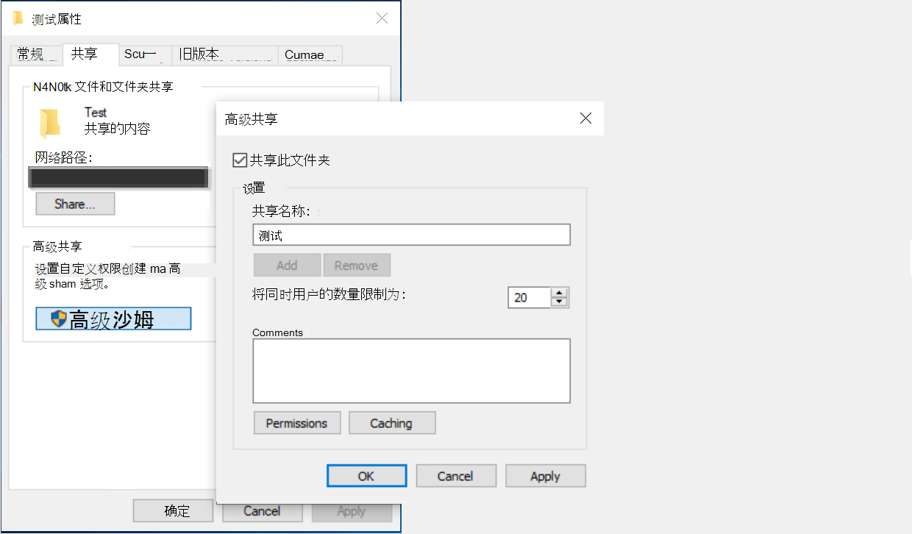

<!---Previous ms.author: rusamai --->

# 文件共享Graph连接器

文件共享Graph连接器允许贵组织的用户搜索本地Windows文件共享。

> [!NOTE]
> 阅读 [**Setup for your Graph connector**](configure-connector.md)一文，了解 Graph 连接器的一般设置过程。

## 在开始使用之前

### 安装 Graph 连接器代理

若要为Windows索引，必须安装并注册连接器Graph代理。 有关详细信息[，请参阅](graph-connector-agent.md)Graph连接器代理。  

### 内容要求

### 文件类型

可索引和搜索以下格式的内容：DOC、 DOCM、DOCX、DOT、DOTX、EML、GIF、HTML、JPEG、MHT、MHTML、MSG、NWS、OBD、OBT、ODP、ODS、ODT、ONE、PDF、POT、PPS、PPT、PPTM、PPTX、TXT、XLB、XLC、XLSB、XLS、XLSX、XLT、XLXM、XML、XPS 和 ZIP。 仅对这些格式的文本内容编制索引。 将忽略所有多媒体内容。 对于不属于此格式的任何文件，仅对元数据编制索引。

### 文件大小限制

支持的最大文件大小为 100 MB。 超过 100 MB 的文件不会编制索引。 处理后的最大大小限制为 4 MB。 当文件大小达到 4 MB 时，处理将停止。 因此，文件中有些短语可能无法用于搜索。

## 步骤 1：在Graph中添加一个Microsoft 365 管理中心

按照常规 [设置说明操作](./configure-connector.md)。
<!---If the above phrase does not apply, delete it and insert specific details for your data source that are different from general setup instructions.-->

## 步骤 2：命名连接

按照常规 [设置说明操作](./configure-connector.md)。
<!---If the above phrase does not apply, delete it and insert specific details for your data source that are different from general setup instructions.-->

## 步骤 3：配置连接设置

在 **"连接数据源"** 页上，选择"文件共享"并提供名称、连接 ID 和说明。 下一页，提供文件共享的路径并选择之前安装的连接器Graph代理。 输入 Microsoft [Windows用户帐户的](https://microsoft.com/windows)凭据，该帐户具有对文件共享中所有文件的读取访问权限。

### 保留上一次访问时间

当连接器尝试对文件进行爬网时，将更新其元数据中的"上次访问时间"字段。 如果您依赖该字段作为任何存档和备份解决方案，并且不希望在连接器访问它时对其进行更新，您可以在"高级设置"页 **中配置** 此选项。

## 步骤 4：管理搜索权限

您可以通过在"管理搜索权限"页中选择所需选项，来限制基于"共享访问控制列表"或"新建技术文件系统 (NTFS) 访问控制列表"搜索任何 **文件的权限。** 这些访问控制列表中提供的用户帐户和组必须由 Active Directory (AD) 。 如果要将任何其他系统用于用户帐户管理，可以选择"每个人"选项，这将允许用户搜索所有文件，而没有任何访问限制。 但是，当用户尝试打开文件时，将应用在源上设置的访问控制。

请注意，默认情况下，当在网络共享文件夹时，Windows 会为共享 ACL 中的"每个人"提供"读取"权限。 通过扩展名，如果在"管理搜索权限"中选择"共享 **ACL"，** 用户将能够搜索所有文件。 如果要限制访问，请删除文件共享中"任何人"的"读取"访问权限，并仅向所需的用户和组提供访问权限。 然后，连接器读取这些访问限制，并应用这些限制进行搜索。

只有在提供的共享路径遵循 UNC 路径格式时，才能选择"共享 ACL"。 可以通过在"共享"选项下进入"高级共享"来创建 UNC 格式的路径。

## 步骤 5：分配属性标签

按照常规 [设置说明操作](./configure-connector.md)。
<!---If the above phrase does not apply, delete it and insert specific details for your data source that are different from general setup instructions.-->

## 步骤 6：管理架构

按照常规 [设置说明操作](./configure-connector.md)。
<!---If the above phrase does not apply, delete it and insert specific details for your data source that are different from general setup instructions.-->

## 步骤 7：选择刷新设置

按照常规 [设置说明操作](./configure-connector.md)。
<!---If the above phrase does not apply, delete it and insert specific details for your data source that are different from general setup instructions.-->

## 步骤 8：查看连接

按照常规 [设置说明操作](./configure-connector.md)。
<!---If the above phrase does not apply, delete it and insert specific details for your data source that are different from general setup 
instructions.-->

<!---## Troubleshooting-->
<!---Insert troubleshooting recommendations for this data source-->

<!---## Limitations-->
<!---Insert limitations for this data source-->