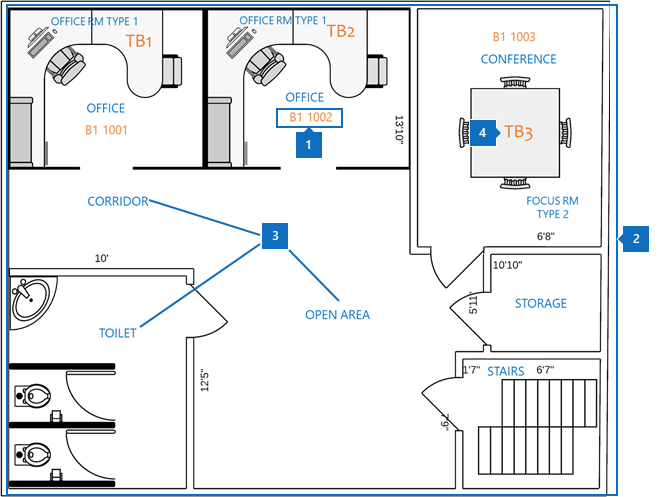

# 最佳做法

若要成功实现 Microsoft Search 平面图计划，您需要协调三个数据片段：

- **生成位置数据**：什么格式以及如何添加？
- **DWG 格式的平面布置图地图**：如何查看它包含哪些数据以获得最大成功？
- ** [Azure Active Directory （azure AD）](https://azure.microsoft.com/services/active-directory/)中的员工办公室位置**：要使用什么格式以及如何添加？  

以下各节也介绍了部署 Microsoft 搜索平面布置图的最佳做法。

## 生成位置数据
在添加平面布置图之前，需要将建筑物添加到 Microsoft 搜索位置。 提供以下所需的生成数据：

|生成数据所需  |示例  |
|---------|---------|
|名称     |    建筑物1、纽约城市     |
|街道地址     |     123任何途径，纽约，纽约州10118  |
|纬度-经度（可选）   |    40.760539，-73.975341      |
|关键字     |    纽约办事处，建筑物1，总公司，总部     |

您可以通过使用 "**位置**" 选项卡中的 "**导入**" 功能，而不是一次添加一个位置，来一次添加多个建筑物。 使用**导入**功能，可以指定纬度-经度。 有关详细信息，请参阅[管理位置](manage-locations.md)。

## DWG 格式的楼面平面图地图
若要在 Microsoft Search 中构建地图，需要在 DWG 格式中上载包含特定信息的平面布置图。 若要了解如何创建和查看 DWG 格式的文件，请参阅[Dwg 查看](https://www.autodesk.in/products/dwg)器。 

楼面平面图地图显示四个元素：

1. **房间号码**：在以下示例中，房间号码定义为**B1 1001**和**b1 1002**。 **B1**是生成代码，1001包含底价号**1**和办公室号**001**。
1. **会议室布局。**：若要帮助阐明多个用户共享 office 时的详细信息，您可以定义椅子和书桌等布局。
1. **会议室类型**：一些示例包括 office、corridor、开放式区域和抽水马桶。
1. **资产信息**：如果用户在开放的空间中，则可以指示他们所在的办公桌。 在此示例中，办公桌由**TB1**和**TB2**表示。

在此图中，房间号码是最重要的项。 它们映射到用户帐户上的某个人的办公室位置，如下图中所示。

此信息存储在 Azure AD 中的**PhysicalDeliveryOfficeName**属性中。 在 Microsoft 365[管理中心](https://admin.microsoft.com)，它称为**Office**属性，可在**活动用户**中添加。

### DWG 文件
Microsoft Search 需要 DWG 中的平面布置图文件，这是格式为 AutoCAD 绘图格式的格式。 这些文件必须包含**布局**和**标签**数据。 **房间号码**是平面布置图最重要的标签。

建议使用下表中所示的完全匹配方法创建 office 编号系统。 但您并不局限于该标记。 例如，如果用户在 Azure AD 中的办公室位置是**B1 1001**，则可以使用下面的任意选项在 DWG 文件中标记房间号码。

|Match  |布局  |
|---------|---------|
|与办公室位置的完全匹配（推荐）   **B1 1001**   生成代码： B1 基底：1  会议室编号：001    |         |
|匹配楼层和房间号   **1001** 基底：1  会议室编号：001    |      |
|仅匹配会议室号码   **1** 会议室编号：1        |         |

## 用户帐户办公地点
若要映射员工的位置，DWG 文件中的房间号码将映射到 Azure AD 中的用户帐户中的办公室位置。 **Office location**属性需要与 DWG 文件中的 office 位置信息相匹配。

下表介绍了映射位置数据的最佳做法：

|最佳做法  |说明 |
|---------|---------|
|包括建筑物代码、基底和房间号。     |   此数据为您提供了完全匹配的最佳机会。     |
|生成代码和楼层后包含分隔符。     |  使用分隔符或空格将建筑物代码从楼层和房间号分离，如以下示例所示：  B1 1001  B1/1001   B1-1001   |
|会议室编号始终遵循生成代码、翼和地板信息。     |  如果房间号为**1001**，则将办公地点设置为**b1 1001**、 **b1/1001**或**b1-1001**。   如果房间号为**F1-001**，则将办公位置设置为**b1 F1-001**或**b1/F1-001**。   如果房间号为**1**，则将 Azure AD 位置设置为**b1 1001**、 **B1/1001**或**B1-001**。       |
|

## 后续步骤
[管理位置](manage-locations.md) 
[管理基底计划](manage-floorplans.md)