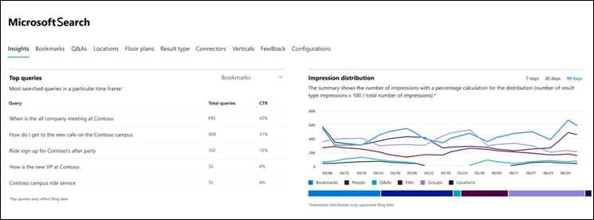
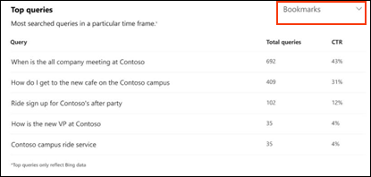
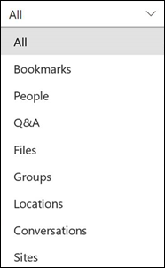
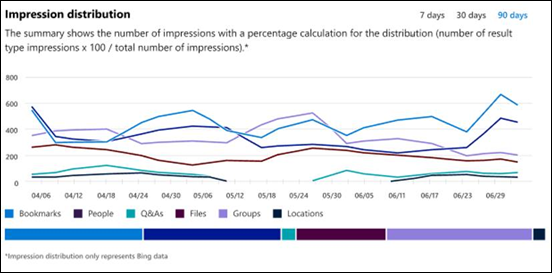

# Microsoft Search Insights 仪表板报告

您可以使用 Microsoft Search Insights 仪表板来管理已发布的答案的[必应](https://Bing.com)数据。 这只是[使内容易于查找](make-content-easy-to-find.md)您的用户所需的步骤之一。

首次转到 Microsoft 365[管理中心](https://admin.microsoft.com)中的 microsoft 搜索时，请在 "见解" 仪表板上输入。

"见解" 仪表板上提供了以下报告。

> [!NOTE]
> 报告中的数据仅表示[必应](https://Bing.com)数据。

## 热门查询

此报告提供用户运行的前 2000[必应](https://Bing.com)搜索查询的详细信息。 若要在**Top 查询**中显示查询，查询必须至少有三次单击。

较低的即点即用速率（CTR）意味着用户找不到要查找的内容。

您可以通过筛选答案的类型来选择报告的不同视图。 例如，如果只想查看书签的顶部查询，请选择报表右上角的下拉箭头，然后选择 "**书签**"。 默认情况下，将显示**所有**答案类型。

## 印记分布

此报告显示[必应 Bing](https://Bing.com)分布在 Bing 一段时间内的各种答案。 示例包括书签、人员、问答&、文件、位置、文件网站、组和对话。

"印象分布" 可帮助管理员了解在指定时间段内用户查找的内容。
