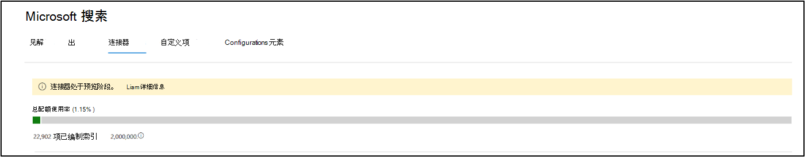

<!-- markdownlint-disable no-inline-html -->

# 监视连接Monitor your connections

若要访问和管理连接器，必须指定为租户的搜索管理员。To access and manage your connectors, you must be designated as a search administrator for your tenant. 请与租户管理员联系，预配搜索管理员角色。Contact your tenant administrator to provision you for the search administrator role.

## 连接操作Connection Operations

导航 [到](https://admin.microsoft.com/Adminportal/Home#/MicrosoftSearch/Connectors) Microsoft 365 管理中心中的 ["连接器"选项卡](https://admin.microsoft.com)。Navigate to the [Connectors tab](https://admin.microsoft.com/Adminportal/Home#/MicrosoftSearch/Connectors) in the [Microsoft 365 admin center](https://admin.microsoft.com).

对于每种连接器类型 [，Microsoft 365 管理](https://admin.microsoft.com) 中心支持下表中所示的操作：For each connector type, the [Microsoft 365 admin center](https://admin.microsoft.com) supports the operations shown in the following table:

OperationOperation | Microsoft 构建的连接器Microsoft-built connector | 合作伙伴或自定义生成连接器Partner or custom-built connector
--- | --- | ---
添加连接Add a connection | ：heavy_check_mark： (请参阅[配置 Microsoft 构建的连接器) ](configure-connector.md):heavy_check_mark: (See [Configure your Microsoft-built connector](configure-connector.md)) | ：x： (参考合作伙伴或自定义生成连接器管理员 UX) :x: (Refer to your partner or custom-built connector admin UX)
删除连接Delete a connection | :heavy_check_mark: | :heavy_check_mark:
编辑已发布的连接Edit a published connection | ：heavy_check_mark： Name:heavy_check_mark: Name   ：heavy_check_mark：说明:heavy_check_mark: Description   ：heavy_check_mark：外部数据源的身份验证凭据:heavy_check_mark: Authentication credentials for your external data source   ：heavy_check_mark：本地数据源的网关凭据:heavy_check_mark: Gateway credentials for your on-premises data source   ：heavy_check_mark：刷新计划:heavy_check_mark: Refresh schedule   | ：heavy_check_mark： Name:heavy_check_mark: Name   ：heavy_check_mark：说明:heavy_check_mark: Description
编辑草稿连接Edit a draft connection | :heavy_check_mark: | :x:

## 监视连接状态Monitor your connection status

创建连接后，已处理项目的数量会显示在 Microsoft 搜索页上的"连接器"**选项卡** 上。After you create a connection, the number of processed items shows on the **Connectors** tab on the **Microsoft Search** page. 初始完全爬网成功完成后，将显示定期增量爬网的进度。After the initial full crawl completes successfully, the progress for periodic incremental crawls displays. 此页面提供有关连接器日常操作的信息以及日志和错误历史记录的概述。This page provides information about the connector's day-to-day operations and an overview of the logs and error history.

"状态"列中针对每个 **连接显示** 四种状态：Four states show up in the **Status** column against each connection:

* **正在同步**。**Syncing**. 连接器正在对源数据进行爬网，以对现有项目编制索引并进行更新。The connector is crawling the data from the source to index the existing items and make any updates.

* **已启用**：连接已启用，并且没有针对它运行的活动爬网。**Enabled**: The connection is enabled, and there's no active crawl running against it. **上次同步** 时间指示上次成功爬网的时间。**Last sync time** indicates when the last successful crawl happened. 连接与上次同步时间一样新鲜。The connection is as fresh as the last sync time.

* **已暂停**。**Paused**. 管理员通过暂停选项暂停爬网。The crawls are paused by the admins through the pause option. 下一次爬网仅在手动恢复时运行。The next crawl runs only when it's manually resumed. 但是，此连接的数据仍然可搜索。However, the data from this connection continues to be searchable.

* **失败**。**Failed**. 连接出现严重故障。The connection had a critical failure. 此错误需要手动干预。This error requires manual intervention. 管理员需要根据显示的错误消息采取相应的操作。The admin needs to take appropriate action based on the error message shown. 在发生错误之前已编制索引的数据是可搜索的。Data that was indexed until the error occurred is searchable.

## 监视索引配额使用率Monitor your index quota utilization

可用的索引配额和消耗显示在连接器登录页上。The available index quota and consumption is displayed on the connectors landing page.

>[!NOTE]
>在预览期间，每个尝试使用 Graph 连接器的组织都获得一个免费的固定配额，在所有连接中最多包含 200 万个项目。During the preview period, every organization trying out Graph connectors was provided a free fixed quota of up to 2 million items across all connections. 随着 Graph 连接器的发布，对于一直预览版使用 Graph 连接器的组织，免费配额将于 2021 年 2 月 1 日到期。With Graph connectors being generally available, the free quota will expire on Feb 1st, 2021 for those organizations who have been using Graph connectors in preview.
>标记为"预览"的 Microsoft 构建的 Graph 连接器不会包含在组织的总收费索引配额中。Microsoft-built Graph connectors labeled as ["Preview"](connectors-preview.md) will not be included in the total charged index quota for your organization. 但是，它算作可以为组织配置的最大 10 个连接数，以及组织可以跨连接编制索引的最大 700 万个项目数;每个连接限制为 700，000 个项目。However, it will count towards the max number of 10 connections you can configure for your organization and the max number of 7 million items your organization can index across connections; each connection is limited 700,000 items. 

配额利用率栏将基于组织配额的使用情况指示各种状态：The quota utilization bar will indicate various states based on consumption of quota by your organization:

状态State | 配额消耗Quota consumption
--- | ---
一般Normal | 1-69%1-69%
高High | 70-89%70-89%
关键Critical | 90%-99%90%-99%
完整Full | 100%100%

索引的项目数也会随每个连接一起显示。The number of items indexed will also be displayed with each connection. 每个连接编制索引的项目数将影响可供组织使用的总配额。The number of items indexed by each connection contributes to the total quota available for your organization.

当超出组织的索引配额时，所有活动连接都将受到影响，并且这些连接将超出 **限制状态** 。When index quota is exceeded for your organization, all active connections will be impacted, and those connections will operate in **limit exceeded** state. 在此状态中，活动连接In this state, your active connections  

* 将无法添加新项。Will not be able to add new items.

* 将能够更新或删除现有项目。Will be able to update or delete existing items.

若要解决此问题，可以执行下列任一操作：To fix this, you can do any of the following:

* 了解如何根据许可要求和定价为组织 [购买索引配额](licensing.md)。Learn how to purchase index quota for your organization at [Licensing requirements and pricing](licensing.md).

* 确定要包含过多内容的连接，并更新这些连接以索引较少的项目，以为配额提供空间。Identify connections which have too much content being ingested and update them to index fewer items to make room for quota. 若要更新连接，必须使用引入筛选器删除并创建一个新连接，该筛选器将引入较少的项目。To update the connection, you must delete and create a new connection with a new ingestion filter which brings in fewer items.

* 永久删除一个或多个连接Permanently delete one or more connections