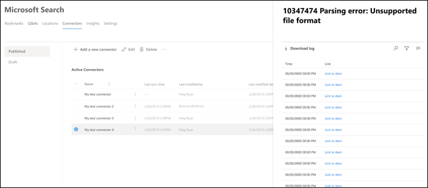

<!-- markdownlint-disable no-inline-html -->

# 管理 Microsoft 搜索的连接

若要访问和管理连接器，必须将其指定为租户的搜索管理员。 请联系你的租户管理员，为你提供搜索管理员角色。

## 入门

导航到[Microsoft 365 管理中心](https://admin.microsoft.com)中的 "[连接器" 选项卡](https://admin.microsoft.com/Adminportal/Home#/MicrosoftSearch/Connectors)。

对于每种连接器类型， [Microsoft 365 管理中心](https://admin.microsoft.com) 支持下表中所示的操作：

Operation | Microsoft 构建的连接器 | 合作伙伴或自定义生成的连接器
--- | --- | ---
添加连接 | ： heavy_check_mark： (请参阅 [配置 Microsoft 构建的连接器](configure-connector.md))  | ： x： (指的是合作伙伴或自定义的连接器管理员 UX) 
删除连接 | :heavy_check_mark: | :heavy_check_mark:
编辑已发布的连接 | ： heavy_check_mark： Name   ： heavy_check_mark：说明   ： heavy_check_mark：外部数据源的身份验证凭据   ： heavy_check_mark：本地数据源的网关凭据   ： heavy_check_mark：刷新计划   | ： heavy_check_mark： Name   ： heavy_check_mark：说明
编辑拔模连接 | :heavy_check_mark: | :x:

## 监视连接状态

创建连接后，已处理的项目数显示在 **Microsoft 搜索** 页面上的 "**连接器**" 选项卡上。 成功完成初始完全爬网后，会显示定期增量爬网的进度。 此页面提供有关连接器的日常操作的信息，以及日志和错误历史记录的概述。

" **状态** " 列中显示的四种状态针对每个连接：

* **同步**。 连接器将对源中的数据进行爬网，以对现有项目编制索引并进行任何更新。

* **已启用**：连接已启用，并且没有对其运行的活动爬网。 **上次同步时间** 表示上次成功爬网发生的时间。 连接与上次同步时间一样新。

* **暂停**。 管理员通过 "暂停" 选项暂停爬网。 下一次爬网仅在手动恢复时运行。 但是，此连接中的数据将继续可搜索。

* **失败**。 连接发生严重故障。 此错误需要手动干预。 管理员需要根据所显示的错误消息采取适当的操作。 在出现错误之前编制索引的数据是可搜索的。

### 查看你的上次爬网信息

成功完成第一次增量或完全爬网后，最后一次爬网数据值将显示在详细信息窗格中的最后一个爬网标头下。 如果没有运行的上次爬网，则在上一次爬网标头下将看不到任何信息。 有关上次爬网的信息将帮助您深入了解爬网的执行方式并在需要的地方执行必要的步骤。

每个连接将提供以下上次爬网值：

值 | 说明
--- | ---
完成时间 | 上次爬网完成的日期和时间
类型 | 增量爬网或完全爬网
持续时间 | 完成最后一次爬网需要多长时间
成功 | 上次爬网中已成功引入的项目数
错误 | 上次爬网中导致的项目数

### 监视错误

对于 "**连接器**" 选项卡上的每个 **活动连接器**，"**错误**" 选项卡下将显示任何现有的爬网错误。该选项卡列出错误代码、每个错误的计数以及错误日志下载选项。 请参阅下图中的示例。 选择 **错误代码** 以查看错误的详细信息。

若要查看错误的特定详细信息，请选择其错误代码。 屏幕上会显示错误详细信息和链接。 最新错误显示在顶部。 请参阅下表中的示例。

下面列出了可针对任何连接显示的不同错误。 如果这些解决方案不起作用，请联系支持部门或向我们发送 [反馈](connectors-feedback.md)。

错误代码 | 错误消息 | 解决方案
--- | --- | ---
1000 | 数据源不可用。 请检查 internet 连接或确保该连接器仍可访问该数据源。 | 当数据源由于网络问题或数据源本身被删除、移动或重命名而无法访问时，将发生此错误。 检查提供的数据源详细信息是否仍然有效。
1001 | 无法更新数据，因为数据源正在限制连接器。 | 若要 unthrottle 数据源，请检查其规模限制是否可以增加，或等待一天内的流量较长的时间。
1002 | 无法对数据源进行身份验证。 验证与此数据源关联的凭据是否正确。 | 单击 " **编辑** " 以更新身份验证凭据。
1003 | 与连接器关联的帐户无权访问该项目。 |  确保正确的帐户具有对要编制索引的项目的访问权限。
1004 | 无法访问本地数据网关。 请确保网关服务正在运行，并且在连接配置中更新了网关详细信息。 | 使用网关检查计算机，打开 Power BI 网关应用程序，并确保网关正在运行。 验证网关使用的是与 Microsoft 搜索相同的管理员帐户，然后确保连接配置中的所有网关详细信息都已更新。
1005 | 与此数据源关联的凭据已过期。 续订凭据并更新连接。 | 单击 " **编辑** " 以更新身份验证凭据。
1006 | 您的网关版本已过期，不会再支持此连接器。 你将需要更新网关。 | 请访问 [安装本地 data gateway](https://docs.microsoft.com/data-integration/gateway/service-gateway-install) ，以在包含网关的计算机上下载并安装最新版本的 Power BI 网关。
1007 | 未检测到有效的 Power BI 许可证。 您需要有效的 Power BI 许可证来执行此爬网。 | 您需要有效的 Power BI 许可证来执行此爬网。 请检查您的组织是否具有有效的许可证。 如果是，请再试一次。 如果不是，请获取许可证，然后重试。
1008 | 租户的总配额使用率已达到其限制。 尝试删除连接以释放一些配额，或调整摄取筛选器以引入较少的数据。 | 尝试删除连接以释放一些配额，或调整摄取筛选器以引入较少的数据。 如果不能解决问题，请联系 Microsoft 支持部门。
2001 | 由于队列中的更新数过多，索引被限制。 根据队列的不同，可能需要一段时间才能完成更新。 | 请等待队列被清除。
2002 | 由于不受支持的项格式设置而导致索引失败。 | 有关详细信息，请参阅连接器特定文档。
2003 | 由于不受支持的项目内容而导致索引失败。 | 有关详细信息，请参阅连接器特定文档。
2010 | 由于 Microsoft 所做的更新，此连接不再有效。 请删除该连接，然后创建一个新的连接。 | 请删除该连接，然后创建一个新的连接。
5000 | 出现问题。 如果这种情况继续存在，请与支持人员联系。 |

## 监视索引配额利用率

可用的索引配额和消耗显示在 "连接器" 登录页上。

>[!NOTE]
>在预览期间，每个尝试使用 Graph 连接器的组织都提供了在所有连接中最多为2000000个项目的免费固定配额。 使用 Graph 连接器时，对于已在预览中使用 Graph 连接器的组织，免费配额将于2月 2021 1 日过期。
>名为 ["Preview"](connectors-preview.md) 的 Microsoft 构建的图形连接器不会包括在您的组织的总费用索引配额中。 但是，它会计算最多可以为组织配置的10个连接数，以及您的组织可以在多个连接中为其索引的最大7000000个项目数。

配额使用率栏将根据您的组织的配额消耗来指示各种状态：

状态 | 配额消耗
--- | ---
一般 | 1-69%
高 | 70-89%
关键 | 90%-99%
完整 | 100%

已编制索引的项目数也会随每个连接显示。 按每个连接编制索引的项目数分配给组织的可用总配额。

当您的组织超过索引配额时，所有活动连接将受到影响，并且这些连接将以 **超出限制** 的状态运行。 在此状态下，你的活动连接  

* 将无法添加新项目。

* 将能够更新或删除现有项目。

若要解决此问题，可以执行以下任一操作：

* 了解如何在你的组织中购买 [许可证要求和定价](licensing.md)的索引配额。

* 确定具有过多内容引入的连接并更新这些连接以编制更少的项目，以便为配额留出空间。 若要更新连接，必须使用新的摄取筛选器删除并创建新的连接，这将导致较少的项目。

* 永久删除一个或多个连接

## 限制

* **发布** Microsoft 构建的连接器时，可能需要几分钟的时间才能创建连接。 在这段时间内，连接会将其状态显示为 "挂起"。

* [Microsoft 365 管理中心](https://admin.microsoft.com)在连接发布后不支持编辑 **搜索架构**。 若要编辑搜索架构，请删除您的连接，然后创建一个新的连接。

* 每秒大约4个项目会限制摄取吞吐量。

* 不支持架构更新。 创建连接设置后，无法更新架构。 您只能删除并重新创建连接。

* 存在连接限制。 每个租户最长可创建10个连接。

* "编辑对连接的支持" 不可用。 一旦创建了连接，就不能再对其进行编辑或更改。 如果需要更改任何详细信息，则必须删除并重新创建连接。
