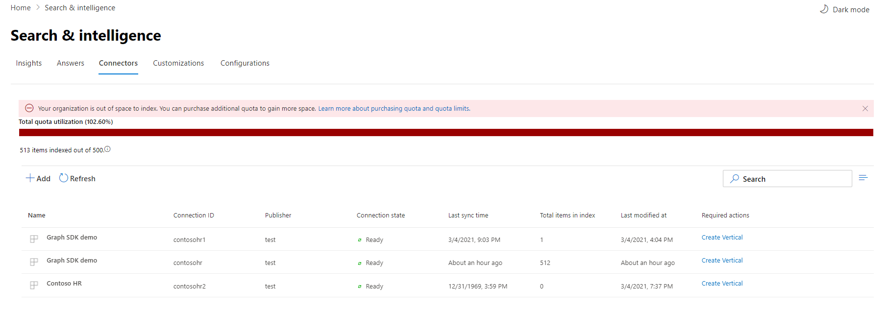

<!-- markdownlint-disable no-inline-html -->

# 管理 Microsoft 搜索的连接Manage your connections for Microsoft Search

若要访问和管理连接器，必须将其指定为租户的搜索管理员。To access and manage your connectors, you must be designated as a search administrator for your tenant. 请联系你的租户管理员，为你提供搜索管理员角色。Contact your tenant administrator to provision you for the search administrator role.

## 入门Get started

导航到[Microsoft 365 管理中心](https://admin.microsoft.com)中的 "[连接器" 选项卡](https://admin.microsoft.com/Adminportal/Home#/MicrosoftSearch/Connectors)。Navigate to the [Connectors tab](https://admin.microsoft.com/Adminportal/Home#/MicrosoftSearch/Connectors) in the [Microsoft 365 admin center](https://admin.microsoft.com).

对于每种连接器类型， [Microsoft 365 管理中心](https://admin.microsoft.com) 支持下表中所示的操作：For each connector type, the [Microsoft 365 admin center](https://admin.microsoft.com) supports the operations shown in the following table:

OperationOperation | Microsoft 构建的连接器Microsoft-built connector | 合作伙伴或自定义生成的连接器Partner or custom-built connector
--- | --- | ---
添加连接Add a connection | ： heavy_check_mark： (请参阅 [配置 Microsoft 构建的连接器](configure-connector.md)) :heavy_check_mark: (See [Configure your Microsoft-built connector](configure-connector.md)) | ： x： (指的是合作伙伴或自定义的连接器管理员 UX) :x: (Refer to your partner or custom-built connector admin UX)
删除连接Delete a connection | :heavy_check_mark: | :heavy_check_mark:
编辑已发布的连接Edit a published connection | ： heavy_check_mark： Name:heavy_check_mark: Name   ： heavy_check_mark：说明:heavy_check_mark: Description   ： heavy_check_mark：外部数据源的身份验证凭据:heavy_check_mark: Authentication credentials for your external data source   ： heavy_check_mark：本地数据源的网关凭据:heavy_check_mark: Gateway credentials for your on-premises data source   ： heavy_check_mark：刷新计划:heavy_check_mark: Refresh schedule   | ： heavy_check_mark： Name:heavy_check_mark: Name   ： heavy_check_mark：说明:heavy_check_mark: Description
编辑拔模连接Edit a draft connection | :heavy_check_mark: | :x:

## 监视连接状态Monitor your connection status

创建连接后，已处理的项目数显示在 **Microsoft 搜索** 页面上的 "**连接器**" 选项卡上。After you create a connection, the number of processed items shows on the **Connectors** tab on the **Microsoft Search** page. 成功完成初始完全爬网后，会显示定期增量爬网的进度。After the initial full crawl completes successfully, the progress for periodic incremental crawls displays. 此页面提供有关连接器的日常操作的信息，以及日志和错误历史记录的概述。This page provides information about the connector's day-to-day operations and an overview of the logs and error history.

" **状态** " 列中显示的四种状态针对每个连接：Four states show up in the **Status** column against each connection:

* **同步**。**Syncing**. 连接器将对源中的数据进行爬网，以对现有项目编制索引并进行任何更新。The connector is crawling the data from the source to index the existing items and make any updates.

* **已启用**：连接已启用，并且没有对其运行的活动爬网。**Enabled**: The connection is enabled, and there's no active crawl running against it. **上次同步时间** 表示上次成功爬网发生的时间。**Last sync time** indicates when the last successful crawl happened. 连接与上次同步时间一样新。The connection is as fresh as the last sync time.

* **暂停**。**Paused**. 管理员通过 "暂停" 选项暂停爬网。The crawls are paused by the admins through the pause option. 下一次爬网仅在手动恢复时运行。The next crawl runs only when it's manually resumed. 但是，此连接中的数据将继续可搜索。However, the data from this connection continues to be searchable.

* **失败**。**Failed**. 连接发生严重故障。The connection had a critical failure. 此错误需要手动干预。This error requires manual intervention. 管理员需要根据所显示的错误消息采取适当的操作。The admin needs to take appropriate action based on the error message shown. 在出现错误之前编制索引的数据是可搜索的。Data that was indexed until the error occurred is searchable.

### 查看你的上次爬网信息View your last crawl info

成功完成第一次增量或完全爬网后，最后一次爬网数据值将显示在详细信息窗格中的最后一个爬网标头下。After the first initial incremental or full crawl completes successfully, the last crawl data values are displayed under the last crawl header in the detail pane. 如果没有运行的上次爬网，则在上一次爬网标头下将看不到任何信息。If there was no last crawl that ran, you will not see any information under the last crawl header. 有关上次爬网的信息将帮助您深入了解爬网的执行方式并在需要的地方执行必要的步骤。This information about last crawl will help you gain insights into how the crawl performed and take necessary steps wherever required.

每个连接将提供以下上次爬网值：The following last crawl values will be available for each connection:

值Value | 说明Description
--- | ---
完成时间Completed at | 上次爬网完成的日期和时间Date and time the last crawl got completed
类型Type | 增量爬网或完全爬网Incremental or full crawl
持续时间Duration | 完成最后一次爬网需要多长时间how much time did the last crawl take to complete
成功Successes | 上次爬网中已成功引入的项目数Number of items that have been successfully ingested in the last crawl
错误Errors | 上次爬网中导致的项目数Number of items that errored in the last crawl

### 监视错误Monitor errors

对于 "**连接器**" 选项卡上的每个 **活动连接器**，"**错误**" 选项卡下将显示任何现有的爬网错误。该选项卡列出错误代码、每个错误的计数以及错误日志下载选项。For each **Active Connector** on the **Connectors** tab, any existing crawl errors show under the **Error** tab. The tab lists error codes, the count of each, and error log download options. 请参阅下图中的示例。See the example in the following image. 选择 **错误代码** 以查看错误的详细信息。Select an **error code** to view the error's details.

若要查看错误的特定详细信息，请选择其错误代码。To view an error's specific details, select its error code. 屏幕上会显示错误详细信息和链接。A screen appears with error details and a link. 最新错误显示在顶部。The most recent errors appear at the top. 请参阅下表中的示例。See the example in the following table.

下面列出了可针对任何连接显示的不同错误。Below is the list of different errors that can appear against any connection. 如果这些解决方案不起作用，请联系支持部门或向我们发送 [反馈](connectors-feedback.md)。If these solutions don’t work, contact support or send us [feedback](connectors-feedback.md).

错误代码Error code | 错误消息Error message | 解决方案Solution
--- | --- | ---
10001000 | 数据源不可用。The data source isn't available. 请检查 internet 连接或确保该连接器仍可访问该数据源。Check your internet connection or make sure the data source is still accessible by the connector. | 当数据源由于网络问题或数据源本身被删除、移动或重命名而无法访问时，将发生此错误。This error occurs when the data source is not reachable due to a network issue or when the data source itself is deleted, moved, or renamed. 检查提供的数据源详细信息是否仍然有效。Check if the data source details provided are still valid.
10011001 | 无法更新数据，因为数据源正在限制连接器。Can't update the data, because the data source is throttling the connector. | 若要 unthrottle 数据源，请检查其规模限制是否可以增加，或等待一天内的流量较长的时间。To unthrottle the data source, check if its scale limits can be increased or wait until a less traffic-heavy time of the day.
10021002 | 无法对数据源进行身份验证。Can't authenticate with the data source. 验证与此数据源关联的凭据是否正确。Verify that the credentials associated with this data source are correct. | 单击 " **编辑** " 以更新身份验证凭据。Click **Edit** to update the authentication credentials.
10031003 | 与连接器关联的帐户无权访问该项目。The account associated with the connector doesn't have permission to access the item. |  确保正确的帐户具有对要编制索引的项目的访问权限。Ensure the proper account has access to the item you want indexed.
10041004 | 无法访问本地数据网关。Unable to reach the on-premises data gateway. 请确保网关服务正在运行，并且在连接配置中更新了网关详细信息。Make sure the gateway service is running and the gateway details are updated in the connection configuration. | 使用网关检查计算机，打开 Power BI 网关应用程序，并确保网关正在运行。Check the computer with the gateway, open the Power BI Gateway application and make sure the gateway is running. 验证网关使用的是与 Microsoft 搜索相同的管理员帐户，然后确保连接配置中的所有网关详细信息都已更新。Verify that the gateway is using the same admin account as Microsoft Search, then make sure all the gateway details are all updated in the connection configuration.
10051005 | 与此数据源关联的凭据已过期。Credentials associated with this data source have expired. 续订凭据并更新连接。Renew the credentials and update the connection. | 单击 " **编辑** " 以更新身份验证凭据。Click **Edit** to update the authentication credentials.
10061006 | 您的网关版本已过期，不会再支持此连接器。Your gateway version is out of date and doesn’t support this connector anymore. 你将需要更新网关。You will need to update the gateway. | 请访问 [安装本地 data gateway](https://docs.microsoft.com/data-integration/gateway/service-gateway-install) ，以在包含网关的计算机上下载并安装最新版本的 Power BI 网关。Please visit [Install an on-premises data gateway](https://docs.microsoft.com/data-integration/gateway/service-gateway-install) to download  and install the latest version of the Power BI gateway on the machine containing the gateway.
10071007 | 未检测到有效的 Power BI 许可证。No valid Power BI license detected. 您需要有效的 Power BI 许可证来执行此爬网。You need a valid Power BI license to perform this crawl. | 您需要有效的 Power BI 许可证来执行此爬网。You need a valid Power BI license to perform this crawl. 请检查您的组织是否具有有效的许可证。Check that your organization has a valid license. 如果是，请再试一次。If it does, try again. 如果不是，请获取许可证，然后重试。If it doesn’t, obtain a license and then try again.
10081008 | 租户的总配额使用率已达到其限制。The total quota utilization of your tenant has reached its limit. 尝试删除连接以释放一些配额，或调整摄取筛选器以引入较少的数据。Try deleting a connection to free up some of your quota or adjusting your ingestion filters to bring in less data. | 尝试删除连接以释放一些配额，或调整摄取筛选器以引入较少的数据。Try deleting a connection to free up some of your quota or adjusting your ingestion filters to bring in less data. 如果不能解决问题，请联系 Microsoft 支持部门。If these don't solve the issue, contact Microsoft support.
20012001 | 由于队列中的更新数过多，索引被限制。Indexing is throttled because of a large number of updates in the queue. 根据队列的不同，可能需要一段时间才能完成更新。Depending on the queue, it can take some time for the updates to complete. | 请等待队列被清除。Please wait until the queue gets cleared.
20022002 | 由于不受支持的项格式设置而导致索引失败。Indexing failed due to unsupported item formatting. | 有关详细信息，请参阅连接器特定文档。See connector-specific documentation for more information.
20032003 | 由于不受支持的项目内容而导致索引失败。Indexing failed due to unsupported item content. | 有关详细信息，请参阅连接器特定文档。See connector-specific documentation for more information.
50005000 | 出现问题。Something went wrong. 如果这种情况继续存在，请与支持人员联系。If this continues, contact support. |

## 监视索引配额利用率Monitor your index quota utilization

可用的索引配额和消耗显示在 "连接器" 登录页上。The available index quota and consumption is displayed on the connectors landing page.

>[!NOTE]
>在预览期间，每个尝试使用 Graph 连接器的组织都提供了在所有连接中最多为2000000个项目的免费固定配额。During the preview period, every organization trying out Graph connectors was provided a free fixed quota of up to 2 million items across all connections. 使用 Graph 连接器时，对于已在预览中使用 Graph 连接器的组织，免费配额将于2月 2021 1 日过期。With Graph connectors being generally available, the free quota will expire on Feb 1st, 2021 for those organizations who have been using Graph connectors in preview.
>名为 ["Preview"](connectors-preview.md) 的 Microsoft 构建的图形连接器不会包括在您的组织的总费用索引配额中。Microsoft-built Graph connectors labeled as ["Preview"](connectors-preview.md) will not be included in the total charged index quota for your organization. 但是，它会计算最多可以为组织配置的10个连接数，以及您的组织可以在多个连接中为其索引的最大7000000个项目数。However, it will count towards the max number of 10 connections you can configure for your organization and the max number of 7 million items your organization can index across connections.

配额使用率栏将根据您的组织的配额消耗来指示各种状态：The quota utilization bar will indicate various states based on consumption of quota by your organization:

状态State | 配额消耗Quota consumption
--- | ---
一般Normal | 1-69%1-69%
高High | 70-89%70-89%
关键Critical | 90%-99%90%-99%
完整Full | 100%100%

已编制索引的项目数也会随每个连接显示。The number of items indexed will also be displayed with each connection. 按每个连接编制索引的项目数分配给组织的可用总配额。The number of items indexed by each connection contributes to the total quota available for your organization.

当您的组织超过索引配额时，所有活动连接将受到影响，并且这些连接将以 **超出限制** 的状态运行。When index quota is exceeded for your organization, all active connections will be impacted, and those connections will operate in **limit exceeded** state. 在此状态下，你的活动连接In this state, your active connections  

* 将无法添加新项目。Will not be able to add new items.

* 将能够更新或删除现有项目。Will be able to update or delete existing items.

若要解决此问题，可以执行以下任一操作：To fix this, you can do any of the following:

* 了解如何在你的组织中购买 [许可证要求和定价](licensing.md)的索引配额。Learn how to purchase index quota for your organization at [Licensing requirements and pricing](licensing.md).

* 确定具有过多内容引入的连接并更新这些连接以编制更少的项目，以便为配额留出空间。Identify connections which have too much content being ingested and update them to index fewer items to make room for quota. 若要更新连接，必须使用新的摄取筛选器删除并创建新的连接，这将导致较少的项目。To update the connection, you must delete and create a new connection with a new ingestion filter which brings in fewer items.

* 永久删除一个或多个连接Permanently delete one or more connections

## 限制Limitations

* **发布** Microsoft 构建的连接器时，可能需要几分钟的时间才能创建连接。When you **publish** a Microsoft-built connector, it might take a few minutes for the connection to be created. 在这段时间内，连接会将其状态显示为 "挂起"。During that time, the connection will show its status as pending.

* [Microsoft 365 管理中心](https://admin.microsoft.com)在连接发布后不支持编辑 **搜索架构**。The [Microsoft 365 admin center](https://admin.microsoft.com) doesn't support editing the **search schema** after a connection is published. 若要编辑搜索架构，请删除您的连接，然后创建一个新的连接。To edit the search schema, delete your connection and then create a new one.

* 每秒大约4个项目会限制摄取吞吐量。Ingestion throughput is throttled at about four items per second.

* 不支持架构更新。There is no support for schema updates. 创建连接设置后，无法更新架构。After you create a connection setup, there's no way to update the schema. 您只能删除并重新创建连接。You can only delete and re-create the connection.

* 存在连接限制。There is a connections limit. 每个租户最长可创建10个连接。Each tenant can create up to 10 connections.

* "编辑对连接的支持" 不可用。Edit support for connection is not available. 一旦创建了连接，就不能再对其进行编辑或更改。Once the connection has been created, you cannot edit or change it. 如果需要更改任何详细信息，则必须删除并重新创建连接。If you need to change any details, you must delete and recreate the connection.
