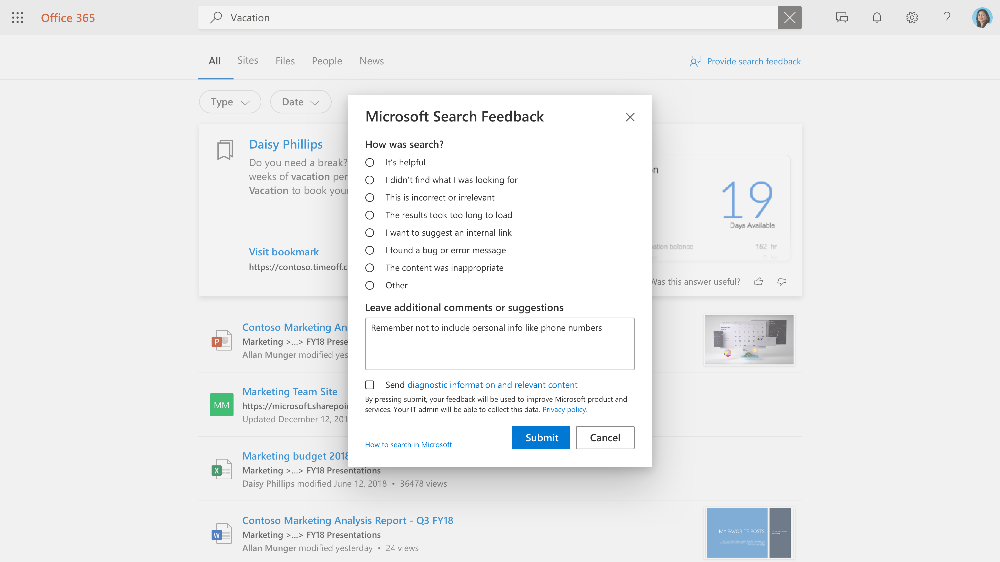

# 管理用户反馈

为用户创建出色的搜索体验是 Microsoft 与搜索管理员之间的合作关系。 来自用户的反馈允许我们持续评估产品，并调整该产品以获得最佳体验。 但是，最好解决一些反馈问题。

我们现在提供了一些工具，可让你查看和管理用户提供的有关搜索体验的反馈。

## 用户如何提交反馈

当组织成员使用 Microsoft 搜索时，他们可能对体验有反馈。 当他们单击结果页面上的反馈链接时，他们可以对反馈进行分类并添加其他评论。

用户还可以选择将其查询和其他诊断信息以及类别和注释发送到 Microsoft。 [了解有关隐私](https://privacy.microsoft.com/en-US/privacystatement) 以及如何保护此数据的信息。 诊断数据包含 Microsoft 使用反馈项目进行产品改进所需的最重要的信息。

大多数反馈提交[都显示在管理](https://admin.microsoft.com/Adminportal/Home#/MicrosoftSearch/feedback)中心Microsoft 搜索部分中。 随"**我想建议内部** 链接类别"一起发送的反馈在"书签"部分显示为建议书签 ，并且可以通过筛选"建议状态 **"来** 查看。

## 查看反馈

在 ["反馈](https://admin.microsoft.com/Adminportal/Home#/MicrosoftSearch/feedback) "页上，你可以查看和导出组织中人员在过去 30 天内发送的反馈。 用户提交反馈后，将在 20 分钟内出现在此列表中。 可以使用"刷新"按钮确保查看的是最新数据

通过使用筛选器，可以看到特定答案类型的反馈。 您还可以按源和日期范围进行筛选。

您可以使用反馈列表上方的搜索框搜索特定查询的反馈。

在反馈列表中，Verbatim 列指示哪些用户的反馈还包含评论或建议。 若要阅读，请单击查询以打开" **详细信息"** 面板。

>[!NOTE]
>在首次推出管理员和最终用户搜索体验期间，可能需要两周才能在管理门户中显示反馈项目。

## 更新反馈状态

当反馈出现时，它将处于 *"新建"* 状态，并且将一直保留在那里，直到您将它更改为"已解决 *"* 或"*重复"。*

若要更改此状态：

1. 在查询旁边，选择" **其他选项** " (三个垂直点) 。
1. 在菜单上，选择 **"标记为已解决"或****"标记为重复"。**
1. 该列表将刷新并显示更新的状态。

还可以更新多个项目的状态，只需选择它们，然后选择其中任何项目旁边的"更多选项"。

## 导出反馈

如果要与他人共享搜索反馈或将其保留超过 30 天，请单击"导出 **"。** 将自动.csv名为"反馈"和日期的"Feedbacks_10_31_2020.csv"文件。

## 向 Microsoft 发送用户反馈

默认情况下，会向 Microsoft 发送所有用户反馈，并添加给你。 若要停止向 Microsoft 发送反馈，请单击" **管理设置**"，并清除" **自动向 Microsoft 发送用户反馈** "复选框。 此更改可能需要 24 小时才能生效。

如果你决定不自动向 Microsoft 发送反馈，你仍可以将个别反馈发送给 Microsoft。

1. 选择要共享的反馈。
1. 在操作栏中，选择"更多 (三个点) ，然后单击"**将反馈发送到 Microsoft"。**

1. "发送到 Microsoft"列中的状态将更改为"挂起"。 发送反馈后，它将更改为"是"。

如果你自动或手动共享反馈，它永远不会包含针对选择不包括此信息的用户的查询和其他诊断信息。

## 有关如何使用反馈的建议

作为搜索管理员，您应该了解组织中的主要角色以及这些人员通常与之交互并搜索的内容类型。 了解这一点后，可以使用反馈对用户的搜索体验进行有针对性的改进。

1. "我找不到要查找的内容"，类似反馈可用于标识用户需要的内容，但当前未包含在搜索索引中。 确定这通常需要根据用户了解情况进行调查和推断。 找到后，确定包含该内容最合适的方法：
    1. 对于具有高质量登陆页面和有限各种搜索词的内容源，书签非常有用，这样用户社区就可以从书签获得高质量的结果，然后高效地找到他们正在寻找的内容。
    1. Q&A 对于非常频繁但不会改变的单个答案非常有用。
    1. 连接器对于包含各种内容和各种搜索词的内容源非常有用。
1. "结果加载时间过长"，&我发现了问题"可能是更广泛的问题的指示器。 每天查找此反馈可能会有所帮助，如果出现多个情况，你可以为自己验证搜索体验，并根据需要向 Microsoft 打开支持案例。 此类反馈对 Microsoft 也很重要，也是将所有反馈都告诉我们的一个绝佳原因。
1. "我想建议内部链接"可以评估为添加为书签或连接的内容。 第一个想法应该是书签;如果书签使用率较高，可以考虑通过连接器引入内容，以实现更丰富的搜索体验。
