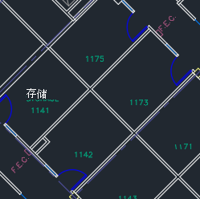
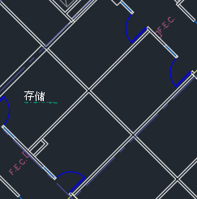
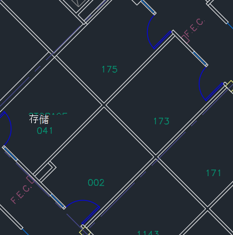

# 管理平面图

会议室中的 **Microsoft 搜索** 帮助用户在建筑物内查找用户和会议室。 平面图回答以下问题：

- Allan Deyoung 的办公室在哪里？
- 2 楼 3 楼
- 查找 2/11173

## 添加平面图

按照以下步骤在"设置"中设置 **Microsoft 搜索。**

### 步骤 1：确定生成代码

构建代码用作用户办公地点的一部分。 更新用户配置文件时，你将使用这些代码。 假设你的组织在此位置有一个建筑物 *：Building 2， 350 5th Avenue， New York City， NY 10016*

下面是此大楼代码的一些很好示例：2、B2、Building2、Building 2 或 NYCB2。 每个建筑物必须具有唯一的代码。

### 步骤 2：查看平面图

平面图文件必须采用 DWG 格式;DWG 文件可以包含文本标签。 当文本标签标记房间时，它称为房间标签。 DWG 文件必须至少包含 **10 个标有标签** 的聊天室。 下面是具有不同标签类型的 DWG 文件的一些示例：

|**包括房间标签的文本标签**|**文本标签，但没有房间标签**|**无文本标签**|
|:-----:|:-----:|:-----:|
||||

有关查看 [和更新](#frequently-asked-questions) DWG 文件的信息，请参阅常见问题部分。

### 步骤 3：更新用户配置文件上的办公室位置

用户的办公地点是建筑物代码和房间标签的组合。 例如，如果建筑物代码为 *2，* 会议室标签为 *1173，* 则办公地点为 *2/1173*。

为组织中添加或更新每个用户的办公地点。 您可以在 Office 2016 中更改用户配置文件上的Microsoft 365 管理中心也可以在本地 Active Directory 中更改以同步到Azure Active Directory。 *PhysicalDeliveryOfficeName* 是用于办公室位置的字段。 如果房间标签不包括楼层号，请参阅常见问题解答获取提示。

本示例中，Allan 办公室位于 2 号楼 1 的 1173 室。

> [!NOTE]
> 若要在搜索楼层计划时查看更新的办公地点，必须更新每个楼层至少 **10** 人的办公地点。

### 步骤 4：验证办公室位置

使用 **Microsoft 搜索** 查找用户并验证其办公地点是否正确显示。 如果刚刚更新了位置，可能需要等待 **72 小时** ，才能在搜索结果中显示更新。

### 步骤 5：添加建筑物位置

平面图 [使用位置](manage-locations.md) 来定义建筑物。 在 ["Microsoft 365 管理中心"](https://admin.microsoft.com)中，转到 [**"位置"，**](https://admin.microsoft.com/Adminportal/Home#/MicrosoftSearch/locations)然后选择"添加 **"。** 输入大楼的名称、地址和关键字。 根据需要添加多个建筑。

有关位置的更多详细信息，请参阅 [管理位置](manage-locations.md)

### 步骤 6：收集和组织办公地点

必须先对办公室位置编制索引，然后才能使用平面图。 这是一个一次操作，可能需要 48 小时才能完成。 总时间将取决于组织的规模。

在 [管理中心](https://admin.microsoft.com)中，转到"[**平面计划"，**](https://admin.microsoft.com/Adminportal/Home#/MicrosoftSearch/floorplans)然后选择"**开始使用"。** 如果未看到此通知，则此步骤已针对组织完成

### 步骤 7：Upload平面图

1. 在管理 [中心中](https://admin.microsoft.com)，转到"[**平面计划"。**](https://admin.microsoft.com/Adminportal/Home#/MicrosoftSearch/floorplans)
2. 在下拉列表中选择一个建筑物，然后选择下一 **步**。 如果未列出大楼，请返回 并 [添加建筑物位置](#step-5-add-building-locations)。
3. 选择 **Upload** 文件"，然后选择要上载的平面图。
4. 上载完成后，必须输入平面图文件中表示的楼层。 然后选择“**下一步**”。
5.  (可选) 如果楼层有侧楼或区域，请输入该详细信息。
6. 你将看到一个评论屏幕，其中列出了映射到楼层计划的办公地点数。 选择 **"** 详细信息"以确保映射正确。
    - 如果没有用户映射，或者你对此映射不满意，请选择"继续 **映射"。** 若要发布，请选择跳过 **并发布**。
7. 输入此平面图的建筑物代码。 可在用户的办公地点属性上找到大楼代码。 例如，如果用户的办公地点为 **2/1173，** 则建筑物代码为 **2**。
8. 在查看屏幕上，重复步骤 6 以确保映射正确。
9.  (可选) 查看并确定所有上载的平面图的位置模式，然后选择下一 **步**。
10. 在查看屏幕上，重复步骤 6 以确保映射正确。
11. 准备好后，选择 **"发布**"，使平面 **Microsoft 搜索。**

> [!NOTE]
> **需要 48 小时才能发布平面图。** 之后，用户将在搜索同事办公室时看到类似于下面的平面图结果。

### 步骤 8： (可选) 指定位置模式

上载平面图后，文本标签会与用户配置文件中的办公室位置进行比较。 如果匹配项少于 10 个，将显示 **"指定位置模式"** 屏幕。 位置模式用于从办公地点提取楼层、侧楼和房间信息。

仅需要会议室，楼层和侧楼是可选的，你可根据需要跳过位置。

## 编辑平面图

若要更新现有平面图，请选择要更改的平面图，然后选择"编辑 **"。** 进行更改并保存它们。

## 疑难解答

|**步骤**|**错误消息**|**类型**|**操作**|
|:-----|:-----|:-----|:-----|
|Upload平面图|无法读取 CC_1.dwg。 请重新上载或删除平面图。|Error|请尝试再次上载文件。 如果不起作用，请删除文件并重试。|
|Upload平面图|有两个名为 CC_1.dwg 的文件。 请删除其中一个，或者使用另一个名称重新上载。|Error|如果文件名不正确，请通过添加 floor 或 wing 信息使文件名是唯一的，然后再次上载该文件。 如果你意外添加了同一个文件两次，只需将其删除。|
|Upload平面图|未找到任何数据。|Error|请检查你的文件以确保该文件正确无误，然后再次上传或删除它。|
|Upload平面图|此文件中缺少外部引用。 上载 CC_1_furniture.dwg 或删除此文件。|警告|Upload外部引用文件或删除。|
|Upload平面图|无法读取 DWG 文件中房间号或标签。 请删除此文件。|警告|请检查您的 DWG 文件以确保包含数据，然后删除该文件，然后重试。|
|链接办公室位置|未在 office Azure Active Directory。 在设置楼层Azure Active Directory之前，向用户添加位置数据。|Error|[更新用户配置文件上的办公室位置](#step-3-update-office-locations-on-user-profiles) |

## 常见问题解答

**问：** 如何查看和编辑 DWG 文件？

**答：** 使用以下任一选项查看 DWG 文件：

- Upload文件以SharePoint并打开它。
- 在[Microsoft](https://support.office.com/article/Open-insert-convert-and-save-DWG-and-DXF-AutoCAD-drawings-60cab691-0f4c-4fc9-b775-583273c8dac5) Visio[或 Autodesk DWG TrueView 中打开文件](https://www.autodesk.com/products/dwg)。
- Upload文件提交到[Autodesk 的联机查看器](https://viewer.autodesk.com/)。

**问：** 如何将文本标签添加到未标记的聊天室？

**答：** 在编辑器中打开 DWG 文件并 [添加房间标签](https://knowledge.autodesk.com/support/autocad-map-3d/learn-explore/caas/CloudHelp/cloudhelp/2019/ENU/MAP3D-Learn/files/GUID-4854F184-6279-4E0C-9487-34A4759017F6-htm.html)。

**问：** 如何出于测试目的创建或编辑 DWG 文件？

**答：** 在 Microsoft Visio、Autodesk AutoCAD 或其他任何 DWG 编辑器中创建 DWG 文件。 请确保文件中标记了 10 个或多个会议室。

**问：** DWG 文件中文本标签的最佳格式是什么？

**答：** 为了获得最佳效果，文本标签应包含楼层和房间号。 以下示例使用 2 或 SC 生成代码。
<!-- markdownlint-disable no-inline-html -->
|会议室标签类型|Floor|Room|示例文本标签|Office生成 (/文本标签的位置) |
|:-----|:-----|:-----|:-----|:-----|
|具有楼层和房间号|1|173|1173|2/1173|
|| 21|45|21045|2/21045|
||23|100K|23-100K|2/23-100K|
||1|G06-07|1G06-07|2/1G06-07|
||2|1024A|02.1024A|2/02.1024A|
||2|1024A|02.1024A|2/02.1024A|
||2|105.01|2105.01|2/2105.01|
|具有建筑物代码、楼层和房间编号|0|X-11-M-12|2-0-X-11-M-12|2/2-0-X-11-M-12 2-0-X-11-M-12|
||2|128A|22128A|2/22128A 22128A|
||1|B2-11|21-B2-11|2/21-B2-11 21-B2-11|
||2|45|SC2045|SC/SC2045 SC2045|

**问：** 我能否使用不包含楼层号的 DWG 文件？

**答：** 是的，可以。 在用户的 Azure Active Directory 配置文件中更新办公地点时，请包含房间编号作为房间编号的一部分，即使 DWG 文件中缺少该楼层号。 上载文件后，将显示"指定位置模式"屏幕，你可以指示这两个值。

例如，包含房间号但没有楼层的 DWG 文件可能类似于：

用户配置文件中的办公地点应为 2/1175，其中"2"是建筑物代码，"1"是楼层，"175"是房间号。
