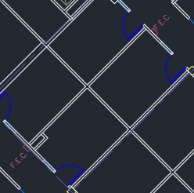

# 管理平面图

建筑物中的Microsoft 搜索帮助用户查找建筑物内的人员、房间和空间。 包括人员全名、名字、房间名称或房间位置的查询模式将返回平面图，如以下示例所示：

- Allan Deyoung 的办公室在哪里？
- 作为 Office 2013 的 Office，位于何处？
- 2 楼 3 楼
- Workspace-1
- B1/1.20

## 用户体验

用户可以在 必应、SharePoint和[Office 365](http://sharepoint.com/)[上查看Office 365。](https://office.com) 还支持返回必应结果的其他入口点，Windows搜索Microsoft Edge地址栏）。 当用户搜索会议室名称或位置时，他们将看到在平面计划答案上标记的关注点。

> [!div class="mx-imgBorder"]
> 

当他们搜索某人的办公室时，他们会看到一个类似的答案，该人员的个人资料图像位于标记上。

> [!div class="mx-imgBorder"]
> 

## 添加平面图

请按照以下步骤在Microsoft 搜索。

### 步骤 1：确定生成代码

构建代码用作用户办公地点的一部分。 更新用户配置文件时，你将使用这些代码。 假设你的组织在此地址有一个建筑物 *：Building 2， 350 5th Avenue， New York City， NY 10016*

下面是大楼代码的一些很好示例：2、B2、Building2、Building 2 或 NYCB2。 每个建筑物必须具有唯一的代码。

### 步骤 2：查看平面图

平面图文件必须采用 DWG 格式，它支持文本标签。 当文本标签标记房间时，它称为房间标签。 下面是一些包含不同类型的标签的 DWG 文件示例：

| 包括房间标签的文本标签 | 文本标签，但没有房间标签 | 无文本标签 |
|:-----:|:-----:|:-----:|
||||

作为最佳实践，DWG 文本标签应按该顺序包含楼层 (侧) 和房间编号。 有关 [文本标签](#frequently-asked-questions) 格式的更多示例，以及有关查看和更新 DWG 文件的信息，请参阅常见问题解答。

### 步骤 3：更新用户配置文件上的办公室位置

用户的办公地点是建筑物代码和房间标签的组合。 例如，如果建筑物代码为 *2，* 会议室标签为 *1173，* 则办公地点为 *2/1173*。

为具有指定工作位置的用户添加或更新办公地点。 可以在管理中心或 Microsoft 365 Azure Active Directory 中的[用户配置文件](https://portal.azure.com/)中Azure Active Directory此操作，否则本地 Active Directory (将同步到Azure Active Directory) 。 *PhysicalDeliveryOfficeName* 是用于办公室位置的字段。 如果房间标签不包括楼层号，请参阅 [常见问题解答获取](#frequently-asked-questions) 提示。

本示例中，Allan 办公室位于 2 号楼 1 的 1173 室。

> [!div class="mx-imgBorder"]
> 

若要设置会议室的楼层计划，请将它们的办公地点添加到会议室&[设备](https://admin.microsoft.com/Adminportal/Home#/ResourceMailbox)部分Microsoft 365 管理中心。 有关详细信息，请参阅设置 [会议室和设备邮箱](/microsoft-365/admin/manage/room-and-equipment-mailboxes#set-up-room-and-equipment-mailboxes)。 如果组织人员可以安排会议或活动的会议室或资源，请参阅更改会议室邮箱处理 [会议请求的方式](/Exchange/recipients/room-mailboxes#change-how-a-room-mailbox-handles-meeting-requests)。 有关配置工作区（包括设置会议室邮箱）的信息，请参阅有关在邮箱中预订工作区[Outlook。](https://techcommunity.microsoft.com/t5/exchange-team-blog/book-a-workspace-in-outlook/ba-p/1524560)

### 步骤 4：验证办公室位置

使用 Microsoft 搜索 查找用户并验证其办公地点是否正确显示。 可能需要等待 **72 小时，** 才能在搜索结果中显示更新。

> [!div class="mx-imgBorder"]
> 

### 步骤 5：添加建筑物位置

楼层计划 [使用位置](manage-locations.md) 来定义建筑物。 在 ["Microsoft 365 管理中心"](https://admin.microsoft.com)中，转到 [**"位置"，**](https://admin.microsoft.com/Adminportal/Home#/MicrosoftSearch/locations)然后选择"添加 **"。** 输入大楼的名称、地址和关键字。 根据需要添加多个建筑。

> [!div class="mx-imgBorder"]
> 

有关位置详细信息，请参阅管理 [位置](manage-locations.md)

### 步骤 6：收集和组织办公地点

在上载楼层计划之前，必须对办公室位置编制索引。 此一次操作可能需要 48 小时才能完成。 总时间将取决于组织的规模。

在 [管理中心](https://admin.microsoft.com)中，转到 [**"平面计划"，**](https://admin.microsoft.com/Adminportal/Home#/MicrosoftSearch/floorplans)然后选择"**开始编制索引"。** 如果未看到此通知，则此步骤已针对组织完成

### 步骤 7：Upload平面图

1. 在管理 [中心中](https://admin.microsoft.com)，转到"[**平面计划"。**](https://admin.microsoft.com/Adminportal/Home#/MicrosoftSearch/floorplans)

2. 在下拉列表中选择一个建筑物，然后选择下一 **步**。 如果未列出大楼，请返回 并 [添加建筑物位置](#step-5-add-building-locations)。

3. 选择 **Upload文件**"，然后选择要上载的平面图。

4. 上载完成后，必须输入平面图文件中表示的楼层。 然后选择“**下一步**”。

5.  (可选) 如果楼层有侧楼或区域，请输入该详细信息。

6. 你将看到一个评论屏幕，其中列出了映射到楼层计划的办公地点数。 选择 **"** 详细信息"以确保映射正确。
    - 如果没有用户映射，或者你对此映射不满意，请选择"继续 **映射"。**
    - 若要发布，请选择跳过 **并发布**。

1. 输入此平面图的建筑物代码。 可在用户的办公地点属性上找到大楼代码。 例如，如果用户的办公地点为 **2/1173，** 则建筑物代码为 **2**。

1. 在查看屏幕上，重复步骤 6 以确保映射正确。 如果你对映射感到满意，请选择"继续映射"**和"****跳过并发布"。** 如果没有，请选择 **"继续映射** "，然后转到"指定位置模式"屏幕。

1.  (可选) 查看并标识 Azure 目录中此生成的所有唯一位置模式的命名逻辑，然后选择"下一 **步"。**

1. 在查看屏幕上，重复步骤 6 以确保映射正确。

1. 准备好后，选择 **"发布"** 以在Microsoft 搜索。

> [!NOTE]
> **需要 48 小时才能发布平面图。** 之后，用户将在搜索同事办公室时看到类似于下面的平面图结果。

> [!div class="mx-imgBorder"]
> 

### 步骤 8： (可选) 指定位置模式

上载楼层图后，会议室文本标签会与用户配置文件中的办公地点进行比较。 如果 Office 位置或文本标签不一致地遵循步骤[2](#step-2-review-your-floor-plans)和步骤[3](#step-3-update-office-locations-on-user-profiles)中建议的命名模式，请使用"指定位置模式"屏幕来添加更多信息来完成映射。 位置模式用于从 AAD 办公地点提取楼层、侧楼和房间信息。

> [!div class="mx-imgBorder"]
> 

楼层和侧楼是可选的，只需要房间，你可根据需要跳过位置。

## 更新平面图

在更新现有楼层计划之前，请确保 AAD 办公地点是最新的，并且你已等待 48 小时，等待任何 AAD 更新处理。 若要更新平面图，请转到"平面图"，选择平面图的建筑物，然后选择"编辑 **"。** 如果平面图在结构上发生了更改，例如由于重建，请删除旧文件，然后上载并发布新的 DWG 文件。

> [!NOTE]
> 当用户移动到已映射的楼层时，不需要更新平面图。 只需更新其用户配置文件以反映新的办公地点：
>
> - In the Microsoft 365 管理中心 (Active users > Account > Manage contact information) 
> - 在 Azure Active Director 管理中心中 (用户>配置文件>编辑联系人) 
> - In your on-prem Active Directory (sync to Azure Active Directory) 

## 删除平面图

若要删除单层平面图，请转到"平面 [图"](https://admin.microsoft.com/Adminportal/Home#/MicrosoftSearch/floorplans) 并选择该建筑物。 接下来，选择平面图并选择"删除 **"。** 若要删除建筑物的所有平面图，请转到位置，选择该建筑物 ，**然后选择删除**。  

## 疑难解答

| 步骤 | 错误消息 | 类型 | 操作 |
|:-----|:-----|:-----|:-----|
|Upload平面图|无法读取 CC_1.dwg。 请重新上载或删除平面图。|错误|请尝试再次上载文件。 如果不起作用，请删除文件并重试。|
|Upload平面图|有两个名为 CC_1.dwg 的文件。 请删除其中一个，或者使用另一个名称重新上载。|错误|如果文件名不正确，请添加楼层或侧楼号以创建一个唯一的文件名，然后重新上载它。 如果你意外添加了同一个文件两次，只需删除其中一个文件。|
|Upload平面图|未找到任何数据。|错误|请检查你的文件以确保该文件正确无误，然后再次上传或删除它。|
|Upload平面图|此文件中缺少外部引用。 上载 CC_1_furniture.dwg 或删除此文件。|警告|Upload外部引用文件或删除。|
|Upload平面图|无法读取 DWG 文件中房间号或标签。 请删除此文件。|警告|请检查您的 DWG 文件以确保包含数据，然后删除该文件，然后重试。|
|链接办公室位置|未在Azure Active Directory。 在设置平面Azure Active Directory之前，将位置数据添加到其他位置。|错误|[更新用户配置文件上的办公室位置](#step-3-update-office-locations-on-user-profiles) |

## 常见问题解答

**问：** 如何查看和编辑 DWG 文件？

**答：** 使用以下任一选项查看 DWG 文件：

- Upload文件以SharePoint并打开它。
- 在[Microsoft](https://support.office.com/article/Open-insert-convert-and-save-DWG-and-DXF-AutoCAD-drawings-60cab691-0f4c-4fc9-b775-583273c8dac5) Visio [Autodesk DWG TrueView 中打开文件](https://www.autodesk.com/products/dwg)。
- Upload文件提交到[Autodesk 的联机查看器](https://viewer.autodesk.com/)。

可以在任何 DWG 编辑器（包括桌面或自动桌面Visio或编辑 DWG AutoCAD。 若要使用Visio，请参阅[创建平面图](https://support.microsoft.com/office/create-a-floor-plan-ec17da08-64aa-4ead-9b9b-35e821645791)。 单个 DWG 文件的最大文件大小为 16 MB。

**问：** 如何将文本标签添加到未标记的聊天室？

**答：** 在编辑器中打开 DWG 文件并 [添加房间标签](https://knowledge.autodesk.com/support/autocad-map-3d/learn-explore/caas/CloudHelp/cloudhelp/2019/ENU/MAP3D-Learn/files/GUID-4854F184-6279-4E0C-9487-34A4759017F6-htm.html)。

**问：** DWG 文件中文本标签的最佳格式是什么？

**答：** 为了获得最佳结果，DWG 文本标签应该是一行，其中包含楼层数、侧 (（如果相关) ）和房间号（按该顺序）。 以下示例使用 2 或 CITY CENTER 生成代码。
<!-- markdownlint-disable no-inline-html -->
|会议室标签类型|Floor|Wing/Zone|Room|示例文本标签|Office代码 (文本标签位置) |
|:-----|:-----|:-----|:-----|:-----|:-----|
|具有楼层和房间号|1| |173|1173|2/1173|
|| 21| |45|21045|2/21045|
||23| |100K|23-100K|2/23-100K|
||1| |G06-07|1G06-07|城市中心/1G06-07|
||2| |1024A|02.1024A|CITY CENTER/02.1024A|
|具有楼层、侧楼和房间号|1|A|173|1A173|2/1A173
||2|Z1|128b|2Z1128b|2/2Z1128b

此外，在 DWG 文件中，不包含任何额外的文本标签，如会议室尺寸或架构师名称。

**问：** 文本标签是否有字符限制？

**答：** 文本标签必须是单行。 特殊字符可用于生成代码或房间标签，但不能用于基底或侧边值。

**问：** 我能否使用不包含楼层号的 DWG 文件？

**答：** 我们建议 DWG 文本标签包括基底编号，但它们不是必需的，请参阅步骤 [2](#step-2-review-your-floor-plans)中的命名模式。 此外，您仍应在用户的联系信息中包括楼层作为办公地点的一部分。 上载 DWG 文件后，将需要使用可选的"指定位置模式"屏幕完成这些非标准标签的映射过程。

例如，包含房间号但没有楼层的 DWG 文件可能类似于：

> [!div class="mx-imgBorder"]
> 

用户配置文件中的办公地点为 2/1175，其中"2"为建筑物代码，"1"为楼层，"175"为房间号。

**问：** 我添加了一个建筑物位置，为什么看不到添加平面图的选项？

**答：** 最近添加或更新的建筑物位置可能尚未在搜索索引中。 新位置或已更改的位置可能需要几个小时才能显示在搜索结果中。 此外，如果建筑物有草稿或已发布的平面图，请选择建筑物名称，然后添加更多计划。

**问：** Why doesn't the Select a building list show my full list of locations？

**答：** 只有没有平面图的建筑物显示在"选择建筑物"列表中。 对于至少具有一个草稿或已发布建筑物的建筑物，请通过在列表中选择建筑物，然后上载来添加更多楼层计划。

**问：** 我可以上载的平面图数量是否有限制？

**答：** 不。 每个建筑物或每个组织没有最大值。

**问：** 我能否使用一个 DWG 文件，该文件包含一个楼层内多个高路/区域的计划？

**答：** 只要所有计划都位于同一楼层，就可以上传一个 DWG 文件，其中包含多个楼层/区域平面图。 确保文本标签和办公地点遵循步骤 [2](#step-2-review-your-floor-plans) 和步骤 [3](#step-3-update-office-locations-on-user-profiles)中的命名最佳做法。

如果 DWG 文件包含多个项目的数据，则上传时将 wing 字段留空。

**问：** 能否为同一楼层上载两个 DWG 文件，一个仅定义楼层，另一个定义了楼层和侧楼？

**答：** 您可以为同一层上载多个 DWG 文件，但需要指示每个文件的侧边或区域。 在下面的示例中，你需要为 FloorPlan1.dwg 文件输入 Wing 或区域值，然后才能转到下一个屏幕。 如果平面图文件没有侧边或有多个侧边，请在 Wing 或 zone 字段中输入一个类似 0 或 X 的值以继续。

> [!div class="mx-imgBorder"]
> 

**问：** 我能否同时上载和更新多个楼层计划？

**答：** 可以同时为一个建筑物上载多个楼层计划。 批量操作（如导入多个建筑物的楼层计划）不可用。

**问：** 我的组织有数百个用户。 是否需要为每个位置指定位置模式？

**答：** 不。 如果遵循步骤 [2](#step-2-review-your-floor-plans) 和步骤 [3](#step-3-update-office-locations-on-user-profiles)中标签和办公地点的格式建议，以及步骤 [7](#step-7-upload-floor-plans)中已完成的项目 1-8，则无需指定位置模式。

但是，如果你的用户仍未映射或者你对此映射不满意，请完成可选步骤 [8](#step-8-optional-specify-location-patterns)。 在步骤 8 中，你需要为生成代码定义 Azure AD 中每个唯一的位置模式。 例如，要上传一个建筑物 A 的平面图，该大楼有 1，000 个办公室。 建筑物 A 中的办公室使用五种不同的位置模式。指定位置模式时，你需要定义在 Azure AD 中为建筑物出现的五种模式。

**问：** 我能否为没有分配给他们的会议室、会议室或空间创建楼层计划答案？

**答：** 是的，可以。 只需将会议室添加到会议室和设备列表中。 有关详细信息，请参阅设置 [会议室和设备邮箱](/microsoft-365/admin/manage/room-and-equipment-mailboxes#set-up-room-and-equipment-mailboxes)。 如果组织人员可以安排会议或活动的会议室或资源，请参阅更改会议室邮箱处理 [会议请求的方式](/Exchange/recipients/room-mailboxes#change-how-a-room-mailbox-handles-meeting-requests)。 若要配置工作区（包括设置会议室邮箱），请参阅有关在邮箱中预订工作区[Outlook。](https://techcommunity.microsoft.com/t5/exchange-team-blog/book-a-workspace-in-outlook/ba-p/1524560) 对于平面图，请按照步骤 2 中的 DWG 会议室标签和步骤 [3](#step-2-review-your-floor-plans) 中的配置文件位置 [中的建议操作](#step-3-update-office-locations-on-user-profiles)。 添加房间或工作区后，你需要等待 72 小时才能在上载平面图之前更新索引。

**问：** 我已完成添加平面图的所有步骤。 为什么它们未显示在结果Microsoft 搜索？

**答：** 指向平面图答案的链接可能出现在搜索结果页面的中间。 当答案与搜索意图相匹配的置信度较低时，可能会发生此类排名。 如果结果页面上未显示任何信息，请验证搜索是否遵循受支持的查询模式：在 AAD 中显示时显示办公室名称、用户名或办公地点。 平面图搜索不支持部分或模糊字词匹配。

**问：** 我已为我的组织工作区添加了平面图。 为什么在预订工作区时它们不显示Outlook？

**答：** 目前，只有Outlook移动设备支持工作区平面图。 它们在桌面或 Web 应用中不可用。 有关详细信息，请参阅有关在网站中[预订工作区Outlook。](https://techcommunity.microsoft.com/t5/exchange-team-blog/book-a-workspace-in-outlook/ba-p/1524560)

**问：** 我的用户能否从平面计划答案预订会议室？

**答：** 平面图答案不包括预订或预订房间的能力。 使用[会议室中的日程安排助理或会议室Outlook](https://support.microsoft.com/office/use-the-scheduling-assistant-and-room-finder-for-meetings-in-outlook-2e00ac07-cef1-47c8-9b99-77372434d3fa)预订会议室。

**问：** 能否描述需要指定位置模式的方案？

**答：** 假设你拥有一个代码为"设计 B"的建筑物，并且正在尝试添加一个第一层"F1"计划。 用户配置文件上的办公室位置具有这些值，指示其位于楼层的隔间数：

- 用户 1：DesignB/F121
- 用户 2：DesignB/F122
- 用户 3：DesignB/F123
- 用户 4：DesignB/F124
- 用户 5：DesignB/F1-25
- 用户 6：DesignB/F1-26

楼层的 DWG 文件具有相同隔间的文本标签：

-  21
- 22
- 23
- 24
- 25
- 26

由于用户配置文件上显示办公地点与相应的文本标签 (DesignB/F121 和 21、DesignB/F1-25 和 25) 之间的差异，Microsoft 搜索 无法匹配它们。 上载文件后，初始审阅显示已映射零位置。 继续映射，在"链接办公室位置"阶段，输入构建代码 DesignB。

第二个审阅阶段，Microsoft 搜索将忽略用户办公地点中的建筑物代码值，并再次尝试匹配办公室位置和文本标签 (F121 和 21、F1-25 和 25) 。 第二项审阅显示已映射零个位置。 你将需要再次继续映射。 此时，系统将提示你指定位置模式。

指定位置模式时，无需为每个办公室添加信息，只需为 Azure AD 中显示的唯一模式添加信息。 在此阶段，Microsoft 搜索确定建筑物的所有唯一位置模式，而不限于已上载的楼层计划。 对于此方案中的用户，有两个唯一的位置模式。 你将看到每个模式随机选取的位置。 输入相应的楼层和房间值：

|位置|&nbsp;|Floor|Wing 或 zone|Room|
|:-----|:-----|:-----|:-----|:-----|
|DesignB/F123| |F1 | |23|
|DesignB/F1-26| |F1| |-26|

接下来，Microsoft 搜索将匹配逻辑应用到使用这些模式的建筑物内的所有位置，并执行两项检查：

1. 对于 Rooms，值是否与 DWG 文件的任何文本标签匹配？
1. 连接后，Floor、Wing 和 Room 值是否与 DWG 文件中的任何文本标签匹配？

如果任一检查返回匹配，则表明该模式的位置映射成功，并进入最后阶段。 In the Ready to go stage， you'll see the number of users mapped to the floor plan locations. 若要验证，请转到"详细信息"窗格。 在此方案中，将仅映射用户 1-4。 映射用户 5 和 6 的首选方法是更新其用户配置文件，以遵循指定的模式 DesignB/F125。 还可以编辑 DWG 文件中的文本标签，以匹配唯一模式 -25 而不是 25。
