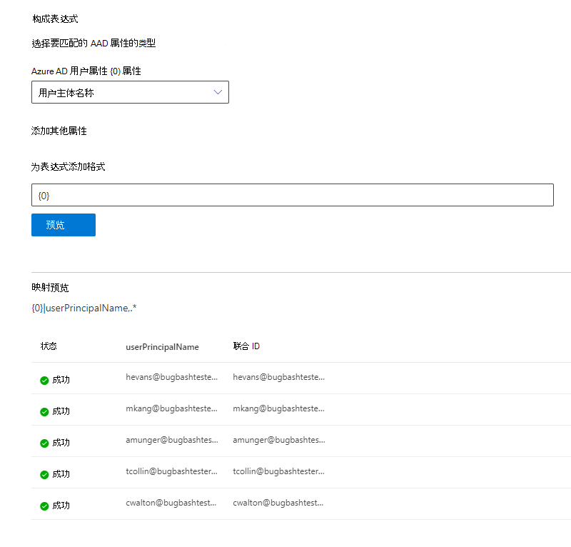

# 映射 Azure AD 标识   

本文将引导你完成将 Azure AD 标识映射到数据源 (非 Azure AD 标识) 以便访问控制列表 (ACL) 中具有非 Azure AD 标识的用户可以查看作用域为他们的连接器搜索结果的步骤。

这些步骤仅与搜索管理员相关，搜索管理员使用"仅有权访问此数据源的用户"和标识类型"AAD"的搜索权限由 Microsoft 设置 [Salesforce](salesforce-connector.md) 连接器。 以下步骤将演练如何将 Azure AD 用户属性映射到用户的 **联合身份验证 ID。**

>[!NOTE]
>如果要设置 [Salesforce](salesforce-connector.md)连接器，并选择"搜索权限"屏幕上的"仅有权访问此数据源和标识类型非 **AAD** 的用户"，请参阅映射非 Azure [AD](map-non-aad.md)标识一文，了解如何映射非 Azure AD 标识的步骤。  

## 映射 Azure AD 属性的步骤

### 1. 选择要映射的 Azure AD 用户属性

可以选择需要映射到联合身份验证 ID 的 Azure AD 属性。

你可以从下拉列表中选择 Azure AD 用户属性。 如果需要为组织创建联合身份验证 ID 映射，还可以添加所需多少 Azure AD 用户属性。

### 2. 创建完成映射的公式

你可以组合 Azure AD 用户属性的值以形成唯一的联合身份验证 ID。

在公式框中， {0} " " 对应于你 *选择的第一* 个 Azure AD 属性。 " {1} " 对应于你 *选择的第二* 个 Azure AD 属性。 " {2} 对应于第三 *个* Azure AD 属性，等等。  

下面是包含示例正则表达式输出和公式输出的公式的一些示例：

| 示例公式                  | 示例 {0} 用户的属性值                 | 示例 {1} 用户的属性值           | 公式输出                  |
| :------------------- | :------------------- |:---------------|:---------------|
| {0}.{1}@contoso.com  | firstname | lastname |firstname.lastname@contoso.com
| {0}@domain.com                 | userid                 |             |userid@domain.com

提供公式后，可以选择单击"预览"，查看数据源中应用了各自的用户映射的 5 个随机用户的预览。 预览的输出包括步骤 1 中为这些用户选择的 Azure AD 用户属性的值，以及步骤 2 中为该用户提供的最终公式的输出。 它还指示是否可以通过"成功"或"失败"图标将公式的输出解析为租户中的 Azure AD 用户。  

>[!NOTE]
>如果单击"预览"后，一个或多个用户映射的状态为"失败"，则仍可继续创建 **连接**。 预览显示 5 个随机用户及其来自数据源的映射。 如果您提供的映射未映射所有用户，则可能会遇到这种情况。

## Azure AD 映射示例

有关示例 Azure AD 映射，请参阅下面的快照。

## 限制  

- 所有用户仅支持一个映射。 不支持条件映射。  

- 连接发布后，你无法更改映射。  

- Azure AD 到联合身份验证 ID 转换不支持基于 Azure AD 用户属性的基于正则表达式的表达式。