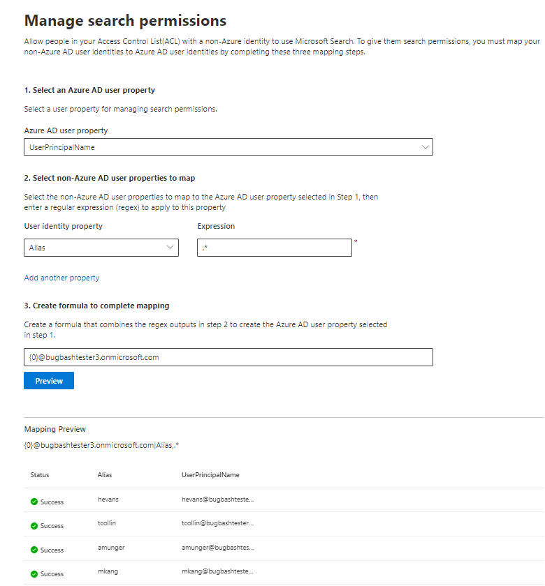

# 映射非 Azure AD 标识  

本文将引导你完成将非 Azure AD 标识映射到 Azure AD 标识的步骤，以便访问控制列表 (ACL) 具有非 Azure AD 标识的用户可以查看范围为他们的连接器搜索结果。

这些步骤仅与由 Microsoft 设置 [ServiceNow](servicenow-connector.md) 或 [Salesforce](salesforce-connector.md) 连接器的搜索管理员相关，搜索管理员具有"仅对此数据源具有访问权限的用户"和标识类型"非 AAD"的搜索权限。

>[!NOTE]
>如果要设置 Salesforce 连接器，在搜索权限屏幕上选择"仅有权访问此数据源和标识类型 **AAD** 的用户"，请参阅映射 [Azure AD](map-aad.md)标识一文，了解如何映射 Azure AD 标识的步骤。  

## 映射非 Azure AD 属性的步骤

### 1. 选择 Azure AD 用户属性  

可以选择要创建映射的 Azure AD 用户属性。 这是你要将非 Azure AD 标识映射到的目标属性。  

可以选择以下 Azure AD 属性之一：

| Azure AD 属性    | 定义           | 示例         |
| :------------------- | :------------------- |:--------------- |
| 用户主体名称 (UPN)  | UPN 包含一个 UPN 前缀 (用户帐户名) 一个 UPN 后缀 (DNS 域名) 。 前缀使用"@"符号与后缀联接。 | us1@contoso.onmicrosoft.com |
| Azure AD ID                 | 给定用户的 Azure AD ID 是用户的唯一 GUID。                 | 58006c96-9e6e-45ea-8c88-4a56851eefad            |
| Active Directory 安全 ID (SID)                   | SID (安全) 标识符是 Active Directory 用来将对象标识为安全主体的唯一标识符。                  | S-1-5-21-453406510-812318184-4183662089             |

### 2. 选择要映射的非 Azure AD 用户属性

可以选择从数据源提取的非 Azure AD 属性以应用正则表达式。 若要了解有关在数据源中查找这些属性位置的信息，请参阅 [ServiceNow 和](servicenow-connector.md) [Salesforce](salesforce-connector.md) 页面。  

你可以从下拉列表中选择非 Azure AD 用户属性，并提供要应用于这些用户属性值的正则表达式。 若要了解有关正则表达式的更多信息，请参阅 [正则表达式参考]( https://docs.microsoft.com/dotnet/standard/base-types/regular-expression-language-quick-reference)。  

下面是应用于示例字符串的正则表达式及其输出的一些示例： 

| 示例字符串                  | 正则表达式                 | 示例字符串上正则表达式的输出           |
| :------------------- | :------------------- |:---------------|
| Alexis Vasquez  | .* | Alexis Vasquez |
| Alexis Vasquez                 | ..$                 | ez            |
| Alexis Vasquez                  |  (\w+) $                  | Vasquez             |

你可以添加与表达式一样多的非 Azure AD 用户属性。 如果最终公式保证这一点，可以将不同的正则表达式应用于同一用户属性。  

### 3. 创建完成映射的公式

你可以合并应用于每个非 Azure AD 用户属性的正则表达式的输出，以形成步骤 1 中所选的 Azure AD 属性。

在公式框中， " " 对应于应用于所选第一 {0} 个非 Azure  AD 属性的正则表达式的输出。 " " 对应于应用于所选第二个非 {1} Azure  AD 属性的正则表达式的输出。 " " 对应于应用于第三个非 Azure AD 属性的 {2} 正则表达式的输出，等等。   

下面是包含示例正则表达式输出和公式输出的公式的一些示例： 

| 示例公式                  | 示例 {0} 用户的值                 | 示例 {1} 用户的值           | 公式输出                  |
| :------------------- | :------------------- |:---------------|:---------------|
| {0}.{1}@contoso.com  | firstname | lastname |firstname.lastname@contoso.com
| {0}@domain.com                 | userid                 |             |userid@domain.com

提供公式后，可以选择单击"预览"以查看数据源中应用了其各自的用户映射的 5 个随机用户的预览。 预览的输出包括步骤 2 中为这些用户选择的非 Azure AD 用户属性的值，以及步骤 3 中为该用户提供的最终公式的输出。 它还指示是否可以通过"成功"或"失败"图标将公式的输出解析为租户中的 Azure AD 用户。  

>[!NOTE]
>如果单击"预览"后，一个或多个用户映射的状态为"失败"，则仍可继续创建 **连接**。 预览显示 5 个随机用户及其来自数据源的映射。 如果您提供的映射未映射所有用户，则可能会遇到这种情况。

## 示例非 Azure AD 映射

有关示例非 Azure AD 映射，请参阅下面的快照。

## 限制  

- 所有用户仅支持一个映射。 不支持条件映射。  

- 连接发布后，你无法更改映射。  

- 转换当前仅支持针对非 AAD 用户属性的基于正则表达式的表达式。

- 只有 3 个 Azure AD 标识，你可以选择映射到 (UPN、Azure AD ID 和 AD SID) 。