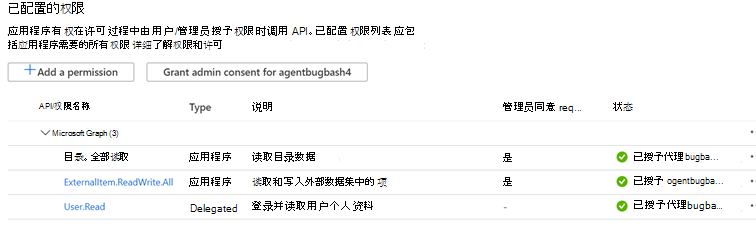
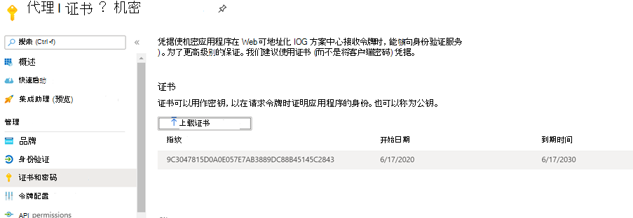
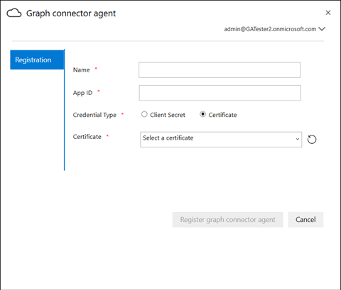

# 本地代理On-Prem Agent

## 图形连接器代理Graph connector agent

本地 Graph 连接器要求您安装 *graph 连接器代理* 软件。On-prem Graph connectors require you to install *Graph connector agent* software. 它允许在本地数据和云服务之间进行快速且安全的数据传输。It allows quick and secure data transfer between on-premises data and cloud services. 本文将指导您完成安装和配置软件的步骤。This article guides you through the steps of installing and configuring the software. 配置完成后，将可以从 [Microsoft 365 管理中心](https://admin.microsoft.com)创建到本地数据源的连接。Once configured, it will be available for creating connections to your on-prem data sources from the [Microsoft 365 admin center](https://admin.microsoft.com).

## 安装Installation

使用 [此链接](https://download.microsoft.com/download/d/d/e/dde18236-9c67-437d-a864-894a0a888ef2/AgentPackage.msi) 下载 Graph 连接器代理的最新版本，并使用安装向导安装该软件。Download the latest version of Graph connector agent using [this link](https://download.microsoft.com/download/d/d/e/dde18236-9c67-437d-a864-894a0a888ef2/AgentPackage.msi) and install the software using the installation wizard. 使用下面所述的计算机的推荐配置，软件可以无缝处理最高三个连接。With the recommended configuration of the machine described below, the software can seamlessly handle up to three connections. 超过此范围的任何连接可能会降低性能。Any connections beyond that might degrade the performance.

建议的配置：Recommended configuration:

* Windows 10、Windows Server 2012 R2 及更高版本Windows 10, Windows Server 2012 R2 and above
* 8核，3GHz8 cores, 3GHz
* 16 GB RAM，1GB 磁盘空间16GB RAM, 1GB Disk Space
* 通过443对数据源和 internet 的网络访问Network access to data source and internet through 443

## 创建代理的应用程序Creating App for the agent  

在创建连接之前，需要对代理实例进行多个重要的关键参数馈送。The agent instance needs to be fed few critical parameters before you create connections. 这些参数包括使用 Graph 摄取 Api 所需的身份验证详细信息。These parameters include authentication details required for using Graph ingestion APIs.  

为代理创建应用程序的步骤。Steps for creating App for the agent.

1. 转到 [Azure 门户](https://portal.azure.com) ，并使用管理员凭据登录租户。Go to the [Azure portal](https://portal.azure.com) and sign in with admin credentials for the tenant.
2. 从导航窗格导航到 " **Azure Active Directory**  ->  **应用程序注册**"，然后选择 "**新建注册**"。Navigate to **Azure Active Directory** -> **App registrations** from the navigation pane and select **New registration**.
3. 提供应用程序的名称并选择 " **注册**"。Provide a name for the app and select **Register**.
4. 记下应用程序 (客户端) ID。Make a note of the Application (client) ID.
5. 从导航窗格中打开 **API 权限** ，并选择 " **添加权限**"。Open **API permissions** from the navigation pane and select **Add a permission**.
6. 依次选择 " **Microsoft Graph** " 和 " **应用程序权限**"。Select **Microsoft Graph** and then **Application permissions**.
7. 从权限中搜索 "ExternalItem" 和 "Directory. All" 并选择 " **添加权限**"。Search for "ExternalItem.ReadWrite.All" and "Directory.Read.All" from the permissions and select **Add permissions**.
8. 选择 " **授予管理员同意 [TenantName]** " 并通过选择 **"是"** 进行确认。Select **Grant admin consent for [TenantName]** and confirm by selecting **Yes**.
9. 检查权限是否处于 "已授予" 状态。Check that the permissions are in the granted state.
     

## 配置 Graph 连接器代理Configuring Graph connector agent

为代理创建应用后，必须使用适当的身份验证详细信息配置代理。Once you have created the App for the agent, you must configure the agent with appropriate authentication details.

可以按以下形式之一提供身份验证详细信息。Authentication details can be provided in one of the following forms.

### 配置客户端机密以进行身份验证Configuring the client secret for authentication

1. 转到 [Azure 门户](https://portal.azure.com) ，并使用管理员凭据登录租户。Go to the [Azure portal](https://portal.azure.com) and sign in with admin credentials for the tenant.
2. 从导航窗格中打开 " **应用注册** "，然后转到相应的应用程序。Open **App Registration** from the navigation pane and go to the appropriate App. 在 " **管理**" 下，选择 " **证书和密码**"。Under **Manage**, select **Certificates and secrets**.
3. 选择 " **新建客户端密码** "，然后选择密码的有效期。Select **New Client secret** and select an expiry period for the secret. 复制生成的机密并将其保存，因为它将不会再次显示。Copy the generated secret and save it because it will not be shown again.
4. 使用此客户端密码和应用程序 ID 配置代理。Use this Client secret along with the Application ID to configure the agent. 不要在代理的 " **名称** " 字段中使用任何空格。Do not use any blank spaces in the **Name** field of the agent. 接受字母数字字符。Alpha numeric characters are accepted.

## 使用指纹证书进行身份验证Using thumbprint certificate for authentication

如果已通过 [配置客户端密码进行身份验证](#configuring-the-client-secret-for-authentication) 来配置身份验证详细信息，则可以直接跳转到 [安装程序概述](configure-connector.md)。If you have already configured the authentication details by following [Configuring the client secret for authentication](#configuring-the-client-secret-for-authentication) , then you can jump directly to [Setup overview](configure-connector.md).

1. 打开 " **应用注册** "，然后从导航窗格中选择 " **证书和密码** "。Open **App registration** and select **Certificates and secrets** from the navigation pane. 复制证书指纹。Copy the certificate thumbprint.

2. 使用客户端密码或指纹来注册 Graph 连接器代理。Use either the client secret or thumbprint to register the Graph connector agent.

