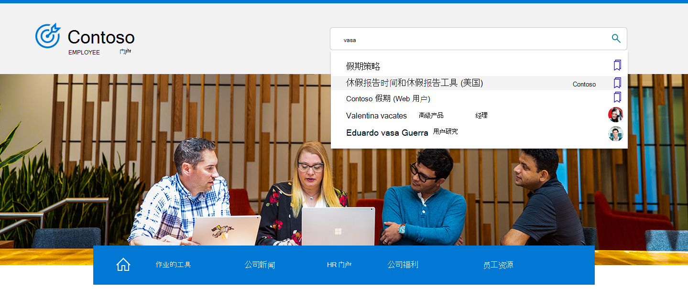

# Microsoft 搜索概述必应

Microsoft 搜索中必应 Web 搜索和 web 搜索Microsoft 搜索必应功能。 它提供了熟悉的搜索体验，可帮助用户从组织和 Web 查找相关结果。 为了帮助保护用户和数据的安全，用户必须先登录工作或学校帐户必应才能找到内部结果。

## 用户看到的内容

当组织成员在Microsoft 搜索中必应，他们可在两个地方查看工作或学校结果：

- 所有结果页面：如果有相关的工作或学校结果，它将出现在搜索结果页面的顶部，后跟公共 Web 结果。
- 工作或学校结果页：仅组织的结果会显示在此页面上。 它从不包括公共 Web 结果。

:::image type="content" alt-text="Contoso 中学校的所有和工作结果页面以及 Contoso 学校结果页面。" source="media/msb-overview/all-work-school-serps.gif" lightbox="media/msb-overview/all-work-school-serps.gif":::

用户可以通过查找组织的徽标、名称或个人资料图像，轻松识别工作或学校结果。

## Microsoft 搜索入门必应

Microsoft 搜索中必应默认情况下为组织中的每个人启用。 如果用户已登录到其他服务（如 Outlook、Microsoft Teams 或 SharePoint）上的工作或学校帐户，则当他们转到 必应 时，将自动登录到同一必应。 有关详细信息，请参阅 [Microsoft 必应搜索安全性和隐私](security-for-search.md)。

如果你不熟悉 Microsoft 搜索 中的必应，我们建议查看 Microsoft 搜索[管理](https://aka.ms/SearchAdminEssentials)必应指南中的指南，了解配置和部署信息。 为了帮助提高用户对应用Microsoft 搜索，我们的[采用工具包](https://aka.ms/SearchAdoptionKit)包括培训和通信资源。

## 工作和学校搜索体验

Microsoft 搜索必应中提供的搜索体验专为工作和学校用户的需求而定制。 在具有企业服务计划的组织中，用户将获得专为工作设计的搜索体验，包括组织结构图Power BI答案。

具有教育服务计划的组织中用户将获得专为搜索学校而设计的体验，包括课程和即将进行的作业的解答。

如果你的组织具有教育和企业服务计划，你可以选择Microsoft 搜索学校必应工作体验中的一个服务。 有关详细信息，请参阅选择 [学校或工作搜索体验](/microsoftsearch/select-work-school-search-experience)。

## 将Microsoft 搜索添加到必应 Intranet

Microsoft 搜索旨在方便用户搜索的任何地方访问内部信息。 如果组织内部网网站中的人员使用 Intranet 网站启动工作或学校搜索，请考虑向网站添加嵌入搜索框。

使用简单的脚本，您可以添加自定义搜索框，甚至将其引导到自定义垂直搜索框。 若要了解更多信息，请参阅 [将搜索框添加到 Intranet 站点](add-a-search-box-to-your-intranet-site.md)。

## 设置默认值以简化工作或学校搜索

为了帮助提高用户Microsoft 搜索的必应，请考虑通过设置默认值，使其在用户的一天中的无缝部分的方法。

**默认浏览器**：当你Microsoft Edge浏览器时，你的用户可以搜索你的组织，并获取相关搜索建议（从地址栏开始）。 从地址栏搜索是一种快速且易于查找的信息，他们无需转到必应开始搜索。 有关详细信息，请参阅将Microsoft Edge[设置为默认浏览器](/deployedge/edge-default-browser)。

**默认搜索引擎**：如果更改默认浏览器不是一个选项，可以通过将 必应 设置为默认搜索引擎，从地址栏启用工作或学校搜索。 有关详细信息，请参阅[Make 必应 the default search engine](set-default-search-engine.md)。 如果你的组织拥有Microsoft 365 企业应用版 (服务Office 365 专业增强版) 计划，可以通过在 必应 扩展中部署 Microsoft 搜索，将 必应 设置为 Google Chrome 的默认搜索引擎。 有关详细信息，请参阅 Microsoft 搜索[和 必应 中的Microsoft 365 企业应用版。](/deployoffice/microsoft-search-bing)

**默认主页**：必应设置为组织的默认主页不会从地址栏搜索工作或学校，但它确实提供了访问 bing.com。 有关详细信息，请参阅将[必应.com 设置为默认主页](set-default-homepage.md)。

## 安全和隐私

Microsoft 搜索必应使用增强的安全和隐私措施来帮助保护组织数据和用户。 有关详细信息，请参阅安全[与隐私Microsoft 搜索和](security-for-search.md)必应Microsoft 搜索中的必应[帮助保护你的信息安全](https://support.microsoft.com/office/how-microsoft-search-in-bing-helps-keep-your-info-secure-cbce46ae-bb1f-4d0e-86f1-5984f4589113)。

## 另请参阅

- [Microsoft 搜索概述](overview-microsoft-search.md)
- [规划内容](plan-your-content.md)
