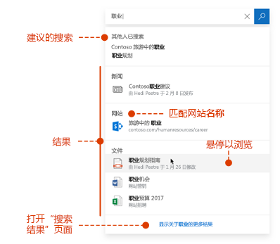
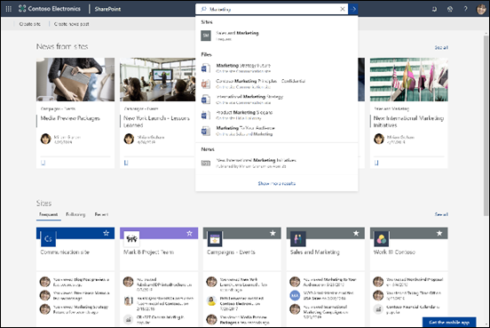

# Microsoft 搜索概述

Microsoft 搜索是 Microsoft 365 高效应用和更广泛的 Microsoft 生态系统中的统一搜索功能。 随着时间的推移，将在越来越多的 Microsoft 365 应用中提供 Microsoft 搜索。

Microsoft 搜索可帮助用户找到正确的答案、人员和内容，以便在他们所使用的应用中完成其任务。

- 用户可获得与其搜索的应用的**上下文**相关的结果。 例如，在 Outlook 中搜索时，他们可找到电子邮件，而不是 SharePoint 中的网站。 在 SharePoint 中搜索时，他们可找到网站、页面和文件。
- 无论用户使用哪种应用，Microsoft 搜索都提供**个人**结果。  Microsoft 搜索使用 Microsoft Graph 中的见解来显示与每个用户相关的结果。 每个用户可能会看到不同的结果，即使他们搜索相同的字词。 他们只能看到其有权访问的结果，Microsoft 搜索不会更改权限。
- 用户无需记住信息所在的位置。 例如，用户正在使用 Word，并希望重复使用某位同事通过 OneDrive 共享的演示文稿中的信息。 无需切换到 OneDrive 并搜索该演示文稿，他们只需从 Word 搜索即可。  
- 在必应中，除了公共网页结果之外，用户还可以从组织内部获得结果。

## 用户看到的内容

在必应中，用户使用与 Web 搜索相同的搜索框。 在 Microsoft 365 应用中，用户可在标题栏中找到 Microsoft 搜索框。 其外观如下所示：

当用户单击搜索框内部时，搜索会根据他们以前在 Office 365 中的活动以及组织内的热点内容来提供建议结果。 他们最近处理的文件、最近使用的命令以及展开合作的人员都是搜索所考虑的活动示例。 当用户开始在搜索框中输入内容时，建议的结果会更新。 用户可以直接从搜索框打开搜索结果。 下面是 SharePoint 中的搜索示例。

如果搜索框中的建议不是他们想要查找的内容，请按 **Enter** 以打开完整的结果列表。 他们可以使用元数据（例如最后修改项目的人员和时间、项目所在的位置以及预览）来确定这是否为其所查找的内容。

## Microsoft 搜索的优点

**从任何 Microsoft 搜索框对整个 Microsoft 365 进行搜索** – 用户可以从任何 Microsoft 搜索框进行搜索，并快速回到正在执行的任务。 Microsoft 搜索将来自 Office 365（包括 SharePoint、OneDrive for Business 和 Exchange）中的数据源的结果汇集在一起。

**易于搜索** - Microsoft 搜索会在搜索框中根据用户以前在 Office 365 中的活动提供建议结果。

**查找共享文件** - Microsoft 搜索使用高级查询理解功能让查找共享文件变得更简单。 用户可以轻松找到他们正在协作的文件。

**显示相关内容** - 提供用户完成任务所需的信息和答案，例如策略、权益、资源、工具等。 还可聚焦特定群组，例如新雇员或远程工作人员。

**Microsoft 搜索的演进** – 用户可以搜索的内容类型集和搜索框的智能水平将随着时间的推移而增长。

**跨所有应用进行管理** - 默认情况下，Microsoft 搜索处于**启用状态**，你所做的任何管理都将应用于所有应用中的 Microsoft 搜索。

## 目前拥有 Microsoft 搜索的应用

 默认情况下，所有支持 Microsoft 搜索的 Microsoft 应用都会将其打开。 用户只需使用工作或学校帐户登录即可。

以下应用目前提供 Microsoft 搜索：
- SharePoint Online
- OneDrive for Business
- Outlook 网页版
- Windows 上的 Office 应用

此外，已登录的用户可在以下对象中找到 Microsoft 搜索：

- 必应主页
- Office.com
- Word、Excel 和 PowerPoint Online 的起始页

如果用户使用必应作为默认搜索引擎，则还可以在必应中从 Edge 地址栏启动搜索。

## 要求

必须拥有以下 Office 365 或 Microsoft 365 订阅之一：

- Office 365 商业协作版和商业高级版
- Office 365 A1/A3/A5
- Office 365 教育版 E1/E3
- Office 365 企业版 E1/E3/E3 开发人员/E5
- Office 365 F1
- Microsoft 365 商业版
- Microsoft 365 A3/A5
- Microsoft 365 F1/E3/E5

用户和管理员必须都分配获得以上许可证之一。 只有拥有活动帐户的用户才可使用 Microsoft 搜索，并且必须**已登录**，因为 Microsoft 搜索需要 Azure active Directory

## 为你的组织定制 Microsoft 搜索

当用户在 SharePoint 起始页、office.com 或必应进行搜索时，作为管理员，你可以使其轻松获得特定组织的理想结果。 可通过定义 Microsoft 搜索响应查询中某些关键字时显示的答案来实现此操作。 你可以定义多种类型的答案： 

**显示有用内容** - 通过为用户添加书签，帮助用户找到组织内的重要工具和资源。 如同你可以为公共网页创建书签一样，你可以为任何内部网页创建书签，以供用户搜索。 你还可以在书签中集成 Power App，以便用户能够直接通过书签完成任务。

**提供常见问题的答案** – 为组织内的最常见问题提供最佳答案。 当用户在搜索框中输入常见问题时，Microsoft 搜索会显示答案，而不是仅提供指向网页的链接。

**显示有用位置** - 在地图上显示贵组织的大楼、办公室和其他工作空间的地图结果和地址信息。 用户可以使用地图获取路线、查看附近场所等。

你可以查看使用情况统计信息，这些统计信息显示用户如何使用你的答案，以及用户是否找到了所需内容。 基于此项，你可以微调答案或添加新的答案。

有关使用关键字和保留关键字的详细信息，请参阅[使内容易于查找](make-content-easy-to-find.md)。

## 搜索哪些内容？

Microsoft 搜索可搜索你的组织存储在 SharePoint Online、OneDrive for Business 和 Exchange 中的内容，包括全局地址列表和 Office 365 组。 Microsoft 搜索不会跨租户搜索，也不会显示来自组织共享的内容的结果。 如果你的组织已设置了使用云混合搜索的混合 SharePoint 环境，则 Microsoft 搜索将同时返回来自在线和本地 SharePoint 内容（包括已连接到 SharePoint Server 环境的任何外部内容）的搜索结果。 [详细了解混合搜索环境](https://docs.microsoft.com/sharepoint/hybrid/learn-about-cloud-hybrid-search-for-sharepoint)。

当用户从 SharePoint 起始页或 Office.com 进行搜索时，Microsoft 搜索会搜索组织内的所有内容，并显示该用户有权查看的结果。 这称为**全局搜索范围**。

当用户从必应搜索时，用户可以从组织内的所有内容获得最相关的结果，该组织嵌入在来自 **Web** 的结果列表中。 如果他们需要查看**所有**组织结果，只需单击一下即可获得全局搜索范围。

## 用户可以找到哪些类型的结果？
用户在搜索时可找到以下类型的结果：

**SharePoint**：文件、文件夹、组织内的人员、组织图表、网站、网站页面、新闻、列表和列表项。 常见问题的答案、指向权威信息的书签、位置和工具（如果已定义）。 
  [了解可以找到哪些类型的文件](https://docs.microsoft.com/zh-CN/SharePoint/technical-reference/default-crawled-file-name-extensions-and-parsed-file-types)。

**Office.com 和 Word、Excel 和 PowerPoint Online 起始页**：应用、文件、文件夹、人员、组织图表、SharePoint 网站、网站页面、列表和列表项。 常见问题的答案、指向权威信息的书签、位置和工具（如果已定义）。 可以找到与 SharePoint 中的文件具有相同类型的文件。

**必应**：公共网页上的内容、文件、Office 365 组、人员、Yammer 和 Teams 对话、组织图表、SharePoint 网站。 常见问题的答案、指向权威信息的书签、位置和工具（如果已定义）。  可以找到 Word、Excel、PowerPoint、Visio、OneNote 和 PDF 文件。

**Outlook**：组织中的电子邮件、附件和人员。

**Windows 上的 Office 应用**：应用中的操作、组织内和网页上的人员、文件、字词解释、文件内部或帮助内容中的查询匹配、网页上的内容。 可以找到 Word、Excel、PowerPoint、Visio 和 OneNote 文件。

**OneDrive**：可以找到与 SharePoint 中的文件具有相同类型的文件。

## Microsoft 搜索如何工作？

当用户进行搜索时，Microsoft 搜索会处理查询并从较长的短语解析搜索意图，使用人工智能 (AI) 来了解用户添加到查询的常见多余短语，这些短语不影响他们的搜索意图。 例如，当用户搜索“如何更改密码”时，我们会从查询中提取不太重要的字词，并根据“更改密码”等相关字词进行触发。  

Microsoft 搜索并不会创建新的索引，而是搜索 SharePoint Online、OneDrive for Business 和 Exchange 内容的现有索引。

用户**有权**查看的搜索结果将显示在搜索结果页面上。 Microsoft 搜索使用智能排名算法根据相关性对结果进行排序。

## SharePoint 中的 Microsoft 搜索

SharePoint 中的 Microsoft 搜索是 SharePoint Online 中的新式搜索体验。 SharePoint Online 还提供了经典搜索体验。 默认情况下，这两种体验都处于开启状态，并且都搜索相同的内容。 作为搜索管理员，你无法在 SharePoint Online 中开启任何一种体验。 用户获得的搜索体验取决于他们搜索的位置：

- 在 SharePoint 起始页、中心网站、通信网站和新式团队网站上，用户可获得 Microsoft 搜索框。
- 用户可以在发布网站、经典团队网站和搜索中心获得经典搜索框。

你可以自定义经典搜索体验，例如向搜索结果页面添加自定义精简程序或以不同方式显示某种类型的结果。 你不能按照这种方式在 SharePoint 中自定义 Microsoft 搜索体验。 你对经典搜索所做的某些自定义可能会影响 SharePoint 中的 Microsoft 搜索。 如果你的组织将同时在 SharePoint 中使用这两种搜索体验，请[了解有关这些差异的信息以及如何避免影响 SharePoint 中的 Microsoft 搜索](https://docs.microsoft.com/zh-CN/sharepoint/differences-classic-modern-search)。

## Microsoft 必应搜索

因为与工作相关的搜索可能是敏感的，Microsoft 搜索为必应的公共 Web 结果部分如何处理这些搜索使用了一套信任措施。

Microsoft 搜索请求通过 HTTPS 提出。 这一点可确保连接经过端到端加密，从而增强了安全性。 此外，所有与 Microsoft 搜索流量有关的搜索日志都会被取消标识并与公共的非 Microsoft 搜索流量分开存储。

无论用户查询在返回的响应中是包含一个还是多个工作相关结果，都要采取以下措施：

**日志记录** - 已取消标识所有与 Microsoft 搜索流量相关的搜索日志，这些日志将保留 18 个月。 存储在这些系统日志中的查询将仅用于在满足一组限制和频率阈值时对公共功能（如针对公共网络结果的自动建议或相关搜索）进行建模和培训，这使我们相信这些查询是常见的，而不是特定于某个组织。 相应查询必须在非 Microsoft 搜索用户的共同相关数据中出现过很多次，并且该查询不能仅触发企业搜索结果。 不满足这些要求的查询将与公共的非 Microsoft 搜索流量分开存储。 受限访问通过各种安全机制进行管理，包括工程系统中的安全组和其他层。

**搜索历史记录** - 当用户使用工作或学校帐户登录时，用户的搜索历史记录将无法在其他计算机或设备上使用。

**广告** - 企业搜索查询从不与广告商共享或推荐给广告商。
广告永远不会以基于工作身份或组织的用户为目标。

## 另请参阅

[设置 Microsoft 搜索](setup-microsoft-search.md)

[使内容易于查找](make-content-easy-to-find.md)