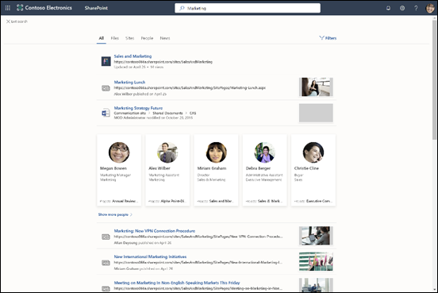

# Microsoft 搜索概述

Microsoft 搜索可帮助您找到完成所处理操作所需的操作。 无论你是搜索人员、文件、组织结构图、网站或常见问题解答，都可以Microsoft 搜索整个工作日获取答案。

Microsoft 搜索帮助用户找到正确的答案、人员以及内容，以在已工作的应用中完成其任务。

- 用户可获得与其搜索的应用的 **上下文** 相关的结果。 例如，当他们在[Microsoft](https://www.microsoft.com/outlook)Outlook 中搜索时，他们找到电子邮件，而不是[SharePoint网站。](http://sharepoint.com/) 在 SharePoint 中搜索时，他们可找到网站、页面和文件。
- 无论用户使用哪种应用，Microsoft 搜索都提供 **个人** 结果。 Microsoft 搜索[Microsoft](https://developer.microsoft.com/graph/) Graph见解来显示与每个用户相关的结果。 每个用户可能会看到不同的结果，即使他们搜索相同的字词。 他们只能看到已有权访问的结果，Microsoft 搜索不会更改权限。
- 用户无需记住信息所在的位置。 例如，一个用户正在Microsoft Word，并且想要重用同事从其用户共享的信息的演示文稿[OneDrive。](https://onedrive.live.com/about/) 无需切换到"搜索"OneDrive搜索该演示文稿，只需从 Word 进行搜索。
- 在[必应](https://bing.com)中，除了公共网页结果之外，用户还可以从组织内部获得结果。

## 用户看到的内容

在[必应](https://bing.com)中，用户使用与 Web 搜索相同的搜索框。 在Office应用中，用户Microsoft 搜索标题栏中的"页面"框。 它类似于：

当用户在"搜索"框中单击时，搜索将基于他们之前在搜索Office 365并基于组织中热门内容提供建议结果。 他们最近处理的文件、最近使用的命令以及他们协作过的人是搜索考虑的活动示例。 当用户开始在"搜索" **框中键入** 内容时，建议的结果将更新。 用户可以从"搜索" **框中打开搜索结果** 。 下面是一个在搜索中[SharePoint。](http://sharepoint.com/)

如果搜索框中的建议不是用户查找的内容， **则 Enter** 将打开结果的完整列表。 他们可以使用元数据（如上次修改项目的人和项目所在的时间）以及预览项来确定项目是否正在查找。

## Microsoft 搜索的优点

**从任何 Microsoft 搜索框对整个 Microsoft 365 进行搜索** – 用户可以从任何 Microsoft 搜索框进行搜索，并快速回到正在执行的任务。 Microsoft 搜索将来自数据源的结果汇集在一起Office 365，包括[SharePoint、Microsoft OneDrive](http://sharepoint.com/) [for Business](https://onedrive.live.com/about/business/)和[Microsoft Exchange Server。](https://products.office.com/exchange/microsoft-exchange-server)

**易于搜索**– Microsoft 搜索"搜索"框中，根据用户之前Office 365活动提供 **建议** 结果。

**查找共享文件** – Microsoft 搜索使用高级查询理解功能让查找共享文件变得更简单。 用户可以轻松找到他们正在协作的文件。

**显示相关内容** – 提供用户完成任务所需的信息和答案，例如策略、权益、资源、工具等。 还可以将特定组（如新员工、远程工作者或不同地理位置）作为目标。

**跨所有应用进行管理** – 默认情况下，Microsoft 搜索处于 **启用状态**，你所做的任何管理都将应用于所有应用中的 Microsoft 搜索。

## 为你的组织定制 Microsoft 搜索

作为管理员，你可以为用户Microsoft 搜索出色的体验。

**显示有用的内容** – 答案根据关键字提供快速的权威结果来搜索查询。 [规划内容](plan-your-content.md)。

**添加外部内容**– Microsoft Graph 连接器允许您将外部内容引入索引。 使用连接器通过外部数据和文件来丰富搜索Microsoft 365。 [Microsoft Graph 连接器概述](connectors-overview.md)

**自定义用户体验** – 您可以通过使用垂直和其他配置来自定义用户体验。 [自定义Microsoft 搜索页面](customize-search-page.md)

## 搜索的内容

Microsoft 搜索显示组织存储在连接器中Microsoft 365索引的内容。 Microsoft 搜索不会跨租户搜索，也不显示来自其他组织共享的内容的结果。 如果你的组织已使用云混合搜索设置混合 SharePoint 环境，Microsoft 搜索 将返回来自联机和本地 SharePoint 内容的搜索结果，包括已连接到 SharePoint Server 环境的任何外部内容。 [详细了解混合搜索环境](/sharepoint/hybrid/learn-about-cloud-hybrid-search-for-sharepoint)。

用户将获取从其他位置获取的相同搜索结果，并且还将从 Internet 获取结果。

## 如何Microsoft 搜索工作

当用户进行搜索时，Microsoft 搜索会处理查询并从较长的短语解析搜索意图，使用人工智能 (AI) 来了解用户添加到查询的常见多余短语，这些短语不影响他们的搜索意图。 例如，当用户搜索“如何更改密码”时，我们会从查询中提取不太重要的字词，并根据“更改密码”等相关字词进行触发。  
用户 **有权** 查看的搜索结果将显示在搜索结果页面上。 Microsoft 搜索使用智能排名算法根据相关性对结果进行排序。

## 企业Microsoft 搜索如何必应公司数据

[安全与隐私Microsoft 搜索中必应](security-for-search.md)

## 另请参阅

[设置 Microsoft 搜索](setup-microsoft-search.md)