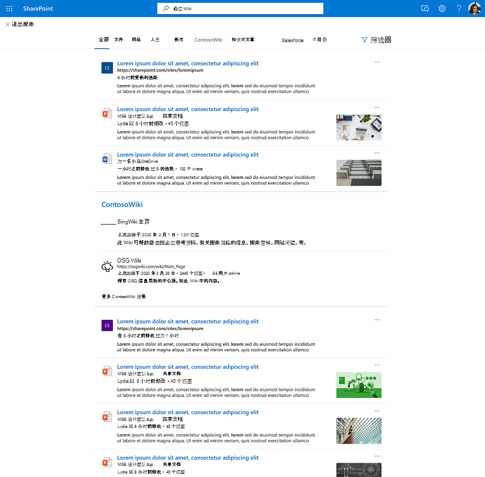

# Graph连接器结果群集

## 连接器Graph群集概述  

借助 Graph 连接器结果群集，企业可以在默认视图中搜索来自第三方数据源的内容，即 SharePoint、Office.com和 必应 中的 Microsoft 搜索 中的"全部"选项卡。

结果群集可帮助用户在一个地方发现所有第三方内容。 结果群集中显示的结果根据垂直搜索配置分组在一起。

## 如何选择和显示连接器结果

结果群集中提供的连接器结果派生自具有连接器内容的单个垂直搜索。 每个垂直搜索都提供一组相关结果，这些结果将成为候选结果群集。 根据每个项目的"title"属性和"content"属性选择相关结果。 内容属性在架构上 *标记为 isContent=true。*

为了确保从垂直搜索中发现内容，我们建议为项目提供有意义的标题。 这会对结果群集候选项的仲裁以及内容在结果群集中出现的可能性产生积极的影响。 例如，避免将 ID 用作属性"title"的值，除非你的用户使用 ID 来查找内容。

结果群集的显示方式因所配置垂直搜索的数量和内容类型等因素而异。 通过交互或忽略结果群集，用户将隐式提供将随着时间调整其触发的提示。

结果群集中显示的连接器项的搜索结果体验使用 [由你定义](./customize-search-page.md#create-your-own-result-type) 的结果类型。 如果未配置结果类型，则使用 [系统生成的](./customize-search-page.md#default-search-result-layout) 布局。

我们建议使用"title"属性作为搜索结果标题，使用"content"属性作为搜索说明。 这将通过准确触发结果群集和群集中最相关的结果为用户提供最佳体验。

结果群集显示在"全部"垂直页面的中间。 例如，下面将显示"MediaWiki"垂直的结果群集。

## 结果群集默认设置
  
默认情况下，结果群集体验已打开。  

如果要禁用它，请按照以下步骤在组织级别关闭体验：

1. 在 ["Microsoft 365 管理中心](https://admin.microsoft.com)中，转到 [**"垂直"。**](https://admin.microsoft.com/Adminportal/Home#/MicrosoftSearch/verticals)
1. 选择"**全部"** 垂直，然后启用"**隐藏连接器结果"。**

请按照以下步骤在网站级别关闭SharePoint体验：

1. 转到 **设置** 网站中的SharePoint
2. 转到"**网站信息** > **""查看所有网站设置"。**
3. 转到"Microsoft 搜索"部分，然后选择"为此 **Microsoft 搜索配置网站集"。**
4. 在导航窗格中，转到"自定义 **体验"，** 然后选择"**垂直"。**
5. 选择"**全部"** 垂直，然后启用"**隐藏连接器结果"。**
