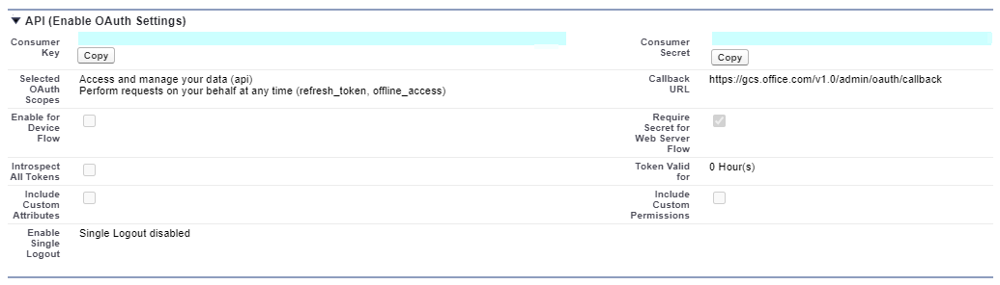
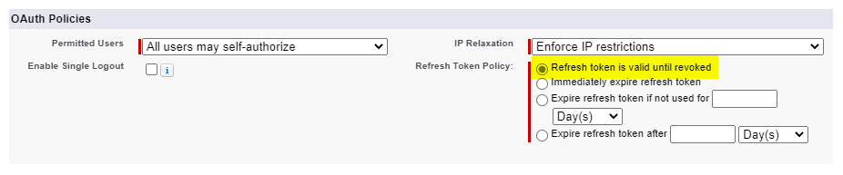
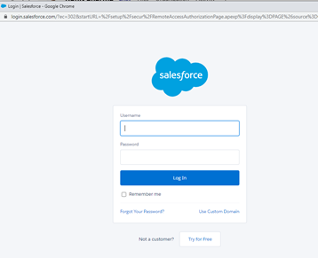
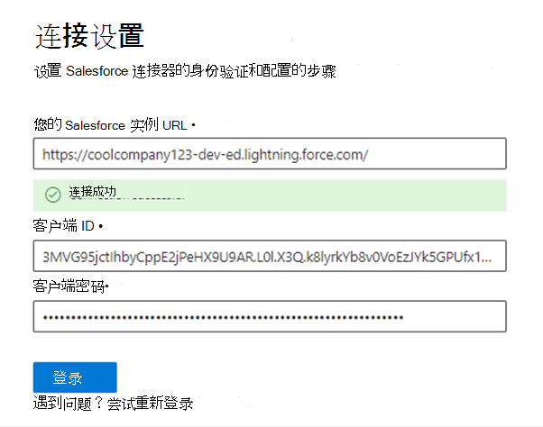
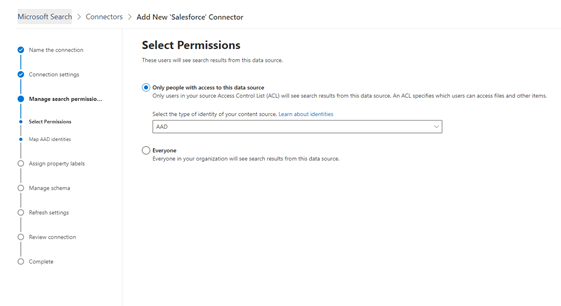
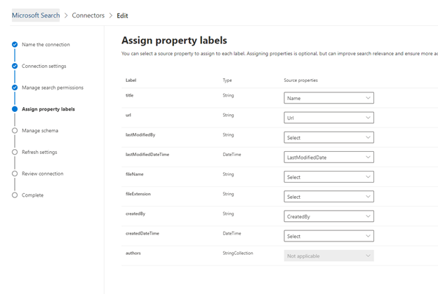

#  (预览的 Salesforce 连接器) Salesforce connector (preview)

使用 Salesforce 图形连接器，组织可以在你的 Salesforce 实例中索引联系人、商机、潜在客户和帐户对象。With the Salesforce Graph connector, your organization can index Contacts, Opportunities, Leads and Accounts objects in your Salesforce instance. 在从 Salesforce 配置连接器和索引内容之后，最终用户可以从任何 Microsoft Search client 中搜索这些项目。After you configure the connector and index content from Salesforce, end users can search for those items from any Microsoft Search client.

本文适用于 [Microsoft 365](https://www.microsoft.com/microsoft-365) 管理员或任何配置、运行和监控 Salesforce 连接器的人。This article is for [Microsoft 365](https://www.microsoft.com/microsoft-365) administrators or anyone who configures, runs, and monitors a Salesforce connector. 它说明了如何配置连接器和连接器功能、限制和故障排除技术。It explains how to configure your connector and connector capabilities, limitations, and troubleshooting techniques.

>[!IMPORTANT]
>目前，Salesforce Graph 连接器支持夏季 ' 19 或更高版本。The Salesforce Graph connector currently supports Summer '19 or later.

## 连接设置Connection settings

若要连接到您的 Salesforce 实例，需要您的 Salesforce 实例 URL、客户端 ID 和 OAuth 身份验证的客户端密码。To connect to your Salesforce instance, you need your Salesforce instance URL, the Client ID, and Client Secret for OAuth authentication. 以下步骤介绍了您或您的 Salesforce 管理员如何从 Salesforce 帐户获取此信息：The following steps explain how you or your Salesforce administrator can get this information from your Salesforce account:

- 登录到您的 Salesforce 实例，然后转到 "设置"Log in to your Salesforce instance and go to Setup

- 导航到 "应用程序-> 应用程序管理器"。Navigate to Apps -> App Manager.

- 选择 " **新建已连接的应用程序**"。Select **New connected app**.

- 完成 "API" 部分，如下所示：Complete the API section as follows:

    - 选中 " **启用 Oauth 设置**" 复选框。Select the checkbox for **Enable Oauth Settings**.

    - 将回调 URL 指定为： [https://gcs.office.com/v1.0/admin/oauth/callback](https://gcs.office.com/v1.0/admin/oauth/callback)Specify the Callback URL as: [https://gcs.office.com/v1.0/admin/oauth/callback](https://gcs.office.com/v1.0/admin/oauth/callback)

    - 选择 "这些必需的 OAuth 作用域"。Select these required OAuth scopes. 

        - 访问和管理您的数据 (api) Access and manage your data (api) 

        - 随时以您的身份执行请求 (refresh_token，offline_access) Perform requests on your behalf at any time (refresh_token, offline_access) 

    - 选中 " **需要 web 服务器流的密码**" 复选框。Select the checkbox for **Require secret for web server flow**.

    - 保存应用程序。Save the app.
    
      

- 复制使用者密钥和使用者密码。Copy the consumer key and the consumer secret. 当您在 Microsoft 365 管理门户中配置 Graph 连接器的连接设置时，这些设置将用作客户端 ID 和客户端密码。These will be used as the Client ID and the Client Secret when you configure the Connection Settings for your Graph Connector in the Microsoft 365 admin portal.

  
- 在关闭您的 Salesforce 实例之前，请执行以下步骤以确保刷新令牌不会过期：Before closing your Salesforce instance, perform the following steps to ensure that refresh tokens do not expire:
    - 转到应用程序-> 应用程序管理器Go to Apps -> App Manager
    - 查找刚创建的应用程序，然后选择右侧的下拉箭头。Find the app you just created and select the drop down on the right. 选择 " **管理**Select **Manage**
    - 选择 **编辑策略**Select **edit policies**
    - 对于 "刷新令牌" 策略，请选择 " **刷新令牌" 在废除前有效**For refresh token policy, select **Refresh token is valid until revoked**

  

现在，您可以使用 [M365 管理中心](https://admin.microsoft.com/) 完成 Graph 连接器的其余设置过程。You can now use the [M365 Admin Center](https://admin.microsoft.com/) to complete the rest of the setup process for your Graph connector.  

为您的 Graph 连接器配置连接设置，如下所示：Configure the Connection settings for your Graph connector as follows:

- 对于实例 URL，请使用 https：//[域]. 我的 .com，其中的域将成为您的组织的 Salesforce 域。For the Instance URL, use https://[domain].my.salesforce.com where domain would be the Salesforce domain for your organization. 
- 输入你从 Salesforce 实例获取的客户端 ID 和客户端密码，并选择 "登录"。Enter the Client ID and Client Secret you obtained from your Salesforce instance and select Sign in.
- 如果这是你第一次尝试使用这些设置登录，你将看到一个弹出窗口，要求你使用管理员用户名和密码登录到 Salesforce。If this is the first time you have attempted to Sign in with these settings, you will get a pop up asking you to login to Salesforce with your admin username and password. 下面的屏幕截图显示弹出窗口。The screenshot below shows the popup. 输入你的凭据，然后选择 "登录"。Enter your credentials and select Log in.

  

  >[!NOTE]
  >如果没有出现弹出窗口，则可能在浏览器中被阻止，因此您必须允许弹出窗口和重定向。If the pop up does not appear, it might be getting blocked in your browser, so you must allow pop-ups and redirects.

  >[!NOTE]
  >如果您的组织使用 (SSO) 的单一登录，则可以在登录接口的右下角选择 " **使用自** 定义域"。If your organization uses single sign-on (SSO), you can select **Use Custom Domain** in the bottom, right-hand corner of the login interface. 输入域，然后选择 " **继续**"。Enter the domain and then select **Continue**. 它将转到您的组织特定登录页，您可以在其中使用 SSO 登录选项。It will go to your organization specific login page where you will have an option to login with SSO.

- 通过在下面的屏幕截图中搜索显示 "连接成功" 的绿色标题，检查连接是否成功。Check that the connection was successful by searching for a green banner that says "Connection successful" as show in the screenshot below.

  

## 管理搜索权限Manage search permissions
你将需要选择哪些用户将看到来自此数据源的搜索结果。You will need to choose which users will see search results from this data source. 如果仅允许某些 Azure Active Directory (Azure AD) 或非 Azure AD 用户查看搜索结果，则需要映射这些标识。If you allow only certain Azure Active Directory (Azure AD) or Non-Azure AD users to see the search results, you will then need to map the identities.

### 选择权限Select Permissions
您可以选择从您的 Salesforce 实例中)  (Acl 中引入访问控制列表，也可以允许组织中的所有人查看此数据源中的搜索结果。You can choose to ingest Access Control Lists (ACLs) from your Salesforce instance, or you can allow everyone in your organization to see search results from this data source. Acl 可以包含 Azure Active Directory (AAD) 标识 (从 Azure AD 联合到 Salesforce) 的用户、非 Azure AD 标识 (在 Azure AD) 中具有相应标识的本机 Salesforce 用户，或两者兼有。ACLs can include Azure Active Directory (AAD) identities (users who are federated from Azure AD to Salesforce), non-Azure AD identities (native Salesforce users who have corresponding identities in Azure AD), or both.

### 映射非 AAD 标识Map non-AAD identities 
如果你选择从 Salesforce 实例中引入 ACL 并为标识类型选择了 "非 AAD"，请参阅 [映射你的非 AZURE AD 标识](map-non-aad.md) ，了解有关标识标识的说明。If you chose to ingest an ACL from your Salesforce instance and selected "non-AAD" for the identity type see [Map your non-Azure AD Identities](map-non-aad.md) for instructions on mapping the identities.

### 映射 AAD 标识Map AAD identities
如果你选择从 Salesforce 实例中引入 ACL 并为标识类型选择了 "AAD"，请参阅 [映射 AZURE AD 标识](map-aad.md) 以获取有关映射标识的说明。If you chose to ingest an ACL from your Salesforce instance and selected "AAD" for the identity type see [Map your Azure AD Identities](map-aad.md) for instructions on mapping the identities. 若要了解如何设置适用于 Salesforce 的 Azure AD SSO，请参阅本 [教程](https://docs.microsoft.com/en-us/azure/active-directory/saas-apps/salesforce-tutorial)。To learn how to set up Azure AD SSO for Salesforce, see this [tutorial](https://docs.microsoft.com/en-us/azure/active-directory/saas-apps/salesforce-tutorial).

## 分配属性标签Assign property labels 
通过从选项菜单中进行选择，可以为每个标签分配一个 source 属性。You can assign a source property to each label by choosing from a menu of options. 虽然这一步并不是强制性的，但具有一些属性标签将改进搜索相关性，并确保最终用户更准确地搜索结果。While this step is not mandatory, having some property labels will improve the search relevance and ensure more accurate search results for end users. 默认情况下，某些标签（如 "Title"、"URL"、"CreatedBy" 和 "LastModifiedBy"）已分配了源属性。By default, some of the Labels like "Title," "URL," "CreatedBy," and  "LastModifiedBy" have already been assigned source properties.

## 管理架构Manage Schema
您可以选择应为其编制索引的源属性，以便它们可以显示在搜索结果中。You can select what source properties should be indexed so that they can show up in search results. 默认情况下，连接向导根据一组源属性选择一个搜索架构。The connection wizard by default selects a search schema based on a set of source properties. 您可以通过选中 "搜索架构" 页中每个属性和属性的复选框对其进行修改。You can modify it by selecting the check boxes for each property and attribute in the search schema page. 搜索架构属性包括搜索、查询、检索和优化。Search schema attributes include Search, Query, Retrieve and Refine. 优化允许您定义可在以后用作搜索体验中的自定义精简条件或筛选器的属性。Refine allows you to define the properties which can be later used as custom refiners or filters in the search experience.  

## 设置刷新计划Set the refresh schedule

Salesforce 连接器仅支持当前完全爬网的刷新计划。The Salesforce connector only supports refresh schedules for full crawls currently.

>[!IMPORTANT]
>完全爬网可查找以前同步到 Microsoft 搜索索引的已删除对象和用户。A full crawl finds deleted objects and users that were previously synced to the Microsoft Search index.

建议的日程安排为一周完全爬网。The recommended schedule is one week for a full crawl.

## 限制Limitations

- Graph 连接器目前不支持基于区域的共享和使用 Salesforce 中的个人组共享基于区域的共享和共享 Apex。The Graph connector does not currently support Apex based , territory-based sharing and sharing using personal groups from Salesforce.
- 在 Salesforce API 中存在一个已知的错误，图连接器使用的是潜在客户的专用组织范围默认值在当前未生效的情况。There is a known bug in the Salesforce API that the Graph connector uses where the private org wide defaults for leads is not honored currently.  
- 如果字段具有字段级安全性 (FLS) 设置配置文件，Graph 连接器将不会为该 Salesforce 组织中的任何配置文件摄取该字段。因此，用户将无法搜索这些域的值，也不会显示在结果中。If a field has field level security (FLS) set for a profile, the Graph connector will not ingest that field for any profiles in that Salesforce org. Users will thus not be able to search on values for those fields, nor will it  show up in the results.  
- 在 "管理架构" 屏幕中，这些常用的标准属性名称列出一次，所做的选择使其可查询、搜索和检索适用于所有或无。In the Manage Schema screen these common standard property names are listed once and the selection done to make them queryable, searchable and retrievable apply to all or none.
    - 名称Name
    - URLUrl 
    - 说明Description
    - FaxFax
    - 电话版Phone
    - MobilePhoneMobilePhone
    - 电子邮件Email
    - 类型Type
    - 标题Title
    - AccountIdAccountId
    - AccountNameAccountName
    - AccountUrlAccountUrl
    - AccountOwnerAccountOwner
    - AccountOwnerUrlAccountOwnerUrl
    - 所有者Owner
    - OwnerUrlOwnerUrl
    - CreatedByCreatedBy 
    - CreatedByUrlCreatedByUrl 
    - LastModifiedByLastModifiedBy 
    - LastModifiedByUrlLastModifiedByUrl 
    - LastModifiedDateLastModifiedDate
    - ObjectNameObjectName 
