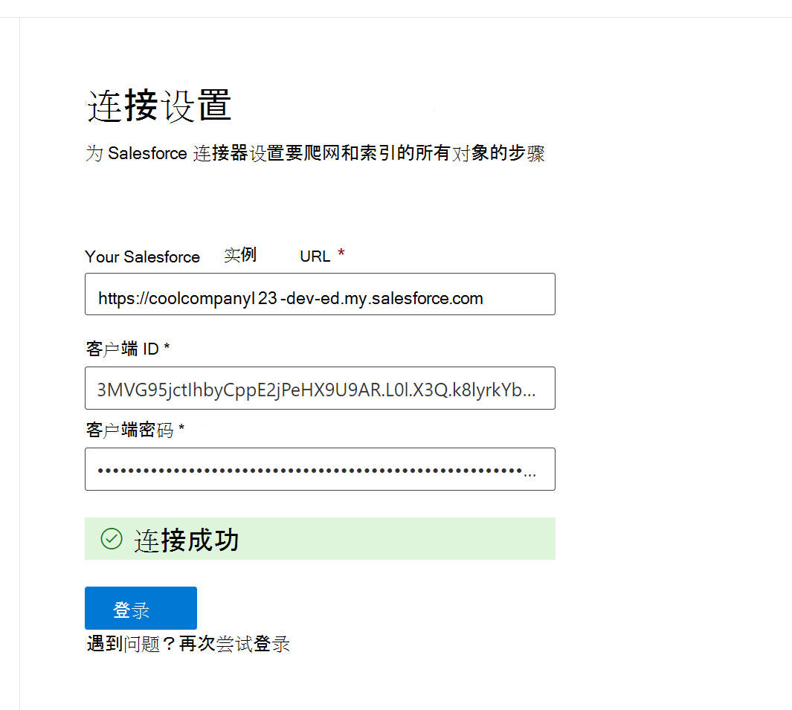

<!---Previous ms.author: rusamai --->

# Salesforce Graph 连接器

Salesforce Graph连接器，允许组织为 Salesforce 实例中的联系人、机会、线索、案例和帐户对象编制索引。 配置来自 Salesforce 的连接器并索引内容后，最终用户可以从任何客户端搜索Microsoft 搜索项。

> [!NOTE]
> 阅读 [**Graph 连接器的**](configure-connector.md)安装程序一文，了解 Graph 连接器的一般设置说明。

本文适用于配置、运行和监视 Salesforce Graph连接器。 它补充了常规安装过程，并显示了仅适用于 Salesforce Graph说明。 本文还包括有关 [限制的信息](#limitations)。

>[!IMPORTANT]
>Salesforce Graph连接器当前支持 Summer '19 或更高版本。

## 在开始使用之前

若要连接到 Salesforce 实例，您需要 Salesforce 实例 URL、客户端 ID 和客户端密码进行 OAuth 身份验证。 以下步骤说明了您或 Salesforce 管理员如何从 Salesforce 帐户获取此信息：

- 登录到 Salesforce 实例并转到安装程序

- 导航到应用 ->应用管理器。

- 选择 **"新建已连接的应用"。**

- 完成 API 部分，如下所示：

    - 选中"启用 **Oauth 设置"复选框**。

    - 将回调 URL 指定为： [https://gcs.office.com/v1.0/admin/oauth/callback](https://gcs.office.com/v1.0/admin/oauth/callback)

    - 选择这些所需的 OAuth 作用域。

        - 访问和管理你的数据 (api) 

        - 随时代表您执行请求， (refresh_token offline_access) 

    - 选中"Web 服务器 **流需要密码"复选框**。

    - 保存应用。
    
      > [!div class="mx-imgBorder"]
      > 

- 复制消费者密钥和使用者密码。 在管理门户中为 设置 连接器配置连接Graph，此信息将用作客户端 ID 和Microsoft 365密码。

  > [!div class="mx-imgBorder"]
  > 
  
- 在关闭 Salesforce 实例之前，请按照以下步骤确保刷新令牌不会过期：
    - 转到应用 ->应用管理器
    - 找到你创建的应用，然后选择右侧下拉列表。 选择 **"管理"**
    - 选择 **编辑策略**
    - 对于刷新令牌策略，选择 **"刷新令牌有效，直到吊销"**

  > [!div class="mx-imgBorder"]
  > 

现在，可以使用[Microsoft 365 管理 中心](https://admin.microsoft.com/)完成连接器的其余设置Graph过程。

## 步骤 1：在Graph中添加连接器Microsoft 365 管理中心

按照常规 [设置说明操作](./configure-connector.md)。
<!---If the above phrase does not apply, delete it and insert specific details for your data source that are different from general setup instructions.-->

## 步骤 2：命名连接

按照常规 [设置说明操作](./configure-connector.md)。
<!---If the above phrase does not apply, delete it and insert specific details for your data source that are different from general setup instructions.-->

## 步骤 3：配置连接设置

对于实例 URL，请使用 https://[domain].my.salesforce.com，其中 domain 是组织的 Salesforce 域。

输入从 Salesforce 实例获取的客户端 ID 和客户端密码，然后选择"登录"。

首次尝试使用这些设置登录时，你将看到一个弹出窗口，要求你使用管理员用户名和密码登录 Salesforce。 下面的屏幕截图显示了弹出窗口。 输入你的凭据，然后选择"登录"。

  

  >[!NOTE]
  >如果未显示弹出窗口，它可能在浏览器中被阻止，因此必须允许弹出窗口和重定向。

通过搜索显示"连接成功"的绿色横幅来检查连接是否成功，如以下屏幕截图所示。

  > [!div class="mx-imgBorder"]
  > 

## 步骤 4：选择属性

选择要对连接器进行爬网并包括在搜索结果中的 Salesforce 对象。 如果选择"联系人"，还将自动选择"帐户"。

>[!NOTE]
>如果某个字段具有字段级别 (为) 设置 FLS，则连接器不会为 Salesforce 组织的任何配置文件输入该字段。因此，用户将无法搜索这些字段的值，也不会显示在结果中。

## 步骤 5：管理搜索权限

你需要选择哪些用户将看到此数据源中的搜索结果。 如果你仅允许某些 Azure Active Directory (Azure AD) 或非 Azure AD 用户查看搜索结果，请确保映射标识。

### 步骤 5.a：选择权限

可以选择从 Salesforce 实例 (访问控制列表) ACL，或允许组织中的每个人查看此数据源中的搜索结果。 ACL 可以包括 Azure Active Directory (AAD) 标识 (从 Azure AD 联合到 Salesforce) 的用户、非 Azure AD 标识 (在 Azure AD) 中具有相应标识的本机 Salesforce 用户，或同时包括这两者。

>[!NOTE]
>如果使用第三方标识提供程序（如 Ping ID 或 secureAuth），则应该选择"非 AAD"作为标识类型。

> [!div class="mx-imgBorder"]
> 

如果选择从 Salesforce 实例中输入 ACL，并且为标识类型选择了"非 AAD"，请参阅映射非 [Azure AD 标识](map-non-aad.md) ，获取有关映射标识的说明。

### 步骤 5.b：映射 AAD 标识

如果你选择从 Salesforce 实例中输入 ACL，并且为标识类型选择了"AAD"，请参阅映射 [Azure AD 标识](map-aad.md) ，获取有关映射标识的说明。 若要了解如何为 Salesforce 设置 Azure AD SSO，请参阅 [本教程](/azure/active-directory/saas-apps/salesforce-tutorial)。

### 应用用户映射以将 Salesforce 标识同步到 Azure AD 标识

在此视频中，你可以看到向 Salesforce 实例进行身份验证、将非 Azure Active Directory 标识同步到 Azure Active Directory 标识以及将适当的安全修整应用到 Salesforce 项的过程。

> [!VIDEO https://www.youtube-nocookie.com/embed/SZYiFxZMKcM]

## 步骤 6：分配属性标签

可以通过从选项菜单中选择来为每个标签分配源属性。 虽然此步骤并非必需步骤，但具有某些属性标签将提高搜索相关性，并确保最终用户获得更好的搜索结果。 默认情况下，某些标签（如"Title"、"URL"、"CreatedBy"和"LastModifiedBy"）已分配有源属性。

## 步骤 7：管理架构

您可以选择应编制索引的源属性，以便它们显示在搜索结果中。 默认情况下，连接向导基于一组源属性选择搜索架构。 您可以通过选中搜索架构页中每个属性和属性的复选框来修改它。 搜索架构属性包括 Search、Query、Retrieve 和 Refine。
利用优化，您可以定义稍后可在搜索体验中用作自定义精简程序或筛选器的属性。  

> [!div class="mx-imgBorder"]
> 

## 步骤 8：设置刷新计划

Salesforce 连接器当前仅支持完全爬网的刷新计划。

>[!IMPORTANT]
>完全爬网将查找已删除的对象和之前已同步到索引Microsoft 搜索用户。

建议的完全爬网计划为一周。

## 步骤 9：查看连接

按照常规 [设置说明操作](./configure-connector.md)。

>[!TIP]
>**默认结果类型**
>* 发布连接器后，Salesforce 连接器将自动注册结果类型。 结果类型使用基于步骤 3中选定的字段的动态生成的结果布局。
>* 可以通过导航到"结果类型"中的"结果类型"来管理 [**Microsoft 365 管理中心。**](https://admin.microsoft.com/Adminportal/Home#/MicrosoftSearch/resulttypes) 默认结果类型将命名为 `ConnectionId` "Default"。 例如，如果连接 ID 为 `Salesforce` ，结果布局将命名为："SalesforceDefault"
>* 此外，还可以选择创建您自己的结果类型（如果需要）。
<!---If the above phrase does not apply, delete it and insert specific details for your data source that are different from general setup instructions.-->

<!---## Troubleshooting-->
<!---Insert troubleshooting recommendations for this data source-->

## 限制

- 当前Graph连接器不支持使用 Salesforce 中的个人组进行基于 Apex、基于区域共享和共享。
- 连接器使用的 Salesforce API 中Graph Bug，当前不应用销售线索的专用组织范围默认值。  
- 如果字段具有为配置文件 (FLS) ，则 Graph 连接器不会为 Salesforce 组织的任何配置文件提供该字段。因此，用户将无法搜索这些字段的值，也不会显示在结果中。  
- 在"管理架构"屏幕中，这些常用标准属性名称列出一次，选项为"查询 **"、"搜索****"、"检索**"和"**精简**"，并应用于全部或无。
    - 名称
    - URL
    - 描述
    - Fax
    - 电话版
    - MobilePhone
    - 电子邮件
    - 类型
    - 标题
    - AccountId
    - AccountName
    - AccountUrl
    - AccountOwner
    - AccountOwnerUrl
    - 所有者
    - OwnerUrl
    - CreatedBy
    - CreatedByUrl
    - LastModifiedBy
    - LastModifiedByUrl
    - LastModifiedDate
    - ObjectName
