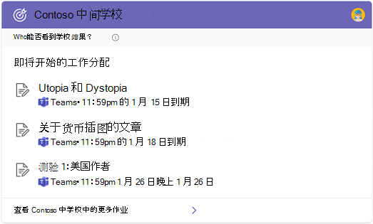
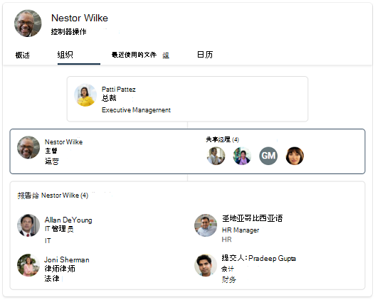

# 选择学校或工作搜索体验 (预览) 

如果你的组织具有教育和企业服务计划，你可以选择一个Microsoft 搜索用户体验必应，无论是学校还是工作。 由于此设置将适用于所有用户，因此建议您选择与组织中大多数人员一致的选项。

1. 在["Microsoft 365 管理中心"](https://admin.microsoft.com)中，转到"[配置"。](https://admin.microsoft.com/Adminportal/Home#/MicrosoftSearch/configurations)
1. 在Microsoft 搜索或必应中，选择"更改 **设置"。**
1. 在面板中，选择"学校搜索"或"工作搜索"的搜索体验。 此更改可能需要 72 小时才能显示在必应。

## 学校与工作搜索之间的差异

大多数情况下，在企业网站中Microsoft 搜索和工作必应相似。 用户可以查找人员、文件、网站、答案等。 但是有一些关键区别：

### 学校搜索

学校搜索体验包括两个唯一的答案：课程和作业。 在课程答案中，学生和教师可以看到课程的完整列表，并使用链接在课堂上Microsoft Teams。 在作业答案中，他们可以看到按截止日期排序的即将完成的工作分配列表。

学校用户可以通过在"课程"上的搜索框中输入这些查询，获得课堂和作业[必应：](https://Bing.com)

- 我的课程
- 课程
- 我的工作分配
- 我的作业

此外，对于学校搜索用户，默认情况下，SafeSearch 设置为 strict。 有关 SafeSearch 的信息，请参阅使用 [SafeSearch](https://support.microsoft.com/topic/946059ed-992b-46a0-944a-28e8fb8f1814)阻止成人内容。

### 工作搜索

工作搜索体验包括组织结构图和Power BI答案。 它们不适用于学校搜索体验。

有关答案Power BI，请参阅管理Power BI[答案](manage-powerbi.md)。
