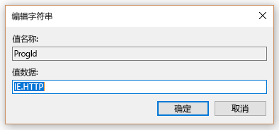
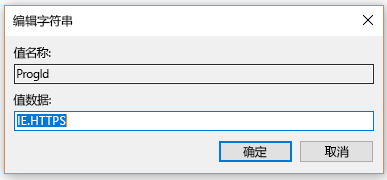

# 设置默认浏览器

配置默认浏览器、 默认搜索引擎和默认主页将帮助您发现 Microsoft 搜索功能，鼓励使用更多的并提供更流畅的用户。
  
要设置您的组织的默认浏览器，请按照以下步骤。
  
## Windows 8 及以上

将 Internet Explorer 或 Microsoft 边缘设置为默认浏览器，请按照下列步骤：
  
### 创建默认关联的文件

1. 打开管理 PowerShell 控制台。
    
2.  `New-Item -Path "\\$env:USERDOMAIN\SYSVOL\$env:USERDNSDOMAIN" -Type Directory -Name "Settings"`
    
3.  `$SettingsPath="\\$env:USERDOMAIN\SYSVOL\$env:USERDNSDOMAIN\Settings"`
    
4.  `Start-Process Dism.exe -PassThru "/Online /Export-DefaultAppAssociations:$SettingsPath\AppAssoc.xml"`
    
这些步骤尝试和域控制器的 SYSVOL 文件夹中创建的默认关联文件。
  
### 添加或编辑默认关联文件

1. `Notepad "$SettingsPath\AppAssoc.xml"`
    
2. 编辑以下条目 （.htm、.html、 http、 https），并删除其他条目，如果您不需要它们。
    
  - **Microsoft Edge**
    
     `<Association Identifier=".htm" ProgId="AppX4hxtad77fbk3jkkeerkrm0ze94wjf3s9" ApplicationName="Microsoft Edge" />`
  
     `<Association Identifier=".html" ProgId="AppX4hxtad77fbk3jkkeerkrm0ze94wjf3s9" ApplicationName="Microsoft Edge" />`
  
     `<Association Identifier="http" ProgId="AppXq0fevzme2pys62n3e0fbqa7peapykr8v" ApplicationName="Microsoft Edge" />`
    
  - **Internet Explorer**
    
     `<Association Identifier=".htm" ProgId="htmlfile" ApplicationName="Internet Explorer" />`
  
     `<Association Identifier=".html" ProgId="htmlfile" ApplicationName="Internet Explorer" />`
  
     `<Association Identifier="http" ProgId="IE.HTTP" ApplicationName="Internet Explorer" />`
  
     `<Association Identifier="https" ProgId="IE.HTTPS" ApplicationName="Internet Explorer" />`
    
3. 打开组策略管理控制台 (gpmc.msc) 并切换到编辑现有的任何策略或创建一个新。
    
1. 导航到**计算机 Components\File 配置 \**
    
2. 双击**设置默认关联配置文件**，将其设置为**已启用**，并输入 AppAssoc.xml 的路径 (例如 %USERDOMAIN%\SYSVOL\%USERDNSDOMAIN%\Settings\AppAssoc.xml)
    
4. 通过将其链接到适当的域中强制产生的 GPO。
    
用户将能够更改浏览器后设置此策略。
  
## Windows 7

1. 配置用于将 GPO 设置在本地计算机。
    
1. 打开**控件 Panel\Programs\Default Programs\Set 默认程序**并将 Internet Explorer 设置为默认值。 
    
2. 打开组策略管理控制台 (gpmc.msc) 并切换到编辑现有的任何策略或创建一个新。
    
1. 导航到**\<计算机/用户\>Configuration\Policies\Preferences\Windows 设置**。
    
2. **Registry\New**右键单击并选择**注册表向导**。
    
3. 从注册表浏览器窗口中，选择**本地计算机**，然后单击**下一步**。
    
4. 导航到**HKEY_CURRENT_USER\Software\Microsoft\Windows\Shell\Associations\UrlAssociations\https**并选择的 ProgId 值。确保值看起来如下所示： 
    
    
  
5. 导航到**HKEY_CURRENT_USER\Software\Microsoft\Windows\Shell\Associations\UrlAssociations\https**并选择的 ProgId 值。确保值如下之一下： 
    
    
  
3. 通过将其链接到适当的域中强制产生的 GPO。
    
用户将能够更改浏览器后设置此策略。