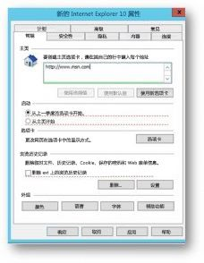

# 将 Bing.com 设置为默认主页Make Bing.com the default home page

本文介绍如何将 Bing.com 设置为 Microsoft Edge、Google Chrome 和 Internet Explorer 浏览器的默认主页。This article explains how to set Bing.com as the default home page for Microsoft Edge, Google Chrome, and Internet Explorer browsers. 
  
 
## Windows 10 版本 1511 或更高版本上的 Microsoft EdgeMicrosoft Edge on Windows 10, Version 1511 or later

此策略一旦设置完成，用户便无法再更改此内容。Users won't be able to change this once this policy is set. 

1. 打开组策略管理控制台 (gpmc.msc) 并切换到编辑任何现有策略或新建一个策略。Open the Group Policy Management Console (gpmc.msc) and switch to editing any existing policy or creating a new one. 
1. 导航到**管理模板\Windows 组件\Microsoft Edge**。Navigate to **Administrative Templates\Windows Components\Microsoft Edge**.    
1. 双击“配置起始页”\*\*\*\*，将其设置为“启用”\*\*\*\*，并输入 `https://www.bing.com/business`Double-click **Configure Start pages**, set it to **Enabled**, and enter `https://www.bing.com/business`
1.  通过将生成的 GPO 链接到适当的域来强制执行此系列设置。Enforce the resultant GPO by linking it to the appropriate domain.

  
## Windows XP SP2 或更高版本上的 Google ChromeGoogle Chrome on Windows XP SP2 or later

有关为不同版本的 Windows 管理 ADMX 文件和最新 ADMX 文件的 Windows 支持文章，请参阅 [Microsoft 支持](https://support.microsoft.com/help/3087759/how-to-create-and-manage-the-central-store-for-group-policy-administra)。The Windows Support article on managing ADMX files and the latest ADMX files for different versions of Windows can be found [on Microsoft Support](https://support.microsoft.com/help/3087759/how-to-create-and-manage-the-central-store-for-group-policy-administra).

还需要最新的 Google 策略文件，可在 [Google Chrome Enterprise 帮助](https://support.google.com/chrome/a/answer/187202)上找到。You'll also need the latest Google policy file, which you can find on [Google Chrome Enterprise Help](https://support.google.com/chrome/a/answer/187202).
  
如果在 GPMC 内找不到本部分中介绍的设置，下载相应 ADMX 并将其复制到[中央存储](https://docs.microsoft.com/previous-versions/windows/it-pro/windows-vista/cc748955%28v%3dws.10%29)。控制器上的中央存储是具有以下命名约定的文件夹：If the settings described in this section can't be found inside of GPMC, download the appropriate ADMX and copy them to the [central store](https://docs.microsoft.com/previous-versions/windows/it-pro/windows-vista/cc748955%28v%3dws.10%29). Central store on the controller is a folder with the following naming convention:
  
 **%systemroot%\sysvol\\<domain\>\policies\PolicyDefinitions****%systemroot%\sysvol\\<domain\>\policies\PolicyDefinitions**
  
控制器处理的每个域都应有一个单独的文件夹。以下命令可用于从命令提示符复制 ADMX 文件：Each domain your controller handles should get a separate folder. The following command can be used to copy the ADMX file from the command prompt:
  
 `Copy <path_to_ADMX.ADMX> %systemroot%\sysvol\<domain>\policies\PolicyDefinitions`
  
1. 打开组策略管理控制台 (gpmc.msc) 并切换到编辑任何现有策略或新建一个策略。Open the Group Policy Management Console (gpmc.msc) and switch to editing any existing policy or creating a new one.
1. 请确保以下文件夹显示在*用户/计算机配置*的**管理模板**部分中：Google Chrome 和 Google Chrome - 默认设置（用户可以覆盖）。Make sure the following folders appear in the **Administrative Templates** section of both *User/Computer Configuration*: Google Chrome and Google Chrome - Default Settings (users can override).
   - 第一个部分的设置是固定的，本地管理员无法进行更改。The settings of the first section are fixed and the local administrator won't be able to change them.
   - 用户可以在其浏览器设置中更改后一部分策略的设置。应决定用户是否可以覆盖默认设置。在以下步骤中，更改文件夹中与组织策略和需求相对应的设置。下面的步骤使用 Google Chrome - 默认设置为默认值。The settings of the latter section of policies can be changed by users in their browser settings. You should decide if users can override your default setting. In the following steps, change in the setting in the folder that corresponds to your organization policy and needs. The steps below use the Google Chrome - Default Settings as the default.

1. 导航到**&lt;计算机/用户配置&gt;\管理模板\Google Chrome - 默认设置\主页**。Navigate to **&lt;Computer/User Configuration&gt;\Administrative Templates\Google Chrome - Default Settings\Home Page**. 
1. 双击“使用新选项卡页作为主页”\*\*\*\*，并将其设置为“启用”\*\*\*\*。Double-click **Use New Tab Page as homepage**, and set it to **Enabled**. 
1. 导航到**&lt;计算机/用户配置&gt;\管理模板\Google Chrome - 默认设置\新选项卡页**。Navigate to **&lt;Computer/User Configuration&gt;\Administrative Templates\Google Chrome - Default Settings\New Tab Page**. 
1. 双击“配置新选项卡页 URL”\*\*\*\*，将其设置为“启用”\*\*\*\*，并输入 `https://www.bing.com/business?form=BFBSPR`Double-click **Configure the New Tab Page URL**, set it to **Enabled**, and enter `https://www.bing.com/business?form=BFBSPR` 
1. 通过将生成的 GPO 链接到适当的域来强制执行此系列设置。Enforce the resultant GPO by linking it to the appropriate domain.

## Internet Explorer 5.0 或更高版本Internet Explorer 5.0 or later
设置此策略后，用户仍可以更改主页。Users can still change the home page after this policy is set. 

1. 打开组策略管理控制台 (gpmc.msc) 并切换到编辑任何现有策略或新建一个策略。Open the Group Policy Management Console (gpmc.msc) and switch to editing any existing policy or creating a new one.
    
2. 导航到**用户配置\偏好设置\控制面板设置\Internet 设置**。Navigate to **User Configuration\Preferences\Control Panel Settings\Internet Settings**.
    
3. 右键单击“Internet 设置”\*\*\*\*，然后选择“Internet Explorer 10”\*\*\*\*。Right-click on **Internet Settings** and select **Internet Explorer 10**.
    
    > [!NOTE]
    > 需要选择 Internet Explorer 10 选项来应用 Internet Explorer 11 设置，就像应用于 Internet Explorer 11 的设置一样。You need to select the option of Internet Explorer 10 to apply the settings for Internet Explorer 11 as the same settings apply to Internet Explorer 11. 
  
4. 带红色下划线的设置不在目标计算机上配置，而带绿色下划线的设置在目标计算机上配置。若要更改下划线，请使用以下功能键：Settings which are underlined in red are not configured at the target machine, while settings underlined in green are configured at the target machine. To change the underlining, use the following function keys:
    
    F5 - 启用当前选项卡上的所有设置F5 - Enable all settings on the current tab
    
    F6 - 启用当前选择的设置F6 - Enable the currently selected setting
    
    F7 - 禁用当前选择的设置F7 - Disable the currently selected setting
    
    F8 - 禁用当前选项卡上的所有设置F8 - Disable all settings on the current tab
    
5. 按 F8\*\*\*\* 在配置任何内容之前禁用所有设置。屏幕应如下所示：Press **F8** to disable all settings before configuring anything. The screen should look like this: 
    
    
  
6. 在主页设置上按 **F6**，然后输入 `https://www.bing.com/business?form=BFBSPR`Press **F6** on the Home page setting and enter `https://www.bing.com/business?form=BFBSPR`
    
7. 通过将生成的 GPO 链接到适当的域来强制执行此系列设置。Enforce the resultant GPO by linking it to the appropriate domain.