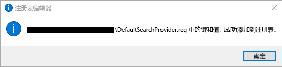
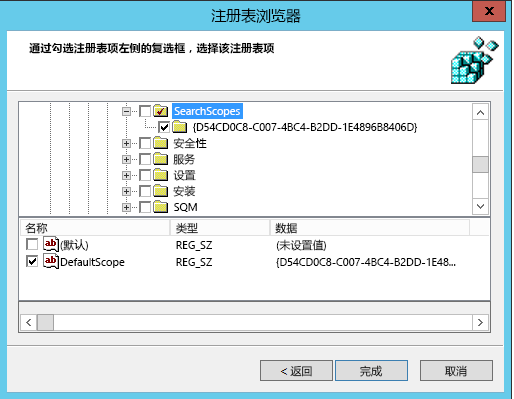
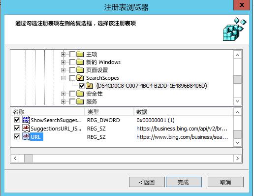

# 将必应设置为默认搜索引擎Make Bing the default search engine
  
本文介绍如何将必应设置为 Microsoft Edge、Google Chrome 和 Internet Explorer 的默认搜索引擎。This article explains how to make Bing the default search engine for Microsoft Edge, Google Chrome, and Internet Explorer. 
  
## Windows 10 版本 1703 或更高版本上的 Microsoft EdgeMicrosoft Edge on Windows 10, Version 1703 or later

虽然你将把必应设置为默认搜索引擎，但 Microsoft Edge 允许用户将其设置更改为使用其他搜索引擎。Although you'll set Bing as the default search engine, Microsoft Edge allows users to change their settings to use a different search engine.
  
有关各种 Windows 版本的最新 ADMX 文件，请参阅[如何在 Windows 中为组策略管理模板创建和管理中央存储](https://support.microsoft.com/zh-CN/help/3087759/how-to-create-and-manage-the-central-store-for-group-policy-administra)。For the latest ADMX files for various versions of Windows, see [How to create and manage the Central Store for Group Policy Administrative Templates in Windows](https://support.microsoft.com/en-us/help/3087759/how-to-create-and-manage-the-central-store-for-group-policy-administra).
  
如果在 GPMC 内找不到本部分中介绍的设置，下载相应 ADMX 并将其复制到中央存储。有关详细信息，请参阅[使用 ADMX 文件编辑基于域的 GPO](https://docs.microsoft.com/zh-CN/previous-versions/windows/it-pro/windows-vista/cc748955%28v%3dws.10%29)。控制器上的中央存储是具有以下命名约定的文件夹：If the setting described in this section cannot be found inside of GPMC, download the appropriate ADMX and copy them to the central store. For more information, see [Editing Domain-Based GPOs Using ADMX Files](https://docs.microsoft.com/en-us/previous-versions/windows/it-pro/windows-vista/cc748955%28v%3dws.10%29). Central store on the controller is a folder with the following naming convention:
  
 **%systemroot%\sysvol\\<domain\>\policies\PolicyDefinitions****%systemroot%\sysvol\\<domain\>\policies\PolicyDefinitions**
  
控制器处理的每个域都应有一个单独的文件夹。以下命令可用于从命令提示符复制 ADMX 文件：Each domain that your controller handles should get a separate folder. The following command can be used to copy the ADMX file from the command prompt:
  
 `Copy <path_to_ADMX.ADMX> %systemroot%\sysvol\<domain>\policies\PolicyDefinitions`
  
1. 打开组策略管理控制台 (gpmc.msc) 并切换到编辑现有策略或新建一个策略。Open the Group Policy Management Console (gpmc.msc) and switch to editing an existing policy or creating a new one.
    
2. 导航到**&lt;计算机/用户配置&gt;\管理模板\Windows 组件\Microsoft Edge**。Navigate to **&lt;Computer/User Configuration&gt;\Administrative Templates\Windows Components\Microsoft Edge**.
    
1. 双击“设置默认搜索引擎”\*\*\*\*，设置为“启用”\*\*\*\*，并输入 `https://www.bing.com/sa/osd/bfb.xml`Double-click **Set default search engine**, set to **Enabled**, and enter `https://www.bing.com/sa/osd/bfb.xml`
    
3. 通过将生成的 GPO 链接到适当的域来强制执行此系列设置。Enforce the resultant GPO by linking it to the appropriate domain.

## Windows XP SP2 或更高版本上的 Google ChromeGoogle Chrome on Windows XP SP2 or later

设置此策略后，用户无法更改默认搜索引擎。Users won't be able to change the search provider after this policy is set.
  
Chrome 自带一组组策略设置，可以从 [Google Chrome Enterprise 帮助](https://support.google.com/chrome/a/answer/187202)以 ADMX 文件格式下载。如果使用操作系统 Windows Vista/Server 2008 或更高版本来管理域的 GPO，此包中提供的 ADMX 文件将负责 Windows XP SP2 或更高版本上的 Chrome 设置。Chrome comes with its own set of group policy settings which can be downloaded in the form of an ADMX file from [Google Chrome Enterprise Help](https://support.google.com/chrome/a/answer/187202). If operating systems Windows Vista/Server 2008 or later are used to manage GPO's for the domain, the ADMX file provided in this package takes care of Chrome settings on Windows XP SP2 or later.
  
将模板文件复制到域控制器上 ADMX 文件的中央存储。有关详细信息，请参阅[使用 ADMX 文件编辑基于域的 GPO](https://docs.microsoft.com/zh-CN/previous-versions/windows/it-pro/windows-vista/cc748955%28v%3dws.10%29)。控制器上的中央存储是具有以下命名约定的文件夹：Copy the template file to a central store for ADMX files on the domain controller. For more information, see [Editing Domain-Based GPOs Using ADMX Files](https://docs.microsoft.com/en-us/previous-versions/windows/it-pro/windows-vista/cc748955%28v%3dws.10%29). Central store on the controller is a folder with the following naming convention:
  
 **%systemroot%\sysvol\\<domain\>\policies\PolicyDefinitions****%systemroot%\sysvol\\<domain\>\policies\PolicyDefinitions**
  
控制器处理的每个域都应有一个单独的文件夹。以下命令可用于从命令提示符复制 ADMX 文件：Each domain that your controller handles should get a separate folder. The following command can be used to copy the ADMX file from the command prompt:
  
 `Copy <path_to_Chrome.ADMX> %systemroot%\sysvol\<domain>\policies\PolicyDefinitions`
  
1. 打开组策略管理控制台 (gpmc.msc) 并切换到编辑任何现有策略或新建一个策略。Open the Group Policy Management Console (gpmc.msc) and switch to editing any existing policy or creating a new one.
    
2. 请确保以下文件夹显示在用户/计算机配置的“管理模板”部分：Google Chrome 和 Google Chrome - 默认设置。Make sure the following folders appear in the Administrative Templates section of both User/Computer Configuration: Google Chrome and Google Chrome - Default Settings.
    
  - 第一个部分的设置是固定的，本地管理员无法在浏览器中进行更改。The settings of the first section are fixed and local administrators won't be able to change them in the browser.
    
  - 用户可以在浏览器设置中更改后一部分策略的设置。The settings of the latter section of policies can be changed by users in the browser settings.
    
3. 导航到**\<计算机/用户\>配置\管理模板\Google Chrome\默认搜索提供程序**Navigate to **\<Computer/User\> Configuration\Administrative Templates\Google Chrome\Default search provider**
    
4. 双击“启用默认搜索提供程序”\*\*\*\*，并将其设置为“启用”\*\*\*\*。Double-click **Enable the default search provider**, and set it to **Enabled**.
    
5. 双击“默认搜索提供程序”图标\*\*\*\*，将其设置为“启用”\*\*\*\*，并输入 `https://www.bing.com/sa/simg/bb.ico`Double-click **Default search provider icon**, set it to **Enabled**, and enter `https://www.bing.com/sa/simg/bb.ico`
    
6. 双击“默认搜索提供程序即时 URL”\*\*\*\*，并输入 `https://www.bing.com/business/search?q={searchTerms}&amp;form=BFBSPR`Double-click **Default search provider instant URL**, and enter `https://www.bing.com/business/search?q={searchTerms}&amp;form=BFBSPR`
    
7. 双击“默认搜索提供程序名称”\*\*\*\*，将其设置为“启用”，然后输入“必应中的 Microsoft 搜索”Double-click **Default search provider name**, set it to Enabled, and enter 'Microsoft Search in Bing'
    
8. 双击“默认搜索提供程序搜索 URL”\*\*\*\*，并将其设置为“启用”\*\*\*\*，然后输入 `https://www.bing.com/business/search?q={searchTerms}&amp;form=BFBSPR`Double-click **Default search provider search URL**, set it to **Enabled**, and enter `https://www.bing.com/business/search?q={searchTerms}&amp;form=BFBSPR`
    
9. 双击“默认搜索提供程序建议 URL”\*\*\*\*，并将其设置为“启用”\*\*\*\*，然后输入 `https://business.bing.com/api/v2/browser/suggest?q={searchTerms}&amp;form=BFBSPA`Double-click **Default search provider suggest URL**, set it to **Enabled**, and enter `https://business.bing.com/api/v2/browser/suggest?q={searchTerms}&amp;form=BFBSPA`
    
10. 通过将生成的 GPO 链接到适当的域来强制执行此系列设置。Enforce the resultant GPO by linking it to the appropriate domain.
    
设置默认搜索引擎将在浏览器地址栏中添加 Microsoft 搜索建议功能。目前，它只支持书签。当用户在地址栏键入内容时，他们会在公共 Web 建议上方看到前两个书签建议。Setting the default search engine will add the Microsoft Search search suggestions feature in the browser address bar. Currently, this supports bookmarks only. Users will see the top two bookmark suggestions above public web suggestions as they type in the address bar.

## Internet Explorer 11 或更高版本Internet Explorer 11 or later versions

设置此策略后，用户可以更改搜索提供程序。Users will be able to change the search provider after this policy is set.
  
### 步骤 1.Step 1 配置将用于设置 GPO 的本地计算机Configure the local machine that will be used to set the GPO.

将以下文本粘贴到 reg (\*.reg) 文件中。Paste the following text into a reg(\*.reg) file.
  
Windows 注册表编辑器版本 5.00Windows Registry Editor Version 5.00
  
<pre>[HKEY_CURRENT_USER\Software\Microsoft\Internet Explorer\SearchScopes]
"DefaultScope"="{D54CD0C8-C007-4BC4-B2DD-1E4896B8406D}"
[HKEY_CURRENT_USER\Software\Microsoft\Internet Explorer\SearchScopes\{D54CD0C8-C007-4BC4-B2DD-1E4896B8406D}]
"Codepage"=dword:0000fde9
"DisplayName"="Microsoft Search in Bing"
"OSDFileURL"="https://www.bing.com/sa/osd/bfb.xml"
"FaviconURL"="https://www.bing.com/sa/simg/bb.ico"
"SuggestionsURL_JSON"="https://business.ing.com/api/v2/browser/suggest?q={searchTerms}&amp;form=BFBSPA"
"ShowSearchSuggestions"=dword:00000001
"URL"="https://www.bing.com/business/search?q={searchTerms}&amp;form=BFBSPR"</pre>
  
双击创建的文件并按照步骤导入文件。成功导入后应该会出现如下对话框：Double-click the file created and follow the steps to import the file. A successful import should result in the following dialog:
  

  
### 步骤 2.Step 2 打开组策略管理控制台 (gpmc.msc) 并切换到编辑现有策略或新建一个策略Open the Group Policy Management Console (gpmc.msc) and switch to editing an existing policy or creating a new one.

1. 导航到**用户配置\策略\首选项\Windows 设置**。Navigate to **User Configuration\Policies\Preferences\Windows Settings**.
    
2. 右键单击“注册表\新建”\*\*\*\*，然后选择“注册表向导”\*\*\*\*。从注册表浏览器窗口中选择“本地计算机”\*\*\*\*，然后单击“下一步”\*\*\*\*。Right-click on **Registry\New** and select **Registry Wizard**. From the Registry Browser window, select **Local Computer** and click **Next**.
    
3. 导航到 **HKEY_CURRENT_USER\SOFTWARE\Microsoft\Internet Explorer\SearchScopes**。Navigate to **HKEY_CURRENT_USER\SOFTWARE\Microsoft\Internet Explorer\SearchScopes**.
    
4. 从此项中确保选择 DefaultScope。From this key, make sure to select DefaultScope.
    
    
  
5. 检查必应中包含 Microsoft 搜索 GUID 的所有子项，以及该项下的所有值（任何用户配置文件路径除外）。向下滚动以选择其他项。Check all sub keys containing the GUID for Microsoft Search in Bing and every value under the key except any path to user profiles. Scroll down to select other items.
    
    
  
6. 单击“完成”以完成此配置。Click Finish to complete this configuration.
    
### 步骤 3.Step 3 设置“用户首选项”，避免用户在强制实施 DefaultScope 时收到警告3. Set up User Preferences to help eliminate a warning the user may get when DefaultScope search is enforced

此警告是设计使然，提醒用户有程序尝试修改其设置。This warning is by design and alerts users of a program trying to modify their settings.
  
1. 在相同 GPO 中，右键单击“注册表\新建”\*\*\*\* 然后选择“注册表向导”\*\*\*\*。Within the same GPO, right click on **Registry\New** and select **Registry Wizard**.
    
2. 导航到 **HKEY_CURRENT_USER\SOFTWARE\Microsoft\Internet Explorer\用户首选项**。Navigate to **HKEY_CURRENT_USER\SOFTWARE\Microsoft\Internet Explorer\User Preferences**.
    
3. 选择“用户首选项”\*\*\*\* 键。Select the **User Preference** key.
    
4. 单击“完成”\*\*\*\*。Click **Finish**.
    
5. 单击新创建的对象。在右侧窗格中双击“用户首选项”对象，将“操作”\*\*\*\* 更改为“删除并保存”\*\*\*\*。Click on the newly created object. On the right-side pane double click on the User Preferences object, change the **Action** to **Delete and Save**.
1. 通过将生成的 GPO 链接到适当的域来强制执行此系列设置。Enforce the resultant GPO by linking it to the appropriate domain.