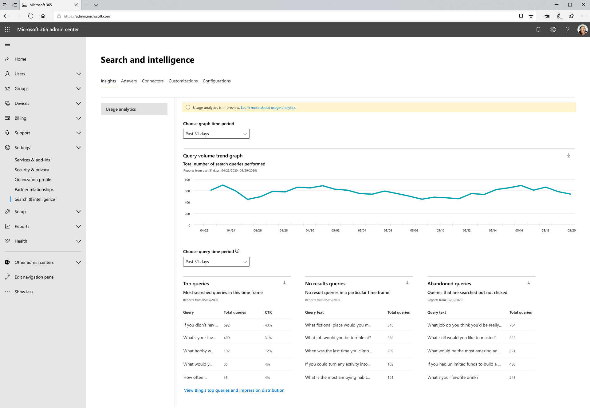

# Microsoft Search 使用率报告Microsoft Search Usage Reports

利用搜索使用率报告，您可以更好地了解搜索在您的组织中的工作方式。Search usage reports enable you to gain more understanding of how search is functioning in your organization. 通过这些报告生成的见解可帮助您 [轻松查找内容](https://docs.microsoft.com/microsoftsearch/make-content-easy-to-find) ，并采取行动，将使搜索对用户的体验更有用和 delightful。The insights generated from these reports will help you [make content easy to find](https://docs.microsoft.com/microsoftsearch/make-content-easy-to-find) and take actions that will make search a more useful and delightful experience for your users.

> [!IMPORTANT]
> Microsoft Search 使用率报告当前处于预览阶段。Microsoft Search usage reports are currently in preview.

[Microsoft 搜索使用情况报告](https://admin.microsoft.com/Adminportal/Home?#/MicrosoftSearch/insights)包括从在 SharePoint 主页和 Office.com 搜索框中执行的搜索生成的图形和表。The [Microsoft Search usage reports](https://admin.microsoft.com/Adminportal/Home?#/MicrosoftSearch/insights) include graphs and tables generated from searches that are executed from SharePoint Home and Office.com search boxes. 您可以查看过去31天、每天或上一年的每月的数据。You can see data from the past 31 days, per day, or monthly for the previous year. 这些报告即将推出，因此需要花费一些时间来累积历史数据。These reports are just rolling out so it will take time to accrue the historical data.

此页面的早期版本包含来自在 Bing 中对 Bing.com 执行 Microsoft 搜索的搜索中的数据。A previous version of this page included data from searches executed for Microsoft Search in Bing on Bing.com. 该数据不久将集成到这些报告中，但现在，您仍可以通过单击页面底部的链接 **查看 Bing 的最前面的查询和印象分布**，以查看这些报告。That data will be integrated into these reports soon, but for now, you can still see those reports by clicking the link at the bottom of the page to **View Bing's top queries and impression distribution**.

## 搜索报告概述Overview of search reports

|**报告****Report**|**说明****Description**|
|:-----|:-----|
|查询量Query Volume|此报告显示执行的搜索查询的数量。This report shows the number of search queries performed. 使用此报告可确定搜索查询量趋势，并确定搜索活动量较高和较低的时段。Use this report to identify search query volume trends and to determine periods of high and low search activity.|
|热门查询Top Queries|此报告显示最热门的搜索查询。This report shows the most popular search queries. 使用此报告可了解您的用户搜索的信息类型。Use this report to understand what types of information your users are searching for.|
|放弃的查询Abandoned Queries|此报告显示最常用的搜索查询，这些查询接收的点击率较低。This report shows popular search queries that receive low click-through. 使用此报告可确定可能导致用户不满意的搜索查询，并提高内容的可发现性。Use this report to identify search queries that might create user dissatisfaction and to improve the discoverability of content. 然后，您可以确定创建答案（如书签），还是通过 Graph 连接器 ingesting 新内容是正确的操作。You can then determine if creating an answer, like a Bookmark, or ingesting new content through a Graph connector is the right action.|
|无结果查询No Results Queries|此报告显示未返回结果的热门搜索查询。This report shows popular search queries that returned no results. 使用此报告可确定可能导致用户不满意的搜索查询，并提高内容的可发现性。Use this report to identify search queries that might create user dissatisfaction and to improve the discoverability of content. 然后，您可以确定创建答案（如书签），还是通过 Graph 连接器 ingesting 新内容是正确的操作。You can then determine if creating an answer, like a Bookmark, or ingesting new content through a Graph connector is the right action.|

## 查看报告Viewing reports

当您导航到 "使用率报告" 页时，可以查看所有报告。When you navigate to the usage reports page, all the reports are available to view. 您可以使用日期筛选器选取要查看的特定日期或月份。You can use the date filter to pick a specific day or month to view.

通过下载报告，可以在更广泛的时间范围内查看报告。Downloading a report will allow you to see reports from a broader range of time. 单击 "下载" 箭头，然后选择 " **过去31天** " 或 " **过去12个月**"。Click on the download arrow and select **past 31 days** or **past 12 months**. 该报告将下载为 Excel 电子表格。The report downloads as an Excel spreadsheet. 如果您选择了31天，电子表格将为每个工作日的 "每个" 选项卡。If you selected past 31 days, the spreadsheet will have am individual tab for each day. 过去12个月的下载内容将每月包含一个选项卡。The past 12 months download will have a tab for each month.

若要查看必应的热门查询和印记分布报告，请单击页面上的链接。To view Bing’s top queries and impression distribution reports click on the link on the page.

## 常见问题解答Frequently asked questions

**当我选择 "过去31天" 或 "过去12个月" 时，为什么必须分别选择特定日期或特定月份。****When I select past 31 days or past 12 months, why do I then have to choose a specific day or specific month respectively.**

Microsoft search 使用率报告中今天的日历视图分为两个步骤。The calendar view today in Microsoft search usage reports is a two-step process. 先从下拉列表 (过去31天或最近12个月) 中选择日期范围，然后选择 "开始日" 或 "月"。first select the date range from the dropdown (past 31 days or past 12 months) and then select the start day or month.

顶部、已放弃和失败的查询表显示从所选日或月的结果。The top, abandoned, and failed query tables show results from either the day or the month you choose.

**何时，我将看到过去7天的聚合数据（过去30天），如 Bing 的首要查询报告？****When will I see aggregate data for past 7 days, past 30 days, etc. like Bing’s top queries reports?**

我们正在考虑此类聚合，并简化了这些报告的未来版本的数据范围筛选。We are considering this type of aggregation and simplifying the data range filtering for future versions of these reports.

**为什么我无法查看不同应用 (源) 的使用率报告细目？****Why can’t I see a breakdown of usage reports by different apps (sources)?**

当前，按源筛选不可用。Currently, filtering by source is not available. 这些报告将搜索与 SharePoint 主页和 Office.com 合并在一起。The reports combine searches from SharePoint Home and Office.com. 我们的下一个版本将包含源筛选，以便您可以查看特定于每个应用程序的指标。Our next release will include source filtering so you can see metrics specific to each application.

**其他使用情况报告的筛选功能即将推出？****What other filtering for usage reports is coming?**

我们正在努力处理更多的筛选器，以帮助您在组织的更精细级别上了解搜索的使用情况。We are working on additional filters that will help make sense of search usage at a more granular level of your organization. 例如，你将能够查看特定地理位置或部门的查询量。For example, you will be able to see query volume for a specific geography or department.

**为什么在 Bing 报告中的 Microsoft 搜索位于单独的页面上？****Why are the Microsoft Search in Bing reports on a separate page?**

新式化 in Office 365 应用程序中的搜索要求我们加入以前完全不同的系统，包括报告生成。Modernizing search in Office 365 applications to Microsoft Search has required us to join previously disparate systems, including the reports generation. 这需要很长时间，我们认为，立即获取这些报告和等待，直到我们能够完成 Bing 数据的集成，这一点也非常重要。This takes time and we felt it was more important to get these reports out now versus waiting until we could complete the integration of the Bing data. 完成集成后，来自所有搜索终结点的数据将包含在同一个报告中。Once we complete the integration, the data from all search endpoints will be included in the same reports.
